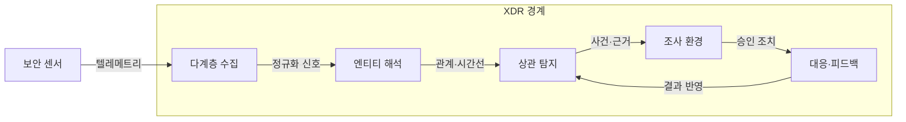
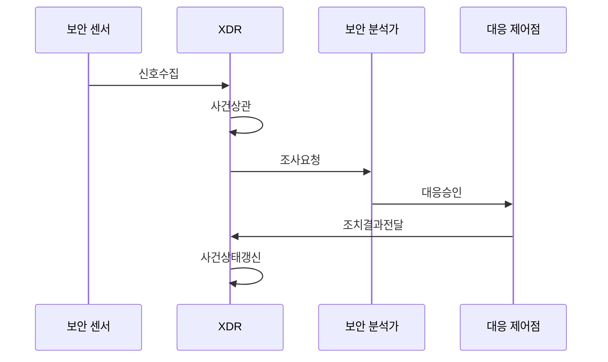

---
sidebar:
  order: 39
  label: "039. XDR 확장 탐지·대응 (XDR Extended Detection Response)"
  badge:
    text: "미출제 · 70%"
    variant: note
title: "XDR 확장 탐지·대응 (XDR Extended Detection Response)"
date: "2026-07-25T21:39:00+09:00"
tags:
  - "notes-security"
weight: 39
extra:
  question_no: "039"
  source_status: "미출제"
  source_history: ""
  priority: 70
  priority_note: "엔드포인트·망·클라우드 상관분석의 우산 답안임"
---

## 미리 알고가기

- **확장 탐지·대응(Extended Detection and Response, XDR)**: 단말·신원·메일·망·클라우드 신호를 한 사건으로 연결해 조사와 대응을 수행하는 체계이다.
- **엔드포인트 탐지·대응(Endpoint Detection and Response, EDR)**: 단말의 프로세스·파일 행위를 탐지하고 침해 단말을 격리하는 체계이다.
- **네트워크 탐지·대응(Network Detection and Response, NDR)**: 네트워크 흐름과 세션을 분석해 통신 위협을 탐지하고 대응하는 체계이다.
- **텔레메트리(Telemetry)**: 단말·신원·메일·망·클라우드의 활동을 관측해 탐지기에 보내는 데이터이다.
- **상관 분석**: 서로 다른 보안 신호의 사용자·자산·시간 관계를 찾아 하나의 공격 사건으로 묶는 분석이다.
## Ⅰ. 개요

- 정의/개념: 다계층 신호를 사건으로 연결해 대응함
- **배경/필요성**: 분산된 공격 흔적의 연결이 필요함

### 쉽게 이해하기 (학습용)

- 여러 장소에 흩어진 발자국을 한 침입자의 이동 경로로 이어 붙여 조사와 차단을 함께 수행한다.

## Ⅱ. 특징

- 사용자·자산·프로세스·세션을 공통 엔티티로 묶는다.
- 여러 신호를 상관 분석해 경보를 사건으로 묶는다.
- 도메인 간 통합 대응으로 공격 경로를 차단한다.
- 통합 범위가 좁으면 공격 시간선과 대응이 끊긴다.

### 쉽게 이해하기 (학습용)

- 단말 경보와 수상한 통신을 같은 사용자·시간으로 묶지만 연동 범위가 좁으면 공격 경로가 끊긴다.

## Ⅲ. 아키텍처 및 구성요소

| 설계 요소 | 설명 |
|:---|:---|
| 다계층 수집 | 종단·신원·메일·망·클라우드 신호 수집 |
| 엔티티 해석 | 자산·계정·프로세스 관계 통합 |
| 상관 탐지 | 문맥 분석으로 경보를 사건화 |
| 조사 환경 | 공격 경로·원본 증거·조치 상태 제공 |
| 대응·피드백 | 조치 실행·결과 기록·개선 |

> 요약: 다계층 신호를 엔티티/시간선 기반 사건으로 운영함

### 쉽게 이해하기 (학습용)

- 여러 보안 센서의 기록을 공통 사용자·자산으로 연결해 한 화면에서 공격 경로를 조사하고 차단한다.

## Ⅳ. 원리 및 절차 흐름도

| 절차 | 설명 |
|:---|:---|
| 신호수집 | 센서 필드를 공통 형식으로 변환함 |
| 사건상관 | 엔티티·시간 관계로 경보를 묶음 |
| 조사요청 | 공격 경로와 원본 근거를 제시함 |
| 대응승인 | 위험·영향을 확인해 조치를 승인함 |
| 조치결과전달 | 격리·차단 성공·실패 결과를 전달함 |
| 사건상태갱신 | 조치 결과를 사건에 기록함 |

> 요약: 다계층 경보를 사건화해 연계 대응

### 쉽게 이해하기 (학습용)

- 흩어진 경보를 한 사건으로 묶어 분석가가 공격 경로를 확인한 뒤 여러 보안 장비에 차단을 지시한다.

## Ⅴ. 종류 및 비교

| 비교축 | XDR | EDR | NDR |
|:---|:---|:---|:---|
| 핵심 특징 | 다계층 신호의 사건·조치 연결 | 단말 행위 관측과 격리 | 네트워크 세션·흐름 분석 |
| 적용 기준 | 도메인 간 공격 경로 대응 | 단말 침해 조사·격리 | 비관리 장치·통신 관측 |
| 주요 위험 | 공급자 종속·통합 깊이 부족 | 단말 밖 문맥 부족 | 암호화 통신 가시성 제한 |

> 요약: XDR은 다계층 증거를 연계해 사건 단위 대응함

### 쉽게 이해하기 (학습용)

- 단말만 보면 EDR, 통신만 보면 NDR, 두 영역의 공격 경로를 함께 잇고 대응하면 XDR을 쓴다.

## Ⅵ. 실무 사례

1. 랜섬웨어 사건은 단말·메일·망 증거를 연결
2. 계정 탈취 사건은 신원·클라우드 조치를 연계

### 쉽게 이해하기 (학습용)

- 랜섬웨어가 발견되면 감염 단말뿐 아니라 유입 메일과 확산 통신까지 한 사건에서 조사한다.
- 계정 탈취가 확인되면 접속 차단과 클라우드 세션 폐기를 한 사건에서 실행한다.

## Ⅶ. 결론

- 도메인 간 공격이면 XDR 연계 범위로 선택

### 쉽게 이해하기 (학습용)

- 공격이 여러 보안 영역을 건너면 필요한 센서와 차단 장비를 모두 잇는 XDR을 선택한다.
