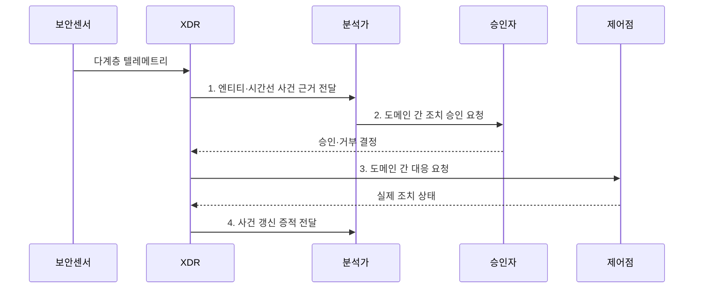

---
sidebar:
  order: 39
  label: "039. XDR 확장 탐지·대응 (XDR Extended Detection Response)"
  badge:
    text: "미출 · 70%"
    variant: note
title: "XDR 확장 탐지·대응 (XDR Extended Detection Response)"
date: "2026-08-02T10:56:00+09:00"
tags:
  - "notes-security"
weight: 39
extra:
  question_no: "039"
  source_status: "미출"
  source_history: ""
  priority: 70
  priority_note: "엔드포인트·망·클라우드 상관분석의 우산 답안임"
---

## Ⅰ. 개요

핵심 용어

- **XDR**은 단말·신원·메일·망·클라우드 신호를 한 사건으로 연결해 조사와 대응을 수행하는 체계다.

- 정의/개념: 다계층 신호를 사건화해 조사·조치하는 **XDR 통합 대응 체계**
- 배경/필요성: 분산 경보만으로는 **도메인 간 공격 경로 연결 불가**

### 쉽게 이해하기 (학습용)

- 여러 장소에 흩어진 발자국을 한 침입자의 이동 경로로 이어 붙여 조사와 차단을 함께 수행한다.

## Ⅱ. 특징

핵심 용어

- **텔레메트리**는 여러 보안 영역의 활동을 관측해 탐지기에 보내는 데이터다.
- **상관분석**은 서로 다른 신호의 사용자·자산·시간 관계를 찾아 하나의 공격 사건으로 묶는다.

- 사용자·자산·세션의 **공통 엔티티 연결**
- 다계층 신호의 **공격 사건 상관분석**
- 도메인 간 **통합 조사·대응**

### 쉽게 이해하기 (학습용)

- 단말 경보와 수상한 통신을 같은 사용자·시간으로 묶지만 연동 범위가 좁으면 공격 경로가 끊긴다.

## Ⅲ. 구조 및 구성요소

핵심 용어

- **엔티티 해석**은 계정·자산·프로세스·세션의 식별자를 같은 실제 주체와 시간선으로 연결한다.
- **사건화**는 분산된 경보를 공격 경로·원본 증거·조치 상태가 포함된 하나의 조사 단위로 묶는다.

| 구성요소 | 책임 |
|:---|:---|
| 다계층 수집 | **종단·신원·메일·망·클라우드 신호** 수집 |
| 엔티티 해석 | **자산·계정·프로세스 관계** 통합 |
| 상관 탐지 | 문맥 분석으로 **경보를 사건화** |
| 조사 환경 | **공격 경로·원본 증거·조치 상태** 제공 |
| 대응·피드백 | **조치 결과 기록·탐지 개선** |

### 쉽게 이해하기 (학습용)

- 여러 보안 센서의 기록을 공통 사용자·자산으로 연결해 한 화면에서 공격 경로를 조사하고 차단한다.

## Ⅳ. 흐름도

핵심 용어

- **도메인 간 대응**은 단말 격리, 계정 세션 회수, 악성 메일 삭제, 네트워크 차단을 하나의 사건에서 조정한다.

**동작 원리**

1. **엔티티·시간선 사건 근거 전달**: 자산·계정·세션의 상관 증거 제공
2. **도메인 간 조치 승인 요청**: 공격 경로·업무 영향·가역성 검토 요청
3. **도메인 간 대응 요청**: 단말·신원·메일·망 제어점에 조치 지시
4. **사건 갱신 증적 전달**: 성공·실패 상태와 탐지 개선 근거 제공

### 쉽게 이해하기 (학습용)

- 흩어진 경보를 한 사건으로 묶어 분석가가 공격 경로를 확인한 뒤 여러 보안 장비에 차단을 지시한다.

## Ⅴ. 종류 및 비교

핵심 용어

- **EDR**은 단말 행위·격리, **NDR**은 네트워크 세션·흐름, **XDR**은 여러 도메인의 사건·조치 연결에 중점을 둔다.

| 탐지·대응 유형 | XDR | EDR | NDR |
|:---|:---|:---|:---|
| 적용 기준 | **도메인 간 공격 경로** 대응 | **단말 침해 조사·격리** | **비관리 장치·통신** 관측 |
| 핵심 특징 | **다계층 사건·조치 연결** | **단말 행위·격리** | **네트워크 세션·흐름** 분석 |
| 한계 | **공급자 종속·통합 깊이** 부족 | 단말 밖 **문맥 부족** | 암호화 통신 **가시성 제한** |

### 쉽게 이해하기 (학습용)

- 단말만 보면 EDR, 통신만 보면 NDR, 두 영역의 공격 경로를 함께 잇고 대응하면 XDR을 쓴다.

## Ⅵ. 실무 고려사항 및 대책

핵심 용어

- **MITRE ATT&CK**은 공격 전술·기법을 구조화해 도메인별 탐지 범위를 점검하게 한다.
- **NIST SP 800-61 Rev. 3**은 사고 탐지·대응·복구를 사이버 위험 관리와 연결한다.

| 문제 | 대책 | 효과 |
|:---|:---|:---|
| **탐지 범위 공백** | **MITRE ATT&CK 기법 매핑** | 도메인별 **가시성** 점검 |
| **사고 대응 단절** | **NIST SP 800-61 Rev. 3 연계** | **탐지·복구 책임** 연결 |
| **공급자 종속·오조치** | **개방 API·승인·롤백 설계** | **이식성·통제 가능성** 확보 |

### 쉽게 이해하기 (학습용)

- XDR은 감염 단말의 행위, 최초 유입 메일, 내부 확산 통신을 한 사건으로 연결해 단말 격리와 악성 메일 삭제를 함께 수행한다.

## Ⅶ. 결론

핵심 용어

- **통합 깊이**는 연동 제품 수가 아니라 공격 경로를 끝까지 연결하고 실제 조치 상태를 환류할 수 있는 정도다.

- 단말 단독은 EDR, 통신 관측은 NDR, 다계층 공격 경로는 **XDR** 선택

### 쉽게 이해하기 (학습용)

- 공격이 여러 보안 영역을 건너면 필요한 센서와 차단 장비를 모두 잇는 XDR을 선택한다.
