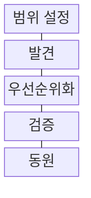
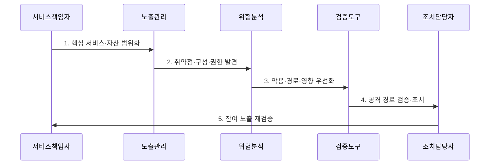

---
sidebar:
  order: 40
  label: "040. CTEM (Continuous Threat Exposure Management)"
  badge:
    text: "기출 · 70%"
    variant: note
title: "CTEM (Continuous Threat Exposure Management)"
date: "2026-07-27T23:59:59+09:00"
tags:
  - "notes-security"
weight: 40
extra:
  question_no: "040"
  source_status: "기출"
  source_history: "137회"
  priority: 70
  priority_note: "137회 기출이며 노출관리 폐루프 설계로 확장성이 큼"
---

## 미리 알고가기

- **지속적 위협 노출 관리(Continuous Threat Exposure Management, CTEM)**: 실제 공격 가능한 노출을 지속해서 식별·검증·조치·재검증하여 공격 표면을 줄이는 관리 체계이다.
- **침해·공격 시뮬레이션(Breach and Attack Simulation, BAS)**: 공격 기법을 안전하게 자동 재현하여 보안 통제와 공격 경로의 유효성을 검증하는 기술이다.
- **CISA 알려진 악용 취약점 목록(Known Exploited Vulnerabilities Catalog, KEV Catalog)**: 실제 악용이 확인되어 우선 조치가 필요한 취약점의 공식 목록이다.
- **FIRST 악용 예측 점수 시스템(Exploit Prediction Scoring System, EPSS)**: 취약점이 단기간에 실제 악용될 가능성을 확률로 예측하는 점수 체계이다.
- **FIRST 공통 취약점 점수 체계(Common Vulnerability Scoring System, CVSS) v4.0**: 취약점의 기술적 심각도와 환경·위협 지표를 평가하는 공식 규격이다.
- **서비스형 소프트웨어(Software as a Service, SaaS)**: 공급자가 운영하는 응용 기능을 인터넷으로 빌려 쓰는 서비스 형태이다.
- **공격 표면 관리(Attack Surface Management)**: 외부에 드러난 자산·서비스·설정 오류를 지속해서 발견하는 활동이다.
- **폐루프(Closed Loop)**: 노출 발견부터 담당자 조치·재검증까지 결과가 다시 관리 상태에 반영되는 순환이다.
## Ⅰ. 개요

- 정의/개념: 공격 가능한 노출을 줄이는 **폐루프 관리 체계**
- 배경/필요성: 취약점 점수만으로는 **실제 공격 경로 판단 곤란**

### 쉽게 이해하기 (학습용)

- 위험 목록만 쌓지 않고 실제 침입 경로가 되는 노출부터 확인해 없앤 뒤 다시 시험하는 활동이다.

## Ⅱ. 특징

- 외부·내부·SaaS의 **업무 자산 연결**
- 악용·공격 경로·영향의 **위험 우선화**
- 시뮬레이션·재검증의 **폐루프 감축**

### 쉽게 이해하기 (학습용)

- 취약점 점수보다 실제 악용 경로와 업무 영향을 먼저 보며 담당자가 고치지 않으면 순환이 끊긴다.

## Ⅲ. 구조 및 구성요소

| 구성요소 | 책임 |
|:---|:---|
| 범위 설정 | 핵심 서비스·자산·신원 범위 지정 |
| 발견 | 취약점·구성·권한 등 노출 식별 |
| 우선순위화 | 악용·경로·업무 영향으로 정렬 |
| 검증 | 시뮬레이션으로 노출 경로 확인 |
| 동원 | 담당자 지정·조치·재검증 |

### 쉽게 이해하기 (학습용)

- 중요한 서비스 범위를 정하고 노출을 찾은 뒤 실제 공격 경로만 검증해 담당자 조치와 재검증으로 되돌린다.

## Ⅳ. 흐름도

**동작 원리**

1. **핵심 서비스·자산 범위화**: 업무 중요도와 책임자 정의
2. **취약점·구성·권한 발견**: 내외부 공격 노출 식별
3. **악용·경로·영향 우선화**: KEV·EPSS와 업무 문맥 결합
4. **공격 경로 검증·조치**: 안전한 재현 후 담당자 동원
5. **잔여 노출 재검증**: 조치 효과와 재발 여부 확인

### 쉽게 이해하기 (학습용)

- 중요한 서비스에서 노출을 찾고 실제 공격 경로인지 시험한 뒤 담당자가 고치면 다시 같은 경로를 확인한다.

## Ⅴ. 종류 및 비교

| 노출 관리 유형 | CTEM | 공격 표면 관리 | 취약점 관리 |
|:---|:---|:---|:---|
| 적용 기준 | 실제 공격 가능 경로 감축 | 인터넷 노출 자산 발견 | 소프트웨어 결함 조치 |
| 핵심 특징 | **공격 경로·업무 영향 감축** | **외부 미관리 자산 발견** | 취약점·패치 상태 관리 |
| 한계 | 검증·담당자 동원 실패 | 위험 문맥 부족 | 점수 중심 자원 낭비 |

### 쉽게 이해하기 (학습용)

- 자산 발견은 공격 표면 관리, 결함 조치는 취약점 관리, 검증된 공격 경로의 반복 감축은 CTEM이 맡는다.

## Ⅵ. 실무 고려사항 및 대책

| 고려사항 | 대책 | 효과 |
|:---|:---|:---|
| 실제 악용 우선순위 | **CISA KEV Catalog 연계** | 긴급 조치 대상 식별 |
| 점수 단독 판단 | **FIRST CVSS v4.0·EPSS 결합** | 심각도·악용 가능성 보완 |
| 조치 미완료·재발 | **소유자 지정·BAS 재검증** | 노출 감축 폐루프 확보 |

### 쉽게 이해하기 (학습용)

- CTEM은 KEV 취약점이 있는 공개 서버에서 핵심 데이터까지 이어지는 공격 경로를 검증하고 해당 경로부터 차단·패치·재검증한다.

## Ⅶ. 결론

- **실제 악용성·업무 영향**으로 CTEM 조치 순위 결정

### 쉽게 이해하기 (학습용)

- 실제로 이어지는 침입 길부터 담당자가 끊고 같은 길이 다시 열렸는지 반복 확인한다.
