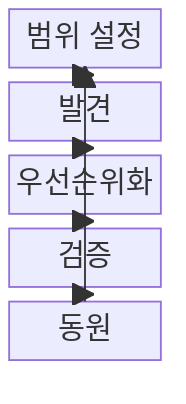
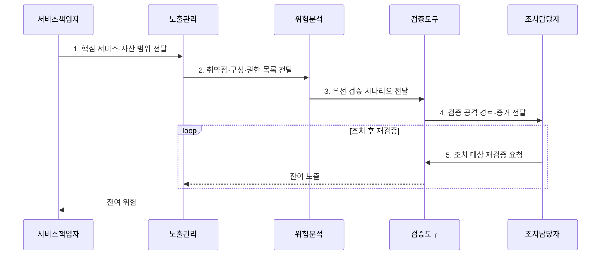

---
sidebar:
  order: 40
  label: "040. CTEM (Continuous Threat Exposure Management)"
  badge:
    text: "기출 · 70%"
    variant: note
title: "CTEM (Continuous Threat Exposure Management)"
date: "2026-08-02T23:50:00+09:00"
tags:
  - "notes-security"
weight: 40
extra:
  question_no: "040"
  source_status: "기출"
  source_history: "137회"
  priority: 70
  priority_note: "137회 기출이며 노출관리 폐루프 설계로 확장성이 큼"
---

## Ⅰ. 개요

핵심 용어

- **지속적 위협 노출 관리(Continuous Threat Exposure Management, CTEM)**는 실제 공격 가능한 노출을 지속해서 식별·검증·조치·재검증하여 공격 표면을 줄이는 관리 체계다.
- **폐루프**는 노출 발견부터 담당자 조치·재검증까지 결과가 다시 관리 상태에 반영되는 순환이다.

- 정의/개념: 공격 가능한 노출을 지속 식별·검증·조치·재검증하는 **폐루프 관리 체계**
- 배경/필요성: 취약점 점수만으로는 **실제 공격 가능 경로 판단 불가**

### 쉽게 이해하기 (학습용)

- 위험 목록만 쌓지 않고 실제 침입 경로가 되는 노출부터 확인해 없앤 뒤 다시 시험하는 활동이다.

## Ⅱ. 특징

핵심 용어

- **공격 표면**은 공격자가 접근하거나 악용할 수 있는 자산·서비스·설정·권한의 전체 범위다.
- **SaaS**는 공급자가 운영하는 응용 기능을 인터넷으로 빌려 쓰는 서비스 형태다.

- 외부·내부·SaaS의 **업무 자산 연결**
- 악용·공격 경로·영향의 **위험 우선화**
- 시뮬레이션·재검증의 **폐루프 노출 감축**

### 쉽게 이해하기 (학습용)

- 취약점 점수보다 실제 악용 경로와 업무 영향을 먼저 보며 담당자가 고치지 않으면 순환이 끊긴다.

## Ⅲ. 구조 및 구성요소

핵심 용어

- **BAS**는 공격 기법을 안전하게 자동 재현하여 보안 통제와 공격 경로의 유효성을 검증한다.
- **동원(Mobilization)**은 검증된 노출에 담당자·기한·조치 권한을 지정해 실제 개선을 실행하는 단계다.

| 구성요소 | 책임 |
|:---|:---|
| 범위 설정 | **핵심 서비스·자산·신원** 범위 지정 |
| 발견 | **취약점·구성·권한 노출** 식별 |
| 우선순위화 | **악용성·공격 경로·업무 영향** 기반 정렬 |
| 검증 | **BAS 시뮬레이션** 기반 공격 경로 확인 |
| 동원 | **담당자 지정·조치·재검증** 수행 |

### 쉽게 이해하기 (학습용)

- 중요한 서비스 범위를 정하고 노출을 찾은 뒤 실제 공격 경로만 검증해 담당자 조치와 재검증으로 되돌린다.

## Ⅳ. 흐름도

핵심 용어

- **KEV Catalog**는 실제 악용이 확인된 취약점 목록이고, **EPSS**는 단기간 악용 가능성을 확률로 예측한다.
- **재검증**은 패치·차단 뒤 같은 공격 경로가 더 이상 성립하지 않는지 다시 시험하는 절차다.

**동작 원리**

1. **핵심 서비스·자산 범위 전달**: 업무 중요도·책임자·신원 범위 제공
2. **취약점·구성·권한 목록 전달**: 내외부·SaaS 공격 노출 제공
3. **우선 검증 시나리오 전달**: KEV·EPSS·업무 영향 기반 경로 지정
4. **검증 공격 경로·증거 전달**: BAS 재현으로 확인한 경로와 영향 제공
5. **조치 대상 재검증 요청**: 차단·패치 후 잔여 노출 확인 지시

### 쉽게 이해하기 (학습용)

- 중요한 서비스에서 노출을 찾고 실제 공격 경로인지 시험한 뒤 담당자가 고치면 다시 같은 경로를 확인한다.

## Ⅴ. 종류 및 비교

핵심 용어

- **공격 표면 관리**는 외부 노출 자산 발견, **취약점 관리**는 결함 조치, **CTEM**은 검증된 공격 경로의 반복 감축에 중점을 둔다.

| 노출 관리 유형 | CTEM | 공격 표면 관리 | 취약점 관리 |
|:---|:---|:---|:---|
| 적용 기준 | **실제 공격 가능 경로** 감축 | **인터넷 노출 자산** 발견 | **소프트웨어 결함** 조치 |
| 핵심 특징 | **공격 경로·업무 영향 감축** | **외부 미관리 자산 발견** | **취약점·패치 상태** 관리 |
| 한계 | **검증·담당자 동원** 실패 | **위험 문맥** 부족 | **점수 중심 자원 낭비** |

### 쉽게 이해하기 (학습용)

- 자산 발견은 공격 표면 관리, 결함 조치는 취약점 관리, 검증된 공격 경로의 반복 감축은 CTEM이 맡는다.

## Ⅵ. 실무 고려사항 및 대책

핵심 용어

- **CVSS v4.0**은 기술적 심각도와 환경·위협 지표를 평가하고, **EPSS**는 실제 악용 가능성을 보완한다.
- **소유자 지정**은 검증된 노출의 조치 책임·기한·재검증 기준을 명확히 하는 통제다.

| 문제 | 대책 | 효과 |
|:---|:---|:---|
| **실제 악용 우선순위** | **CISA KEV Catalog 연계** | **긴급 조치 대상** 식별 |
| **점수 단독 판단** | **FIRST CVSS v4.0·EPSS 결합** | **심각도·악용 가능성** 보완 |
| **조치 미완료·재발** | **소유자 지정·BAS 재검증** | 노출 감축 **폐루프** 확보 |

### 쉽게 이해하기 (학습용)

- CTEM은 KEV 취약점이 있는 공개 서버에서 핵심 데이터까지 이어지는 공격 경로를 검증하고 해당 경로부터 차단·패치·재검증한다.

## Ⅶ. 결론

핵심 용어

- **노출 감축 성과**는 발견 건수보다 실제 공격 경로를 차단하고 재검증까지 완료한 비율로 평가한다.

- 외부 자산은 공격 표면 관리, 결함은 취약점 관리, 검증 경로는 **CTEM 폐루프** 적용

### 쉽게 이해하기 (학습용)

- 실제로 이어지는 침입 길부터 담당자가 끊고 같은 길이 다시 열렸는지 반복 확인한다.
