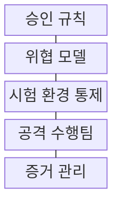
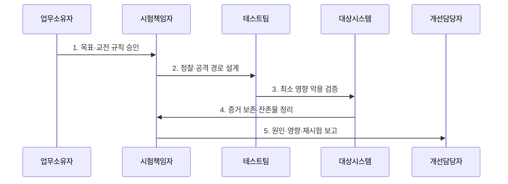

---
sidebar:
  order: 41
  label: "041. 모의 침투 테스트 (Penetration Testing, 펜테스트)"
  badge:
    text: "미출제 · 50%"
    variant: note
title: "모의 침투 테스트 (Penetration Testing, 펜테스트)"
date: "2026-07-25T21:41:00+09:00"
tags:
  - "notes-security"
weight: 41
extra:
  question_no: "041"
  source_status: "미출제"
  source_history: ""
  priority: 50
  priority_note: "승인·공격경로·재검증을 갖춘 독립 평가 방법론임"
---

## 미리 알고가기

- **모의 침투 테스트(Penetration Testing)**: 승인된 범위에서 실제 공격 경로와 악용 가능성을 검증하는 활동이다.
- **블랙·그레이·화이트박스**: 평가자에게 사전 제공하는 정보 범위에 따른 시험 구분이다.
- **교전 규칙(Rules of Engagement, RoE)**: 허용 범위·기법·중단 조건·연락 절차를 정한 합의이다.
- **미국 국립표준기술연구소 특별 간행물(NIST SP 800-115)**: 정보 보안 시험·분석·완화 절차를 제시한 공식 지침이다.
- **취약점 신고 포상제**: 외부 연구자가 상시 신고한 취약점에 보상하는 운영 제도이다.

## Ⅰ. 개요

- 정의/개념: 승인 범위에서 공격 경로를 검증하는 **보안 시험 기법**
- 배경/필요성: 자동 진단만으로는 **복합 공격 경로 검증 곤란**

### 쉽게 이해하기 (학습용)

- 실제 공격을 흉내 내되 승인 범위와 중단 조건으로 업무 피해를 제한한다.

## Ⅱ. 특징

- 권한·범위·중단 조건의 **교전 규칙**
- 실제 공격 경로의 **악용·업무 영향 검증**
- 최소 변경·잔존물 제거의 **안전 통제**

### 쉽게 이해하기 (학습용)

- 공격 성공보다 재현 가능한 경로·영향·개선 순서가 핵심이다.

## Ⅲ. 구조 및 구성요소

| 구성요소 | 책임 |
|:---|:---|
| 승인 규칙 | 범위·기법·중단·통신·책임 합의 |
| 위협 모델 | 자산·신원·흐름 기반 경로 설계 |
| 시험 환경 통제 | 계정·도구·로그·중단 조건 관리 |
| 공격 수행팀 | 최소 변경으로 경로·권한·영향 입증 |
| 증거 관리 | 재현 근거와 변경·잔존물 추적 |

### 쉽게 이해하기 (학습용)

- 교전 규칙이 허용 경로와 제외 자산 및 증거 수집 범위를 통제한다.

## Ⅳ. 흐름도

**동작 원리**

1. **목표·교전 규칙 승인**: 범위·기법·중단·통신 합의
2. **정찰·공격 경로 설계**: 자산·신원·흐름 분석
3. **최소 영향 악용 검증**: 권한·이동·우회 입증
4. **증거 보존·잔존물 정리**: 근거 확보 후 계정·도구 제거
5. **원인·영향·재시험 보고**: 개선 우선순위와 검증 계획 전달

### 쉽게 이해하기 (학습용)

- 승인 뒤 경로를 검증하고 잔존물을 제거한 후 재현 절차를 보고한다.

## Ⅴ. 종류 및 비교

| 침투 시험 유형 | 블랙박스 | 그레이박스 | 화이트박스 |
|:---|:---|:---|:---|
| 적용 기준 | 외부 공격 현실성 검증 | 인증 후 경로 효율 검증 | 설계·코드의 깊은 보증 |
| 핵심 특징 | **공개 정보·외부 접근** | **제한 계정·구조 제공** | 소스·구성·고권한 제공 |
| 한계 | 내부 경로 누락 | 현실성·완전성 절충 | 공격 현실성 저하 |

### 쉽게 이해하기 (학습용)

- 제공 정보가 많을수록 깊이는 커지지만 공격 현실성은 낮아질 수 있다.

## Ⅵ. 실무 고려사항 및 대책

| 고려사항 | 대책 | 효과 |
|:---|:---|:---|
| 시험 범위·안전 통제 | **NIST SP 800-115 적용** | 승인·중단·증거 절차 정렬 |
| 서비스 장애·데이터 훼손 | **최소 영향·비상 연락 설계** | 업무 피해·책임 분쟁 방지 |
| 조치 미완료 | **원인별 담당자·재시험 지정** | 취약 경로 폐쇄 확인 |

### 쉽게 이해하기 (학습용)

- 시험자는 대상·시간·금지 행위·중단 조건을 사전 승인받고 인터넷 뱅킹의 인증 우회 가능성을 검증한 뒤 증거를 정리하고 재시험한다.

## Ⅶ. 결론

- **공격 현실성·업무 영향**으로 침투 시험 깊이 결정

### 쉽게 이해하기 (학습용)

- 침투 테스트는 승인·최소 영향·정리·재검증까지 끝내야 한다.
