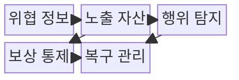
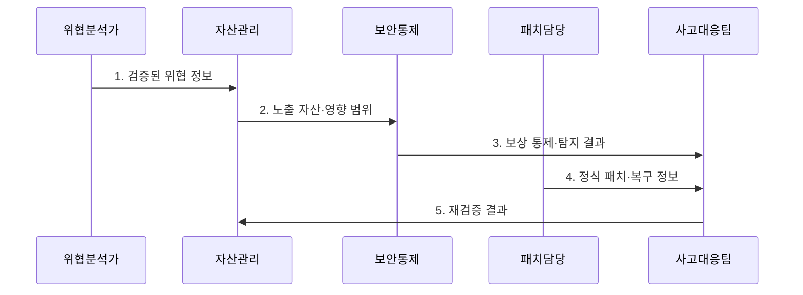

---
sidebar:
  order: 42
  label: "042. 제로데이 취약점·대응 체계 (Zero-Day Vulnerability)"
  badge:
    text: "기출 · 70%"
    variant: note
title: "제로데이 취약점·대응 체계 (Zero-Day Vulnerability)"
date: "2026-08-02T11:22:00+09:00"
tags:
  - "notes-security"
weight: 42
extra:
  question_no: "042"
  source_status: "기출"
  source_history: "134회"
  priority: 70
  priority_note: "134회 기출이며 미패치 기간 대응설계가 계속 유효함"
---

## Ⅰ. 개요

핵심 용어

- **제로데이 취약점**은 정식 패치나 충분한 방어 정보가 준비되기 전에 악용되는 취약점이다.

- 정의/개념: **제로데이 취약점**은 공급자의 정식 패치나 충분한 방어 수단이 준비되기 전에 공개되거나 공격에 악용되는 미해결 보안 결함
- 배경/필요성: 서명·패치 중심 통제에는 **대응 공백 발생**

#### 한줄 요약

- 패치가 나오기 전에는 공격 경로를 줄이면서 이미 침해됐는지 추적해야 한다.

## Ⅱ. 특징

핵심 용어

- **보상 통제**는 정식 패치 전 격리·기능 제한·탐지로 공격 경로를 임시 축소하는 통제다.
- **IoC**는 악성 파일·주소·행위처럼 침해 가능성을 나타내는 관측 정보다.

- 위협 징후 **IoC·외부 정보의 영향 범위 추정**
- 노출도·권한·악용의 **대응 우선순위화**
- 보상 통제·패치·조사의 **전주기 대응**

#### 한줄 요약

- 임시 차단은 시간을 벌 뿐이므로 패치와 침해 조사를 대신하지 못한다.

## Ⅲ. 구조 및 구성요소

핵심 용어

- **노출 자산**은 취약한 제품·버전과 외부 접근 경로를 가진 실제 시스템이다.
- **선행 침해 조사**는 패치 이전 로그와 행위를 분석해 이미 악용됐는지 확인한다.

| 구성요소 | 책임 |
|:---|:---|
| 위협 정보 | 권고 내용과 **징후 신뢰도** 판별 |
| 노출 자산 | 영향 **제품·버전·경로** 식별 |
| 행위 탐지 | 알려진 서명 외 **선행 침해** 추적 |
| 보상 통제 | 격리·기능 제한으로 **공격 경로** 축소 |
| 복구 관리 | **패치·자격 교체·재검증** 추적 |

#### 한줄 요약

- 위협 정보로 영향 자산을 찾고 임시 통제·패치·재검증을 연결한다.

## Ⅳ. 흐름도

핵심 용어

- **재검증**은 패치 뒤 우회 경로와 잔여 노출을 확인하고 임시 통제 회수 여부를 판단한다.

**동작 원리**

1. **검증된 위협 정보**: 권고·IoC·실제 악용 근거 제공
2. **노출 자산·영향 범위**: 영향 제품·버전·접근 경로 제공
3. **보상 통제·탐지 결과**: 경로 축소 상태와 과거 로그 조사 결과 전달
4. **정식 패치·복구 정보**: 결함 제거와 탈취 자격 재설정 결과 제공
5. **재검증 결과**: 우회 경로·잔여 노출 확인과 임시 통제 회수 판단

#### 한줄 요약

- 신호 신뢰도를 확인한 뒤 노출을 줄이고 패치 후 우회 경로를 재검증한다.

## Ⅴ. 종류 및 비교

핵심 용어

- **N-day 취약점**은 공개 권고와 패치가 존재하지만 아직 조치하지 않은 결함이다.
- **악용 확인 상태**는 실제 공격 사용 근거가 있어 침해 조사와 긴급 조치가 필요한 상태다.

| 취약점 상태 유형 | 제로데이 | N-day | 악용 확인 |
|:---|:---|:---|:---|
| 적용 기준 | **노출 확인** 시 | **미패치 상태** 시 | **침해 근거** 확인 시 |
| 핵심 특징 | **정보·패치 부족 결함** | **권고·패치 공개 결함** | 실제 공격 사용 확인 |
| 한계 | **공격 경로·영향 범위** 누락 | 공개 공격에 **지속 노출** | **선행 침해** 누락 |

#### 한줄 요약

- 공개·패치 여부와 실제 악용 여부에 따라 조사와 조치 순서가 달라진다.

## Ⅵ. 실무 고려사항 및 대책

핵심 용어

- **CISA KEV Catalog**는 실제 악용이 확인된 취약점의 우선 조치를 지원하는 공식 목록이다.
- **CISA**는 미국 사이버보안 및 인프라 보안국으로, KEV Catalog를 운영해 실제 악용 취약점의 우선 조치를 지원한다.
- **NIST SP 800-40 Rev. 4**는 위험 기반 전사 패치 관리와 예방적 유지보수를 제시한다.

| 문제 | 대책 | 효과 |
|:---|:---|:---|
| 실제 악용 여부를 모르면 긴급 자산 선정 지연 | **CISA KEV Catalog** 대조 | 악용 확인 자산의 **긴급 조치 우선순위** 확보 |
| 패치 공백 중 서비스 중단 우려로 조치 지연 | **NIST SP 800-40 Rev. 4** 적용 | 위험에 맞춘 **임시·정식 조치** 병행 |
| 선행 침해를 놓치면 패치 후 탈취 자격 악용 | **행위 탐지·자격 교체·재검증** 수행 | 잔존한 **공격 가능성** 축소 |

#### 한줄 요약

- 제로데이가 공개되면 영향 장비의 외부 접근을 제한하고 탐지 규칙을 적용하며, 패치 전 로그까지 조사해 이미 악용됐는지 확인한다.

## Ⅶ. 결론

핵심 용어

- **대응 우선순위**는 실제 악용 여부, 외부 노출, 자산 중요도와 공격 경로를 함께 평가해 정한다.

- 실제 악용·외부 노출이 확인된 자산부터 **보상 통제·침해 조사·패치** 우선 적용

#### 한줄 요약

- 제로데이는 임시 통제·침해 조사·패치·재검증을 함께 운영해야 한다.
