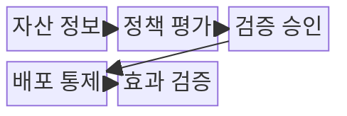
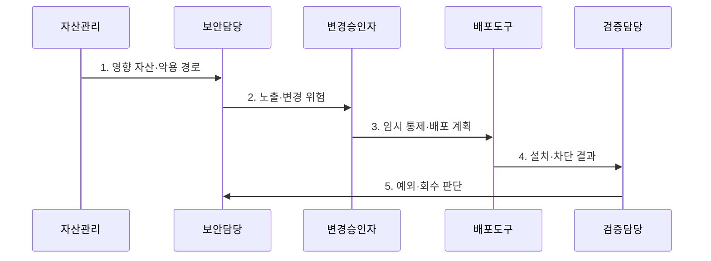

---
sidebar:
  order: 43
  label: "043. 패치 관리·가상 패치 (Patch Management Virtual Patching)"
  badge:
    text: "미출제 · 50%"
    variant: note
title: "패치 관리·가상 패치 (Patch Management Virtual Patching)"
date: "2026-07-31T11:16:39+09:00"
tags:
  - "notes-security"
weight: 43
extra:
  question_no: "043"
  source_status: "미출제"
  source_history: ""
  priority: 50
  priority_note: "패치·가상패치 선택과 검증 폐루프가 독립적임"
---

## 미리 알고가기

- **패치 관리(Patch Management)**: 취약점 수정본을 평가·시험·배포하고 적용 결과를 재검증하는 운영 체계이다.
- **가상 패치(Virtual Patching)**: 정식 패치를 적용하기 전까지 네트워크나 응용 계층에서 취약점의 공격 경로를 임시 차단하는 보상 통제이다.
- **핵심 판단**: 취약점의 악용 위험과 패치에 따른 운영 변경 위험을 함께 평가하여 적용 시점과 방식을 결정한다.
- **롤백(Rollback)**: 패치나 설정 변경으로 장애가 발생했을 때 이전의 정상 상태로 되돌리는 절차이다.
- **악용 가능성(Exploitability)**: 취약점이 실제 공격 조건에서 성공적으로 이용될 가능성이다.
- **NIST SP 800-40 Rev. 4**: 위험 기반 전사 패치 관리와 예방적 유지보수 계획을 제시한 공식 지침이다.
- **웹 응용 방화벽(Web Application Firewall, WAF)**: 웹 요청의 공격 패턴과 비정상 입력을 검사·차단하는 보안 장비이다.
## Ⅰ. 개요

- 정의/개념: 수정본을 평가·배포·검증하는 **변경 통제 체계**
- 배경/필요성: 즉시 패치는 **업무 중단·호환 위험** 동반

### 쉽게 이해하기 (학습용)

- 정식 수정이 늦으면 가상 패치로 시간을 벌되 만료와 회수를 관리한다.

## Ⅱ. 특징

- 정식 패치의 **결함 원인 제거**
- 가상 패치의 **공격 경로 임시 차단**
- 단계 배포·롤백·회수의 **변경 통제**

### 쉽게 이해하기 (학습용)

- 가상 패치는 정식 수정을 대신하지 못하므로 장기 방치하면 안 된다.

## Ⅲ. 구조 및 구성요소

| 구성요소 | 책임 |
|:---|:---|
| 자산 정보 | 영향 버전과 **노출 경로** 식별 |
| 정책 평가 | **악용 가능성·업무 영향·변경 위험** 분석 |
| 검증 승인 | 호환성·성능·재부팅·**롤백** 검증 |
| 배포 통제 | **시범·단계·긴급 배포**와 예외 관리 |
| 효과 검증 | 버전·차단 효과·**잔존 침해** 확인 |

### 쉽게 이해하기 (학습용)

- 자산·위험·변경 증거를 바탕으로 정식·임시 통제를 선택한다.

## Ⅳ. 흐름도

**동작 원리**

1. **영향 자산·악용 경로**: 버전·노출·악용 여부 제공
2. **노출·변경 위험**: 심각도·서비스 중단·호환성 분석 결과 전달
3. **임시 통제·배포 계획**: 가상 패치와 시범·확대 순서 지시
4. **설치·차단 결과**: 적용 버전과 공격 경로 재검증 결과 제공
5. **예외·회수 판단**: 미적용 사유·만료일과 임시 통제 회수 여부 전달

### 쉽게 이해하기 (학습용)

- 영향 자산을 찾고 임시 차단 뒤 단계 배포와 효과 검증을 수행한다.

## Ⅴ. 종류 및 비교

| 패치 대응 유형 | 정식 패치 | 구성 우회책 | 가상 패치 |
|:---|:---|:---|:---|
| 적용 기준 | **시험·배포 가능** | **기능 제한 수용** 가능 | 즉시 패치 곤란·**경로 식별** 가능 |
| 핵심 특징 | **취약 원인 제거** | **취약 기능 비활성화** | 악성 경로 임시 차단 |
| 한계 | 호환성·재부팅·**롤백 실패** | 업무 저하·**설정 회귀** | **차단 규칙 우회·오탐·장기화** |

### 쉽게 이해하기 (학습용)

- 원인 제거는 정식 패치, 빠른 경로 차단은 가상 패치가 담당한다.

## Ⅵ. 실무 고려사항 및 대책

| 고려사항 | 대책 | 효과 |
|:---|:---|:---|
| 자산 위험을 반영하지 않으면 중요 패치 지연 | **NIST SP 800-40 Rev. 4** 적용 | 전사 **책임·우선순위** 정렬 |
| 호환성 미검증 패치로 서비스 중단 | **시범 배포·롤백** 사전 검증 | 장애 범위와 **복구 시간** 축소 |
| 가상 패치를 방치하면 우회 노출·기술 부채 증가 | **WAF 가상 패치** 만료일·정식 패치·회수 추적 | 임시 통제의 **장기화 방지** |

### 쉽게 이해하기 (학습용)

- 즉시 패치할 수 없는 웹 서비스는 WAF 규칙으로 공격 요청을 임시 차단하고, 정식 패치가 검증되면 배포한 뒤 임시 규칙을 회수한다.

## Ⅶ. 결론

- 즉시 배포 가능하면 **정식 패치**, 변경 위험이 크면 **가상 패치 후 단계 배포** 선택

### 쉽게 이해하기 (학습용)

- 패치 관리는 정식 수정 확인 뒤 임시 통제를 안전하게 회수해야 한다.
