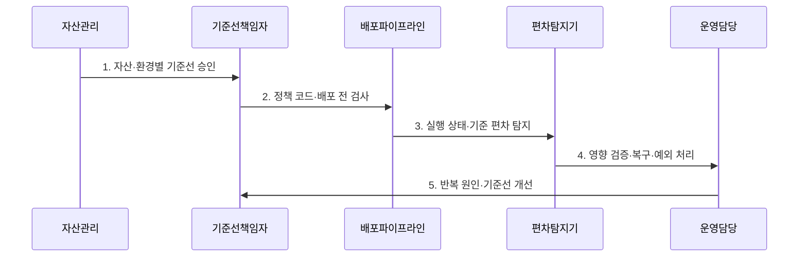

---
sidebar:
  order: 44
  label: "044. 보안 구성 관리 (Security Configuration Management)"
  badge:
    text: "미출제 · 50%"
    variant: note
title: "보안 구성 관리 (Security Configuration Management)"
date: "2026-07-25T21:44:00+09:00"
tags:
  - "notes-security"
weight: 44
extra:
  question_no: "044"
  source_status: "미출제"
  source_history: ""
  priority: 50
  priority_note: "안전 기준선·드리프트 관리는 여러 환경의 선행 통제임"
---

## 미리 알고가기

- **보안 구성 관리(Security Configuration Management)**: 서버·네트워크·애플리케이션의 설정을 승인된 보안 기준선에 맞게 유지하는 활동이다.
- **취약한 구성(Security Misconfiguration)**: 불필요한 포트, 기본 계정, 약한 암호처럼 공격 경로를 만드는 부적절한 설정이다.
- **핵심 판단**: 초기 하드닝에 그치지 않고 운영 중 발생하는 구성 편차를 지속해서 탐지하고 조치해야 한다.
- **보안 기준선(Security Baseline)**: 자산 유형·버전·환경별로 승인한 안전한 설정의 기준 상태이다.
- **구성 편차(Configuration Drift)**: 배포나 수동 변경으로 실제 설정이 승인된 보안 기준선과 달라진 상태이다.
- **하드닝(Hardening)**: 불필요한 기능·계정·포트를 제거하고 안전한 설정을 적용해 공격 표면을 줄이는 활동이다.
- **보상 통제(Compensating Control)**: 원래 통제를 적용할 수 없을 때 동등한 위험 감소 효과를 제공하는 대체 통제이다.
- **NIST SP 800-128**: 정보시스템의 보안 중심 구성 관리와 기준선·변경 통제를 제시한 공식 지침이다.
- **CIS Benchmarks**: 운영체제·클라우드·응용별 안전한 구성 권고를 제공하는 합의 기반 기준이다.

## Ⅰ. 개요

- 정의: 승인 기준선과 실제 설정의 **편차 통제**
- 기존 한계: 배포·수동 변경의 **구성 드리프트**

### 쉽게 이해하기 (학습용)

- 안전한 초기 설정뿐 아니라 운영 중 생기는 편차까지 계속 통제한다.

## Ⅱ. 특징

- 자산·버전·환경별 **보안 기준선**
- 배포 전 정책 검사와 **실행 중 편차 탐지**
- 예외·자동 복구·롤백의 **변경 통제**

### 쉽게 이해하기 (학습용)

- 예외에는 담당자·사유·보상 통제·만료일이 필요하다.

## Ⅲ. 구조 및 구성요소

| 구성요소 | 핵심 내용 |
|:---|:---|
| 자산 정보 | 자산 유형·버전·업무별 기준 연결 |
| 버전 기준 | 승인 설정과 변경 이력 관리 |
| 정책 검사 | 배포 전 위반 사항 판정 |
| 편차 탐지 | 운영 상태와 목표 상태 차이 식별 |
| 예외 복구 | 사유·만료·복구 영향 통제 |

### 쉽게 이해하기 (학습용)

- 승인 기준선과 실제 상태를 비교해 편차를 복구하거나 예외로 기록한다.

## Ⅳ. 흐름도

| 절차 | 설명 |
|:---|:---|
| 자산·환경별 기준선 승인 | 보안·가용성 요구를 버전화 |
| 정책 코드·배포 전 검사 | 위반 템플릿을 변경 전에 차단 |
| 실행 상태·기준 편차 탐지 | 수동·긴급 변경을 지속 확인 |
| 영향 검증·복구·예외 처리 | 롤백·보상 통제·만료일 관리 |
| 반복 원인·기준선 개선 | 운영 결과를 정책에 반영 |

> 요약: 기준선 승인 후 편차를 탐지·복구함

### 쉽게 이해하기 (학습용)

- 자산별 기준을 승인하고 배포 전 검사와 실행 중 탐지를 함께 운영한다.

## Ⅴ. 종류 및 비교

| 구성 점검 유형 | 정기 수동 점검 | 배포 전 정책 검사 | 실행 중 편차 탐지 |
|:---|:---|:---|:---|
| 적용 기준 | 자동 수집 곤란·현장 판단 | IaC·CI/CD 변경 | 수동·긴급 변경 탐지 |
| 핵심 특징 | **주기적 사람 점검** | **배포 전 정책 검사** | 운영 상태 지속 비교 |
| 한계 | 점검 사이 편차 누락 | 배포 외 변경 누락 | 오탐·자동 복구 장애 |

### 쉽게 이해하기 (학습용)

- 배포 검사는 사전 오류를, 실행 탐지는 수동·긴급 변경을 찾는다.

## Ⅵ. 실무 고려사항 및 대책

| 고려사항 | 대책 | 효과 |
|:---|:---|:---|
| 구성 관리 거버넌스 | **NIST SP 800-128 적용** | 기준선·변경 책임 정렬 |
| 안전 설정 품질 | **CIS Benchmarks 선별 적용** | 자산별 하드닝 일관성 확보 |
| 자동 복구 장애 | **영향 검증·예외·롤백 설계** | 서비스 중단·반복 편차 방지 |

### 쉽게 이해하기 (학습용)

- 기준 구성을 벗어나 공개로 변경된 저장소를 탐지하면 승인된 정책 코드로 비공개 상태를 복구하고 변경 이력을 감사한다.

## Ⅶ. 결론

- **자산유형·편차영향·복구위험**으로 구성 통제를 결정한다.

### 쉽게 이해하기 (학습용)

- 보안 구성 관리는 편차를 복구하고 승인 예외를 만료시켜야 한다.
