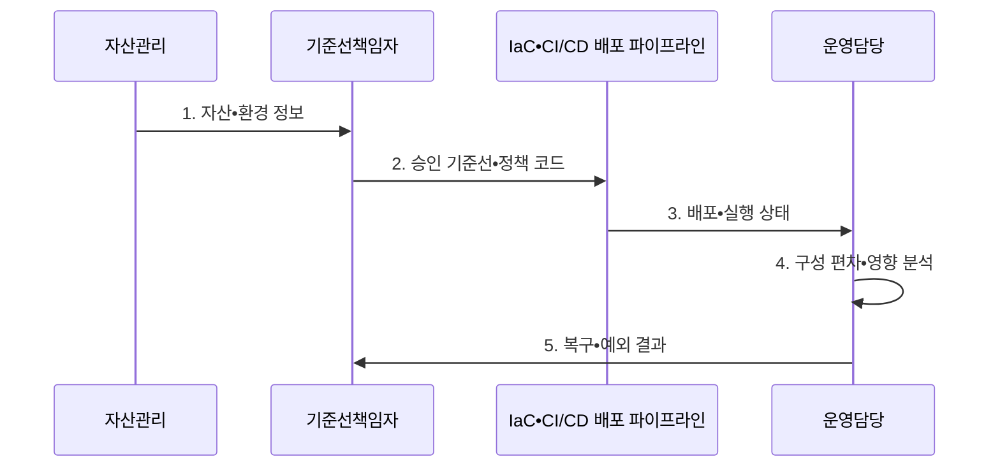

---
sidebar:
  order: 44
  label: "044. 보안 구성 관리 (Security Configuration Management)"
  badge:
    text: "미출제 • 50%"
    variant: note
title: "보안 구성 관리 (Security Configuration Management)"
date: "2026-08-03T08:48:47+09:00"
tags:
  - "notes-security"
weight: 44
extra:
  question_no: "044"
  source_status: "미출제"
  source_history: ""
  priority: 50
  priority_note: "안전 기준선•드리프트 관리는 여러 환경의 선행 통제임"
---

## Ⅰ. 개요

핵심 용어

- **보안 구성 관리** 는 서버•네트워크•애플리케이션 설정을 승인된 보안 기준선에 맞게 유지하는 활동이다.
- **구성 편차** 는 배포나 수동 변경으로 실제 설정이 승인 기준선과 달라진 상태다.

- 정의/개념: **보안 구성 관리** 는 시스템별 승인 기준선을 정의하고 실제 설정을 지속 비교•교정하여 구성 드리프트와 오설정을 통제하는 관리 체계
- 배경/필요성: 배포•수동 변경으로 **구성 편차(드리프트) 발생**

#### 한줄 요약

- 안전한 초기 설정뿐 아니라 운영 중 생기는 편차까지 계속 통제한다.

## Ⅱ. 특징

핵심 용어

- **보안 기준선** 은 자산 유형•버전•환경별로 승인한 안전한 설정 상태다.
- **보상 통제** 는 원래 통제를 적용할 수 없을 때 동등한 위험 감소 효과를 제공하는 대체 통제다.

- 자산•버전•환경별 **보안 기준선**
- 배포 전 정책 검사와 **실행 중 편차 탐지**
- 예외•자동 복구•롤백의 **변경 통제**

#### 한줄 요약

- 예외에는 담당자•사유•보상 통제•만료일이 필요하다.

## Ⅲ. 구조 및 구성요소

핵심 용어

- **정책 검사** 는 배포 전에 설정이 승인 기준을 위반하는지 판정한다.
- **편차 탐지** 는 운영 중 실제 상태와 목표 상태의 차이를 지속 식별한다.

| 구성요소 | 책임 |
|:---|:---|
| 자산 정보 | 자산 유형•버전•업무별 **기준 연결** |
| 버전 기준 | **승인 설정•변경 이력** 관리 |
| 정책 검사 | 배포 전 **위반 설정** 판정 |
| 편차 탐지 | 운영 상태와 목표 상태의 **차이 식별** |
| 예외 복구 | **사유•만료•복구 영향** 통제 |

#### 한줄 요약

- 승인 기준선과 실제 상태를 비교해 편차를 복구하거나 예외로 기록한다.

## Ⅳ. 흐름도

핵심 용어

- **IaC** 는 인프라 구성을 코드로 선언•버전 관리하고, **CI/CD** 는 변경 통합•검증•배포를 자동화한다.
- **롤백** 은 설정 변경 장애 때 이전 정상 상태로 되돌리는 절차다.

**동작 원리**

1. **자산•환경 정보**: 자산 유형•버전•업무 중요도 제공
2. **승인 기준선•정책 코드**: 보안•가용성 요구와 배포 전 검사 규칙 제공
3. **배포•실행 상태**: 변경된 설정과 현재 운영 상태 제공
4. **구성 편차•영향 분석**: 기준선 차이와 자동 복구 영향 확인
5. **복구•예외 결과**: 롤백•보상 통제•만료일과 반복 원인 제공

#### 한줄 요약

- 자산별 기준을 승인하고 배포 전 검사와 실행 중 탐지를 함께 운영한다.

## Ⅴ. 종류 및 비교

핵심 용어

- **정기 수동•배포 전•실행 중 점검** 은 각각 현장 판단, 사전 정책 위반, 운영 중 긴급•수동 변경 탐지에 적합하다.

| 구성 점검 유형 | 정기 수동 점검 | 배포 전 정책 검사 | 실행 중 편차 탐지 |
|:---|:---|:---|:---|
| 적용 기준 | 자동 수집 곤란•**현장 판단** | **IaC•CI/CD 변경** | 수동•긴급 **변경 탐지** |
| 핵심 특징 | **주기적 사람 점검** | **배포 전 정책 검사** | 운영 상태 지속 비교 |
| 한계 | 점검 사이 **편차 누락** | 배포 외 **변경 누락** | 오탐•**자동 복구 장애** |

#### 한줄 요약

- 배포 검사는 사전 오류를, 실행 탐지는 수동•긴급 변경을 찾는다.

## Ⅵ. 실무 고려사항 및 대책

핵심 용어

- **NIST SP 800-128** 은 보안 중심 구성 관리와 기준선•변경 통제를 제시한다.
- **CIS Benchmarks** 는 운영체제•클라우드•응용별 합의 기반 안전 구성 권고다.
- **CIS** 는 인터넷 보안 센터로, 자산 유형별 합의 기반 하드닝 지침인 CIS Benchmarks를 제공한다.

| 문제 | 대책 | 효과 |
|:---|:---|:---|
| 기준선 승인 책임이 없으면 환경별 설정 충돌 | **NIST SP 800-128** 적용 | 기준선•변경의 **책임 정렬** |
| 획일적 권고 적용으로 업무 기능 장애 | **CIS Benchmarks** 를 자산별 선별 적용 | 하드닝의 **일관성•호환성** 확보 |
| 자동 복구가 정상 변경까지 되돌리면 서비스 중단 | **영향 검증•예외•롤백** 설계 | 서비스 중단과 **반복 편차** 방지 |

#### 한줄 요약

- 기준 구성을 벗어나 공개로 변경된 저장소를 탐지하면 승인된 정책 코드로 비공개 상태를 복구하고 변경 이력을 감사한다.

## Ⅶ. 결론

핵심 용어

- **예외 만료 관리** 는 담당자•사유•보상 통제•만료일을 기록하고 기한 뒤 기준선 복귀 여부를 확인한다.
- **자동 복구•승인 예외 선택** 은 편차의 업무 영향과 복구 위험을 비교해 즉시 기준선으로 되돌릴지 기한부 보상 통제를 허용할지 정하는 판단이다.

- 저위험 편차는 **자동 복구**, 업무 영향이 크면 **승인 예외•만료 관리** 선택

#### 한줄 요약

- 보안 구성 관리는 편차를 복구하고 승인 예외를 만료시켜야 한다.
