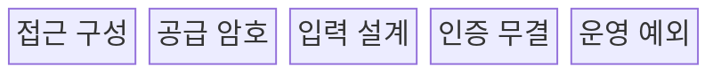
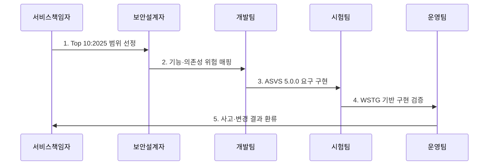

---
sidebar:
  order: 45
  label: "045. OWASP Top 10 (OWASP Top 10)"
  badge:
    text: "기출 · 70%"
    variant: note
title: "OWASP Top 10 (OWASP Top 10)"
date: "2026-07-27T23:59:59+09:00"
tags:
  - "notes-security"
weight: 45
extra:
  question_no: "045"
  source_status: "기출"
  source_history: "120회, 129회"
  priority: 70
  priority_note: "120·129회 반복된 웹 위험 분류의 우산 주제임"
---

## 미리 알고가기

- **OWASP(Open Worldwide Application Security Project)**: 애플리케이션 보안 지침과 시험 도구를 공개하여 안전한 개발을 지원하는 비영리 프로젝트이다.
- **OWASP Top 10:2025**: 가장 중요한 웹 애플리케이션 위험 범주 10개를 제시하는 최신 인식 자료이다.
- **OWASP Application Security Verification Standard(ASVS) 5.0.0**: 애플리케이션 보안 요구사항과 검증 수준을 제시하는 최신 안정 표준이다.
- **OWASP Web Security Testing Guide(WSTG)**: 웹 보안 시험 항목과 절차를 제시하는 공식 지침이다.
- **XML 외부 엔터티(XML External Entity, XXE)**: XML 외부 엔터티로 파일 읽기·내부 요청을 유도하는 공격이다.
- **서버 측 요청 위조(Server-Side Request Forgery, SSRF)**: 서버가 공격자 지정 주소로 요청하게 만드는 공격이다.
- **소프트웨어 개발 생명주기(Software Development Life Cycle, SDLC)**: 요구·설계·개발·시험·배포·운영의 소프트웨어 생명주기이다.
- **핵심 판단**: Top 10은 위험 인식 자료이며 검증 표준이나 준수 인증이 아니다.

## Ⅰ. 개요

- 정의: 주요 웹 애플리케이션의 **위험 범주**
- 기존 한계: 개별 취약점의 **우선순위 공유 곤란**

### 쉽게 이해하기 (학습용)

- 반복되는 웹 위험을 공통 언어로 묶어 보안 요구와 시험으로 연결한다.

## Ⅱ. 특징

- 원인·영향 중심의 **웹 위험 공통 분류**
- 자료·전문가 검토 기반 **주기적 갱신**
- ASVS·WSTG 연결의 **요구·시험 구체화**

### 쉽게 이해하기 (학습용)

- 위험 목록을 ASVS 요구와 WSTG 시험으로 구체화해야 한다.

## Ⅲ. 구조 및 구성요소

| 설계 요소 | 핵심 내용 |
|:---|:---|
| 접근 구성 | A01 접근 통제·A02 구성 오류 |
| 공급 암호 | A03 공급망 실패·A04 암호화 실패 |
| 입력 설계 | A05 인젝션·A06 불안전한 설계 |
| 인증 무결 | A07 인증 실패·A08 무결성 실패 |
| 운영 예외 | A09 로깅/경보·A10 예외 처리 |

### 쉽게 이해하기 (학습용)

- Top 10 위험을 ASVS 통제와 WSTG 시험에 연결해 수명주기에 반영한다.

## Ⅳ. 흐름도

| 절차 | 설명 |
|:---|:---|
| Top 10:2025 범위 선정 | 적용 판·서비스 경계를 정의 |
| 기능·의존성 위험 매핑 | 공격 경로를 범주에 연결 |
| ASVS 5.0.0 요구 구현 | 검증 수준·통제 항목을 개발 |
| WSTG 기반 구현 검증 | 설계·코드·동적 시험 수행 |
| 사고·변경 결과 환류 | 운영 근거로 요구를 개선 |

> 요약: 위험 매핑 기반의 검증과 운영 환류

### 쉽게 이해하기 (학습용)

- 적용 판과 범위를 정한 뒤 위험별 요구·시험·운영 지표를 연결한다.

## Ⅴ. 종류 및 비교

| OWASP 활용 유형 | Top 10 | ASVS | WSTG |
|:---|:---|:---|:---|
| 적용 기준 | 주요 웹 위험을 인식할 때 | 보안 요구사항·수준을 정할 때 | 웹 보안 시험 절차가 필요할 때 |
| 핵심 특징 | **주요 웹 위험 범주** | **보안 요구·검증 수준** | 웹 시험 방법·절차 |
| 한계 | 체크리스트·준수 인증으로 오용 | 범위·수준의 과도한 적용 | 원인 수정 없이 시험만 수행 |

### 쉽게 이해하기 (학습용)

- Top 10은 위험 인식, ASVS는 요구, WSTG는 시험에 사용한다.

## Ⅵ. 실무 고려사항 및 대책

| 고려사항 | 대책 | 효과 |
|:---|:---|:---|
| 최신 위험 분류 | **OWASP Top 10:2025 적용** | 공급망·예외 처리 위험 반영 |
| 체크리스트 오용 | **OWASP ASVS 5.0.0 구체화** | 검증 가능한 요구사항 확보 |
| 시험 근거 부족 | **OWASP WSTG 절차 연계** | 재현 가능한 검증 수행 |

### 쉽게 이해하기 (학습용)

- 로그인한 사용자가 거래번호를 바꿔 다른 고객의 내역을 조회하지 못하도록 서버가 요청마다 객체 소유권을 검증한다.

## Ⅶ. 결론

- **서비스위험·검증수준·시험근거**로 OWASP 자료를 선택한다.

### 쉽게 이해하기 (학습용)

- Top 10은 체크리스트가 아니라 요구와 시험을 정하는 출발점이다.
