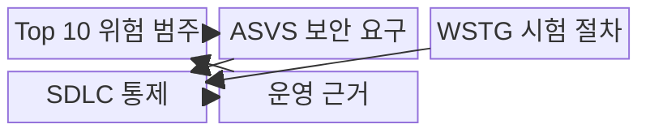
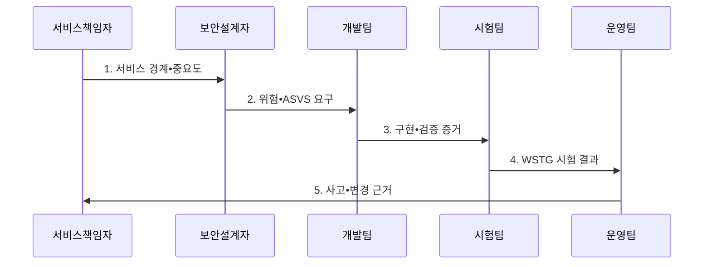

---
sidebar:
  order: 45
  label: "045. OWASP Top 10 (OWASP Top 10)"
  badge:
    text: "기출 • 70%"
    variant: note
title: "OWASP Top 10 (OWASP Top 10)"
date: "2026-08-03T08:48:47+09:00"
tags:
  - "notes-security"
weight: 45
extra:
  question_no: "045"
  source_status: "기출"
  source_history: "120회, 129회"
  priority: 70
  priority_note: "120•129회 반복된 웹 위험 분류의 우산 주제임"
---

## Ⅰ. 개요

핵심 용어

- **OWASP Top 10** 은 가장 중요한 웹 애플리케이션 위험 범주 10개를 제시하는 위험 인식 자료다.
- **OWASP** 는 애플리케이션 보안 지침과 시험 도구를 공개하는 비영리 프로젝트다.

- 정의/개념: **OWASP Top 10** 은 웹 애플리케이션에서 널리 발생하고 영향이 큰 보안 위험을 범주별 원인•공격•대책과 함께 정리한 인식•우선순위 분류 체계
- 배경/필요성: 개별 취약점만으로는 **우선순위 공유 곤란**

#### 한줄 요약

- 반복되는 웹 위험을 공통 언어로 묶어 보안 요구와 시험으로 연결한다.

## Ⅱ. 특징

핵심 용어

- **위험 인식 자료** 는 우선 위험을 공통 언어로 제시하지만 검증 표준이나 준수 인증 자체는 아니다.
- **주기적 갱신** 은 자료와 전문가 검토를 반영해 변화한 웹 공격 위험을 다시 분류한다.
- **ASVS•WSTG 연계** 는 위험 범주를 검증 가능한 보안 요구와 재현 가능한 웹 시험 절차로 구체화한다.

- 원인•영향 중심의 **웹 위험 공통 분류**
- 자료•전문가 검토 기반 **주기적 갱신**
- ASVS•WSTG 연결의 **요구•시험 구체화**

#### 한줄 요약

- 위험 목록을 ASVS 요구와 WSTG 시험으로 구체화해야 한다.

## Ⅲ. 구조 및 구성요소

핵심 용어

- **ASVS** 는 애플리케이션 보안 요구사항과 검증 수준을, **WSTG** 는 웹 보안 시험 항목과 절차를 제시한다.
- **SDLC** 는 요구•설계•개발•시험•배포•운영의 소프트웨어 생명주기다.

| 구성요소 | 책임 |
|:---|:---|
| Top 10 위험 범주 | 주요 웹 위험의 **공통 분류** |
| ASVS 보안 요구 | 위험별 **검증 요구•수준** 정의 |
| WSTG 시험 절차 | 요구별 **웹 보안 시험** 제공 |
| SDLC 통제 | 요구•설계•개발•시험에 **통제 반영** |
| 운영 근거 | 사고•변경 결과로 **위험 판단** 보완 |

#### 한줄 요약

- Top 10 위험을 ASVS 통제와 WSTG 시험에 연결해 수명주기에 반영한다.

## Ⅳ. 흐름도

핵심 용어

- **검증 증거** 는 보안 요구의 구현 결과와 설계•코드•동적 시험의 재현 가능한 기록이다.

**동작 원리**

1. **서비스 경계•중요도**: Top 10 적용 범위와 보호 수준 제공
2. **위험•ASVS 요구**: 기능•의존성의 공격 경로와 검증 요구 전달
3. **구현•검증 증거**: 통제 구현 결과와 시험 가능한 근거 제공
4. **WSTG 시험 결과**: 설계•코드•동적 시험의 재현 결과 전달
5. **사고•변경 근거**: 운영 중 발견한 위험과 요구 개선 근거 제공

#### 한줄 요약

- 적용 대상과 범위를 정한 뒤 위험별 요구•시험•운영 지표를 연결한다.

## Ⅴ. 종류 및 비교

핵심 용어

- **오픈 월드와이드 애플리케이션 보안 프로젝트 상위 10대 위험(Open Worldwide Application Security Project Top 10, OWASP Top 10)**: 주요 웹 위험을 인식하는 자료이다.
- **애플리케이션 보안 검증 표준(Application Security Verification Standard, ASVS)**: 보안 요구사항과 검증 수준을 정의한다.
- **웹 보안 시험 지침(Web Security Testing Guide, WSTG)**: 웹 보안 시험 방법과 절차를 제공한다.

| 오픈 월드와이드 애플리케이션 보안 프로젝트 자료 | 담당 역할 | 활용 산출물 |
|:---|:---|:---|
| **오픈 월드와이드 애플리케이션 보안 프로젝트 상위 10대 위험(Open Worldwide Application Security Project Top 10, OWASP Top 10)** | **주요 웹 위험 인식** | 교육•위험 논의의 공통 범주 |
| **애플리케이션 보안 검증 표준(Application Security Verification Standard, ASVS)** | **보안 요구사항•검증 수준 정의** | 설계•개발•검수 요구 기준 |
| **웹 보안 시험 지침(Web Security Testing Guide, WSTG)** | **웹 보안 시험 절차 제공** | 시험 시나리오•점검 절차 |

#### 한줄 요약

- Top 10은 위험 인식, ASVS는 요구, WSTG는 시험에 사용한다.

## Ⅵ. 실무 고려사항 및 대책

핵심 용어

- **OWASP Top 10:2025** 는 최신 웹 위험 범주, **ASVS 5.0.0** 은 수준별 검증 요구, **WSTG** 는 재현 가능한 시험 절차를 제공한다.

| 문제 | 대책 | 효과 |
|:---|:---|:---|
| 오래된 분류를 쓰면 새 공격 경로의 우선순위 누락 | **OWASP Top 10:2025** 적용 | 최신 **웹 위험 범주** 반영 |
| Top 10만 점검하면 검증 가능한 통제 요구 부재 | **OWASP ASVS 5.0.0** 으로 구체화 | 수준별 **보안 요구사항** 확보 |
| 자체 시험만 수행하면 범위•재현 절차 불일치 | **OWASP WSTG** 절차 연계 | 일관되고 **재현 가능한 검증** 수행 |

#### 한줄 요약

- 로그인한 사용자가 거래번호를 바꿔 다른 고객의 내역을 조회하지 못하도록 서버가 요청마다 객체 소유권을 검증한다.

## Ⅶ. 결론

핵심 용어

- **활용 원칙** 은 Top 10을 체크리스트로 끝내지 않고 ASVS 요구와 WSTG 시험으로 구체화하는 것이다.
- **Top 10•ASVS•WSTG 선택** 은 각각 위험 인식, 요구사항•수준 정의, 웹 보안 시험 절차라는 역할에 맞춰 적용하는 판단이다.

- 위험 인식은 **Top 10**, 요구 정의는 **ASVS**, 시험 절차는 **WSTG** 선택

#### 한줄 요약

- Top 10은 체크리스트가 아니라 요구와 시험을 정하는 출발점이다.
