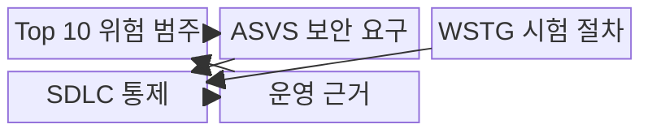
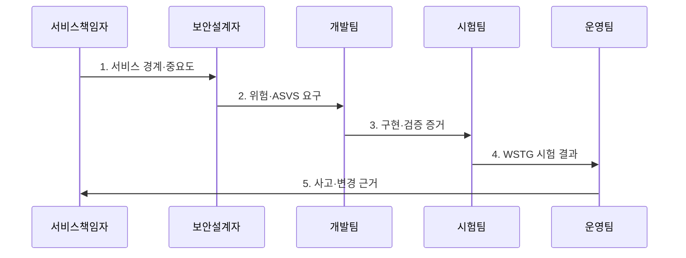

---
sidebar:
  order: 45
  label: "045. OWASP Top 10 (OWASP Top 10)"
  badge:
    text: "기출 · 70%"
    variant: note
title: "OWASP Top 10 (OWASP Top 10)"
date: "2026-07-31T11:17:32+09:00"
tags:
  - "notes-security"
weight: 45
extra:
  question_no: "045"
  source_status: "기출"
  source_history: "120회, 129회"
  priority: 70
  priority_note: "120·129회 반복된 웹 위험 분류의 우산 주제임"
---

## 미리 알고가기

- **OWASP(Open Worldwide Application Security Project)**: 애플리케이션 보안 지침과 시험 도구를 공개하여 안전한 개발을 지원하는 비영리 프로젝트이다.
- **OWASP Top 10:2025**: 가장 중요한 웹 애플리케이션 위험 범주 10개를 제시하는 최신 인식 자료이다.
- **OWASP Application Security Verification Standard(ASVS) 5.0.0**: 애플리케이션 보안 요구사항과 검증 수준을 제시하는 최신 안정 표준이다.
- **OWASP Web Security Testing Guide(WSTG)**: 웹 보안 시험 항목과 절차를 제시하는 공식 지침이다.
- **소프트웨어 개발 생명주기(Software Development Life Cycle, SDLC)**: 요구·설계·개발·시험·배포·운영의 소프트웨어 생명주기이다.
- **핵심 판단**: Top 10은 위험 인식 자료이며 검증 표준이나 준수 인증이 아니다.

> **키워드:** OWASP Top 10 (OWASP Top 10)

## Ⅰ. 개요

- 정의/개념: 주요 웹 애플리케이션 위험을 묶은 **분류 체계**
- 배경/필요성: 개별 취약점만으로는 **우선순위 공유 곤란**

### 쉽게 이해하기 (학습용)

- 반복되는 웹 위험을 공통 언어로 묶어 보안 요구와 시험으로 연결한다.

## Ⅱ. 특징

- 원인·영향 중심의 **웹 위험 공통 분류**
- 자료·전문가 검토 기반 **주기적 갱신**
- ASVS·WSTG 연결의 **요구·시험 구체화**

### 쉽게 이해하기 (학습용)

- 위험 목록을 ASVS 요구와 WSTG 시험으로 구체화해야 한다.

## Ⅲ. 구조 및 구성요소

| 구성요소 | 책임 |
|:---|:---|
| Top 10 위험 범주 | 주요 웹 위험의 **공통 분류** |
| ASVS 보안 요구 | 위험별 **검증 요구·수준** 정의 |
| WSTG 시험 절차 | 요구별 **웹 보안 시험** 제공 |
| SDLC 통제 | 요구·설계·개발·시험에 **통제 반영** |
| 운영 근거 | 사고·변경 결과로 **위험 판단** 보완 |

### 쉽게 이해하기 (학습용)

- Top 10 위험을 ASVS 통제와 WSTG 시험에 연결해 수명주기에 반영한다.

## Ⅳ. 흐름도

**동작 원리**

1. **서비스 경계·중요도**: Top 10 적용 범위와 보호 수준 제공
2. **위험·ASVS 요구**: 기능·의존성의 공격 경로와 검증 요구 전달
3. **구현·검증 증거**: 통제 구현 결과와 시험 가능한 근거 제공
4. **WSTG 시험 결과**: 설계·코드·동적 시험의 재현 결과 전달
5. **사고·변경 근거**: 운영 중 발견한 위험과 요구 개선 근거 제공

### 쉽게 이해하기 (학습용)

- 적용 대상과 범위를 정한 뒤 위험별 요구·시험·운영 지표를 연결한다.

## Ⅴ. 종류 및 비교

| OWASP 활용 유형 | Top 10 | ASVS | WSTG |
|:---|:---|:---|:---|
| 적용 기준 | 주요 **웹 위험 인식** | 보안 **요구사항·수준** 정의 | 웹 **보안 시험 절차** 필요 |
| 핵심 특징 | **주요 웹 위험 범주** | **보안 요구·검증 수준** | 웹 시험 방법·절차 |
| 한계 | **체크리스트·준수 인증**으로 오용 | 범위·수준의 **과도한 적용** | 원인 수정 없이 **시험만 수행** |

### 쉽게 이해하기 (학습용)

- Top 10은 위험 인식, ASVS는 요구, WSTG는 시험에 사용한다.

## Ⅵ. 실무 고려사항 및 대책

| 고려사항 | 대책 | 효과 |
|:---|:---|:---|
| 오래된 분류를 쓰면 새 공격 경로의 우선순위 누락 | **OWASP Top 10:2025** 적용 | 최신 **웹 위험 범주** 반영 |
| Top 10만 점검하면 검증 가능한 통제 요구 부재 | **OWASP ASVS 5.0.0**으로 구체화 | 수준별 **보안 요구사항** 확보 |
| 자체 시험만 수행하면 범위·재현 절차 불일치 | **OWASP WSTG** 절차 연계 | 일관되고 **재현 가능한 검증** 수행 |

### 쉽게 이해하기 (학습용)

- 로그인한 사용자가 거래번호를 바꿔 다른 고객의 내역을 조회하지 못하도록 서버가 요청마다 객체 소유권을 검증한다.

## Ⅶ. 결론

- 위험 인식은 **Top 10**, 요구 정의는 **ASVS**, 시험 절차는 WSTG 선택

### 쉽게 이해하기 (학습용)

- Top 10은 체크리스트가 아니라 요구와 시험을 정하는 출발점이다.
