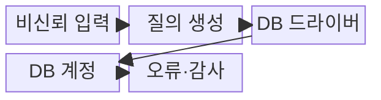
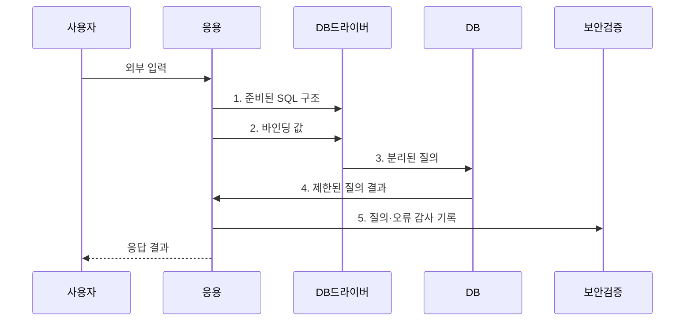

---
sidebar:
  order: 46
  label: "046. SQL 인젝션 (SQL Injection)"
  badge:
    text: "기출 · 50%"
    variant: note
title: "SQL 인젝션 (SQL Injection)"
date: "2026-07-31T11:18:49+09:00"
tags:
  - "notes-security"
weight: 46
extra:
  question_no: "046"
  source_status: "기출"
  source_history: "120회, 123회"
  priority: 50
  priority_note: "120·123회 반복된 입력·쿼리 경계 핵심 공격임"
---

## 미리 알고가기

- **구조화 질의 언어(Structured Query Language, SQL)**: 관계형 데이터베이스의 데이터를 조회·변경하는 질의 언어이다.
- **SQL 인젝션(SQL Injection)**: 외부 입력이 값이 아닌 SQL 명령 구조로 해석돼 질의 의미를 바꾸는 취약점이다.
- **준비된 질의(Prepared Statement)**: SQL 구조를 먼저 고정하고 외부 입력을 별도 매개변수 값으로 전달하는 방식이다.
- **값 바인딩**: 외부 입력을 SQL 구문이 아닌 매개변수 값으로 결합하는 처리이다.
- **인밴드(In-band)**: 공격 결과가 원래 웹 응답으로 직접 돌아오는 방식이다.
- **블라인드(Blind)**: 참·거짓이나 응답 시간 차이로 결과를 추론하는 방식이다.
- **아웃오브밴드(Out-of-band)**: DNS·HTTP 등 별도 통신 경로로 결과를 유출하는 방식이다.
- **MITRE CWE-89**: SQL 명령 구조에 사용된 특수 요소의 부적절한 중화를 정의한 공식 약점 식별자이다.
- **OWASP ASVS 5.0.0**: 입력 처리·인젝션 방지 요구사항을 검증 가능한 형태로 제시하는 공식 표준이다.

> **키워드:** SQL 인젝션 (SQL Injection)

## Ⅰ. 개요

- 정의/개념: 입력이 SQL 구조를 바꾸는 **주입 취약점**
- 배경/필요성: 문자열 결합은 **SQL 구조·값 분리 불가**

### 쉽게 이해하기 (학습용)

- 입력을 값이 아닌 SQL 구문으로 해석하면 질의와 권한이 공격자에게 바뀐다.

## Ⅱ. 특징

- 문자열 결합 입력의 **구문 경계 변조**
- 응답·오류·시간차의 **데이터 추론**
- 준비된 질의·최소 권한의 **예방·영향 제한**

### 쉽게 이해하기 (학습용)

- 값 바인딩은 구조를 고정하며 WAF와 이스케이프는 보조 통제이다.

## Ⅲ. 구조 및 구성요소

| 구성요소 | 책임 |
|:---|:---|
| 비신뢰 입력 | 폼·API·저장 데이터에서 **외부 값** 유입 |
| 질의 생성 | 입력값과 **SQL 구조** 분리 |
| DB 드라이버 | 값 바인딩으로 **입력 경계** 고정 |
| DB 계정 | 허용 스키마로 **피해 범위** 제한 |
| 오류·감사 | **이상 질의 추적·오류 노출** 차단 |

### 쉽게 이해하기 (학습용)

- 준비된 질의와 최소 권한이 주입 가능성과 피해 범위를 각각 줄인다.

## Ⅳ. 흐름도

**동작 원리**

1. **준비된 SQL 구조**: 실행할 명령 형식과 매개변수 위치 고정
2. **바인딩 값**: 외부 입력을 명령이 아닌 매개변수 값으로 전달
3. **분리된 질의**: 허용목록 식별자와 바인딩 값을 데이터베이스에 전송
4. **제한된 질의 결과**: 최소 권한 계정으로 허용된 데이터만 반환
5. **질의·오류 감사 기록**: 이상 질의와 오류 노출 여부를 검증 자료로 제공

### 쉽게 이해하기 (학습용)

- 입력부터 실행점까지 추적해 값은 바인딩하고 식별자는 허용목록으로 제한한다.

## Ⅴ. 종류 및 비교

| SQL 인젝션 유형 | 인밴드 | 블라인드 | 아웃오브밴드 |
|:---|:---|:---|:---|
| 적용 기준 | 결과가 **직접 노출**될 때 | 응답 차이를 **관찰 가능**할 때 | **외부 통신**이 가능할 때 |
| 핵심 특징 | **동일 응답 결과 노출** | **응답 차이 결과 추론** | 별도 통신 경로 유출 |
| 한계 | **대량 데이터** 즉시 유출 | 느리지만 **응답만으로 추론** | 내부 DB에 **별도 외부 통신 경로** 필요 |

### 쉽게 이해하기 (학습용)

- 결과가 돌아오는 경로에 따라 인밴드·블라인드·외부 경로로 나뉜다.

## Ⅵ. 실무 고려사항 및 대책

| 고려사항 | 대책 | 효과 |
|:---|:---|:---|
| SQL 구조와 입력을 결합하면 명령 경계 변조 | **MITRE CWE-89** 기준으로 문자열 결합 제거 | 입력의 **명령 구조 변조** 차단 |
| 입력 처리 요구가 없으면 구현별 방어 편차 | **OWASP ASVS 5.0.0** 적용 | 개발·검증의 **요구 일관성** 확보 |
| 동적 식별자는 값 바인딩이 안 되고 과도한 DB 권한은 피해 확대 | **허용목록·최소 권한** 적용 | 식별자 주입 가능성과 **침해 영향** 제한 |

### 쉽게 이해하기 (학습용)

- 사용자 입력을 SQL 문자열에 이어 붙이지 않고 준비된 문장의 값으로 전달해 입력이 명령 구문으로 실행되지 않게 한다.

## Ⅶ. 결론

- 값은 **준비된 질의로 바인딩**, 식별자는 **허용목록**, DB 계정은 최소 권한 적용

### 쉽게 이해하기 (학습용)

- SQL 구조와 값을 분리하고 DB 최소 권한으로 피해 범위를 줄인다.
