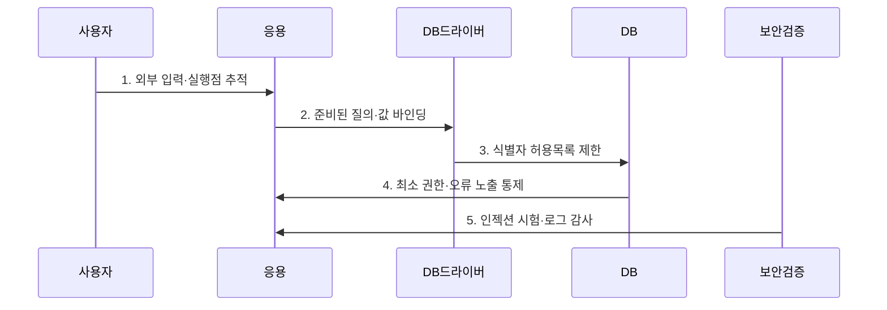

---
sidebar:
  order: 46
  label: "046. SQL 인젝션 (SQL Injection)"
  badge:
    text: "기출 · 50%"
    variant: note
title: "SQL 인젝션 (SQL Injection)"
date: "2026-07-27T23:59:59+09:00"
tags:
  - "notes-security"
weight: 46
extra:
  question_no: "046"
  source_status: "기출"
  source_history: "120회, 123회"
  priority: 50
  priority_note: "120·123회 반복된 입력·쿼리 경계 핵심 공격임"
---

## 미리 알고가기

- **구조화 질의 언어(Structured Query Language, SQL)**: 관계형 데이터베이스의 데이터를 조회·변경하는 질의 언어이다.
- **SQL 인젝션(SQL Injection)**: 외부 입력이 값이 아닌 SQL 명령 구조로 해석돼 질의 의미를 바꾸는 취약점이다.
- **준비된 질의(Prepared Statement)**: SQL 구조를 먼저 고정하고 외부 입력을 별도 매개변수 값으로 전달하는 방식이다.
- **값 바인딩**: 외부 입력을 SQL 구문이 아닌 매개변수 값으로 결합하는 처리이다.
- **객체 관계 매핑(Object-Relational Mapping, ORM)**: 객체와 데이터베이스 테이블·질의를 연결하는 기술이며 문자열 결합 시 주입을 자동 방지하지 못한다.
- **인밴드(In-band)**: 공격 결과가 원래 웹 응답으로 직접 돌아오는 방식이다.
- **블라인드(Blind)**: 참·거짓이나 응답 시간 차이로 결과를 추론하는 방식이다.
- **아웃오브밴드(Out-of-band)**: DNS·HTTP 등 별도 통신 경로로 결과를 유출하는 방식이다.
- **웹 응용 방화벽(Web Application Firewall, WAF)**: 웹 요청의 공격 패턴을 검사·차단하는 보조 통제이다.
- **MITRE CWE-89**: SQL 명령 구조에 사용된 특수 요소의 부적절한 중화를 정의한 공식 약점 식별자이다.
- **OWASP ASVS 5.0.0**: 입력 처리·인젝션 방지 요구사항을 검증 가능한 형태로 제시하는 공식 표준이다.

## Ⅰ. 개요

- 정의: 입력이 SQL 구조를 바꾸는 **주입 취약점**
- 기존 한계: 문자열 결합의 **구조·값 미분리**

### 쉽게 이해하기 (학습용)

- 입력을 값이 아닌 SQL 구문으로 해석하면 질의와 권한이 공격자에게 바뀐다.

## Ⅱ. 특징

- 문자열 결합 입력의 **구문 경계 변조**
- 응답·오류·시간차의 **데이터 추론**
- 준비된 질의·최소 권한의 **예방·영향 제한**

### 쉽게 이해하기 (학습용)

- 값 바인딩은 구조를 고정하며 WAF와 이스케이프는 보조 통제이다.

## Ⅲ. 구조 및 구성요소

| 설계 요소 | 설명 |
|:---|:---|
| 비신뢰 입력 | 폼·API·저장 데이터에서 유입 |
| 질의 생성 | 문자열 결합이 SQL 구조 오염 |
| DB 드라이버 | 값 바인딩으로 입력 경계 고정 |
| DB 계정 | 허용 스키마로 피해 범위 제한 |
| 오류·감사 | 이상 질의 추적 및 노출 차단 |

### 쉽게 이해하기 (학습용)

- 준비된 질의와 최소 권한이 주입 가능성과 피해 범위를 각각 줄인다.

## Ⅳ. 흐름도

| 절차 | 설명 |
|:---|:---|
| 외부 입력·실행점 추적 | 폼·API·저장값 흐름 확인 |
| 준비된 질의·값 바인딩 | SQL 구조와 입력값 분리 |
| 식별자 허용목록 제한 | 테이블·열 이름을 매핑 |
| 최소 권한·오류 노출 통제 | 스키마 권한·응답을 제한 |
| 인젝션 시험·로그 감사 | 우회 입력·이상 질의 검증 |

> 요약: 입력 추적 후 파라미터 분리 및 권한 제한함

### 쉽게 이해하기 (학습용)

- 입력부터 실행점까지 추적해 값은 바인딩하고 식별자는 허용목록으로 제한한다.

## Ⅴ. 종류 및 비교

| SQL 인젝션 유형 | 인밴드 | 블라인드 | 아웃오브밴드 |
|:---|:---|:---|:---|
| 적용 기준 | 결과가 노출될 때 | 결과를 관찰할 때 | 외부 통신 가능시 |
| 핵심 특징 | **동일 응답 결과 노출** | **응답 차이 결과 추론** | 별도 통신 경로 유출 |
| 한계 | 대량 데이터 즉시 유출 | 느리지만 응답만으로 정보 추출 | 내부 DB의 외부 우회 통신 |

> 요약: 공격 경로에 따라 인밴드·블라인드·아웃오브밴드 구분함

### 쉽게 이해하기 (학습용)

- 결과가 돌아오는 경로에 따라 인밴드·블라인드·외부 경로로 나뉜다.

## Ⅵ. 실무 고려사항 및 대책

| 고려사항 | 대책 | 효과 |
|:---|:---|:---|
| SQL 구조·입력 혼합 | **MITRE CWE-89 기준 제거** | 명령 구조 변조 차단 |
| 입력 검증 요구 누락 | **OWASP ASVS 5.0.0 적용** | 개발·검증 기준 일관화 |
| 동적 식별자·DB 권한 | **허용목록·최소 권한 적용** | 우회·침해 영향 제한 |

### 쉽게 이해하기 (학습용)

- 사용자 입력을 SQL 문자열에 이어 붙이지 않고 준비된 문장의 값으로 전달해 입력이 명령 구문으로 실행되지 않게 한다.

## Ⅶ. 결론

- **동적구문·바인딩·DB권한**으로 SQL 인젝션 통제를 결정한다.

### 쉽게 이해하기 (학습용)

- SQL 구조와 값을 분리하고 DB 최소 권한으로 피해 범위를 줄인다.
