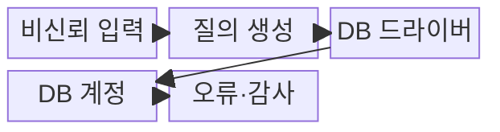
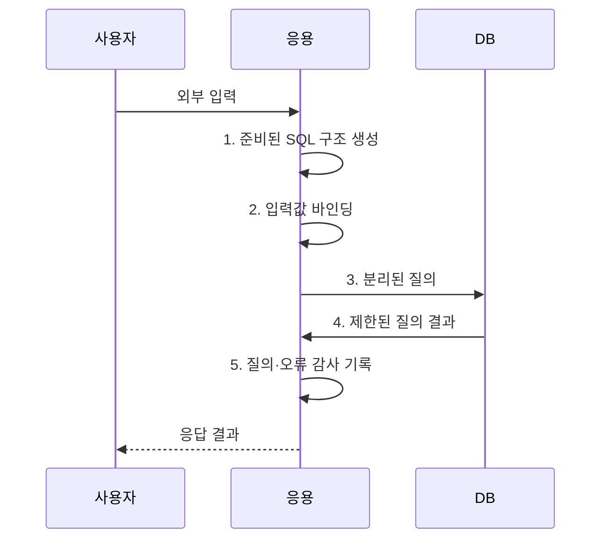

---
sidebar:
  order: 46
  label: "046. SQL 인젝션 (SQL Injection)"
  badge:
    text: "기출 · 50%"
    variant: note
title: "SQL 인젝션 (SQL Injection)"
date: "2026-08-02T11:30:00+09:00"
tags:
  - "notes-security"
weight: 46
extra:
  question_no: "046"
  source_status: "기출"
  source_history: "120회, 123회"
  priority: 50
  priority_note: "120·123회 반복된 입력·쿼리 경계 핵심 공격임"
---

## Ⅰ. 개요

핵심 용어

- **SQL 인젝션**은 외부 입력이 값이 아닌 SQL 명령 구조로 해석돼 질의 의미를 바꾸는 취약점이다.

- 정의/개념: **SQL 인젝션**은 비신뢰 입력이 SQL 명령의 값이 아니라 구문 구조로 해석되어 공격자가 질의 의미를 변경하는 주입 취약점
- 배경/필요성: 문자열 결합은 **SQL 구조·값 분리 불가**

#### 한줄 요약

- 입력을 값이 아닌 SQL 구문으로 해석하면 질의와 권한이 공격자에게 바뀐다.

## Ⅱ. 특징

핵심 용어

- **준비된 질의**는 SQL 구조를 먼저 고정하고 외부 입력을 별도 매개변수 값으로 전달한다.
- **값 바인딩**은 외부 입력을 SQL 구문이 아닌 매개변수 값으로 결합한다.

- 문자열 결합 입력의 **구문 경계 변조**
- 응답·오류·시간차의 **데이터 추론**
- 준비된 질의·최소 권한의 **예방·영향 제한**

#### 한줄 요약

- 값 바인딩은 구조를 고정하며 WAF와 이스케이프는 보조 통제이다.

## Ⅲ. 구조 및 구성요소

핵심 용어

- **최소 권한 DB 계정**은 응용에 필요한 스키마·연산만 허용해 주입 성공 때의 피해 범위를 제한한다.
- **허용목록**은 바인딩할 수 없는 테이블·열 같은 동적 식별자를 승인된 값으로 제한한다.

| 구성요소 | 책임 |
|:---|:---|
| 비신뢰 입력 | 폼·API·저장 데이터에서 **외부 값** 유입 |
| 질의 생성 | 입력값과 **SQL 구조** 분리 |
| DB 드라이버 | 값 바인딩으로 **입력 경계** 고정 |
| DB 계정 | 허용 스키마로 **피해 범위** 제한 |
| 오류·감사 | **이상 질의 추적·오류 노출** 차단 |

#### 한줄 요약

- 준비된 질의와 최소 권한이 주입 가능성과 피해 범위를 각각 줄인다.

## Ⅳ. 흐름도

핵심 용어

- **구조·값 분리**는 SQL 명령 형식과 외부 입력을 서로 다른 채널로 DB 드라이버에 전달하는 원칙이다.

**동작 원리**

1. **준비된 SQL 구조 생성**: 실행할 명령 형식과 매개변수 위치 고정
2. **입력값 바인딩**: 외부 입력을 명령이 아닌 매개변수 값으로 전달
3. **분리된 질의**: 허용목록 식별자와 바인딩 값을 데이터베이스에 전송
4. **제한된 질의 결과**: 최소 권한 계정으로 허용된 데이터만 반환
5. **질의·오류 감사 기록**: 이상 질의와 오류 노출 여부를 검증 자료로 제공

#### 한줄 요약

- 입력부터 실행점까지 추적해 값은 바인딩하고 식별자는 허용목록으로 제한한다.

## Ⅴ. 종류 및 비교

핵심 용어

- **인밴드·블라인드·아웃오브밴드**는 각각 원래 응답, 참·거짓·시간차, DNS·HTTP 별도 경로로 결과를 얻는다.

| SQL 인젝션 유형 | 인밴드 | 블라인드 | 아웃오브밴드 |
|:---|:---|:---|:---|
| 적용 기준 | 결과가 **직접 노출**될 때 | 응답 차이를 **관찰 가능**할 때 | **외부 통신**이 가능할 때 |
| 핵심 특징 | **동일 응답 결과 노출** | **응답 차이 결과 추론** | 별도 통신 경로 유출 |
| 한계 | **대량 데이터** 즉시 유출 | 느리지만 **응답만으로 추론** | 내부 DB에 **별도 외부 통신 경로** 필요 |

#### 한줄 요약

- 결과가 돌아오는 경로에 따라 인밴드·블라인드·외부 경로로 나뉜다.

## Ⅵ. 실무 고려사항 및 대책

핵심 용어

- **MITRE CWE-89**는 SQL 명령 구조에 사용된 특수 요소의 부적절한 중화를 정의한다.
- **OWASP ASVS 5.0.0**은 입력 처리·인젝션 방지 요구사항을 검증 가능한 형태로 제시한다.

| 문제 | 대책 | 효과 |
|:---|:---|:---|
| SQL 구조와 입력을 결합하면 명령 경계 변조 | **MITRE CWE-89** 기준으로 문자열 결합 제거 | 입력의 **명령 구조 변조** 차단 |
| 입력 처리 요구가 없으면 구현별 방어 편차 | **OWASP ASVS 5.0.0** 적용 | 개발·검증의 **요구 일관성** 확보 |
| 동적 식별자는 값 바인딩이 안 되고 과도한 DB 권한은 피해 확대 | **허용목록·최소 권한** 적용 | 식별자 주입 가능성과 **침해 영향** 제한 |

#### 한줄 요약

- 사용자 입력을 SQL 문자열에 이어 붙이지 않고 준비된 문장의 값으로 전달해 입력이 명령 구문으로 실행되지 않게 한다.

## Ⅶ. 결론

핵심 용어

- **방어 원칙**은 값은 준비된 질의로 바인딩하고 식별자는 허용목록, DB 계정은 최소 권한을 적용하는 것이다.

- 값은 **준비된 질의로 바인딩**, 식별자는 **허용목록**, DB 계정은 최소 권한 적용

#### 한줄 요약

- SQL 구조와 값을 분리하고 DB 최소 권한으로 피해 범위를 줄인다.
