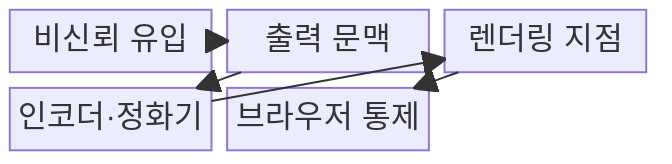
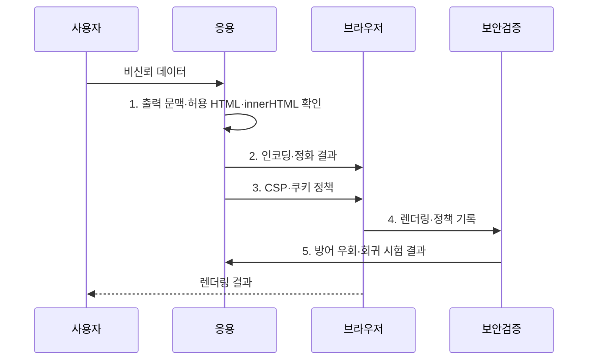

---
sidebar:
  order: 47
  label: "047. XSS (Cross-Site Scripting)"
  badge:
    text: "기출 · 30%"
    variant: note
title: "XSS (Cross-Site Scripting)"
date: "2026-08-02T11:32:00+09:00"
tags:
  - "notes-security"
weight: 47
extra:
  question_no: "047"
  source_status: "기출"
  source_history: "120회"
  priority: 30
  priority_note: "120회 기출이나 최신 독립 반복성은 낮아 보완 수준임"
---

## Ⅰ. 개요

핵심 용어

- **XSS**는 비신뢰 데이터가 피해자의 브라우저에서 스크립트로 실행되는 취약점이다.

- 정의/개념: **XSS**는 비신뢰 데이터가 웹 문서의 실행 가능한 스크립트 문맥에 삽입되어 피해자 브라우저에서 공격자 코드를 실행하게 하는 웹 취약점
- 배경/필요성: 문자열 필터만으로는 문맥별 해석 차이에 따른 **스크립트 실행 차단 불가**

#### 한줄 요약

- 비신뢰 데이터가 브라우저 코드가 되면 피해자의 세션 권한으로 실행된다.

## Ⅱ. 특징

핵심 용어

- **출력 문맥**은 외부 데이터가 삽입되는 HTML 본문·속성·URL·스크립트 등의 해석 위치다.
- **출력 인코딩**은 문맥별 특수문자를 코드가 아닌 데이터로 표시한다.
- **DOM 실행 경로**는 클라이언트 스크립트가 비신뢰 데이터를 위험한 DOM API에 넣어 브라우저에서 코드로 해석되게 하는 경로다.

- 저장·반사·DOM의 **다중 실행 경로**
- HTML·속성·URL별 **문맥 인코딩**
- 정화·CSP·쿠키의 **다층 방어**

#### 한줄 요약

- 출력 문맥에 맞는 인코딩이 어긋나면 필터를 우회할 수 있다.

## Ⅲ. 구조 및 구성요소

핵심 용어

- **HTML 정화**는 사용자 HTML에서 위험 태그·속성·URL을 제거하고 허용 요소만 유지한다.
- **CSP**는 실행 가능한 스크립트와 리소스 출처를 제한하는 브라우저 정책이다.

| 구성요소 | 책임 |
|:---|:---|
| 비신뢰 유입 | 입력·URL·메시지·외부 API의 **데이터 수집** |
| 출력 문맥 | **HTML·속성·URL·스크립트** 구분 |
| 렌더링 지점 | 템플릿·DOM API에 **데이터 반영** |
| 인코더·정화기 | **문맥 인코딩·HTML 정화** 수행 |
| 브라우저 통제 | CSP·쿠키 속성으로 **피해 제한** |

#### 한줄 요약

- 비신뢰 데이터가 렌더링 지점에서 코드로 해석되지 않게 경계를 지킨다.

## Ⅳ. 흐름도

핵심 용어

- **DOM**은 HTML 문서를 객체 구조로 표현하고 스크립트로 변경하는 인터페이스다.
- **innerHTML**은 문자열을 HTML 구문으로 해석해 DOM에 삽입하므로 비신뢰 데이터에 사용하면 위험하다.

**동작 원리**

1. **출력 문맥·허용 HTML·innerHTML 확인**: 삽입 위치와 허용 요소를 판정하고 비신뢰 데이터의 위험 API 사용을 제거
2. **인코딩·정화 결과**: 코드 해석을 막고 위험 구문을 제거한 데이터 제공
3. **CSP·쿠키 정책**: 스크립트 출처와 세션 정보 접근 제한
4. **렌더링·정책 기록**: 브라우저 해석 결과와 정책 위반 정보 제공
5. **방어 우회·회귀 시험 결과**: 저장·반사·DOM 경로의 방어 검증 결과 전달

#### 한줄 요약

- 데이터 경로와 출력 문맥을 찾고 안전한 렌더링과 정화를 적용한다.

## Ⅴ. 종류 및 비교

핵심 용어

- **저장형·반사형·DOM 기반 XSS**는 각각 저장값, 요청값, 클라이언트 DOM 변경 경로에서 스크립트를 실행한다.

| XSS 유형 | 저장형 | 반사형 | DOM 기반 |
|:---|:---|:---|:---|
| 적용 기준 | **저장값 출력** 시 | **요청값 반영** 시 | **클라이언트 반영** 시 |
| 핵심 특징 | **저장 후 반복 실행** | **요청값 반영 실행** | DOM 변경 후 실행 |
| 한계 | 다수 사용자에게 **지속 확산** | 조작 링크로 **피해자 유도** 필요 | 서버 응답 검사로 **탐지 곤란** |

#### 한줄 요약

- 저장 위치와 반영 주체에 따라 저장형·반사형·DOM 기반으로 나뉜다.

## Ⅵ. 실무 고려사항 및 대책

핵심 용어

- **MITRE CWE-79**는 웹 페이지 생성 중 입력의 부적절한 중화를 정의한다.
- **OWASP ASVS 5.0.0**은 출력 인코딩·정화·브라우저 보안 요구를 제시한다.
- **안전한 쿠키 속성**은 HttpOnly·Secure·SameSite로 스크립트 접근, 평문 전송, 교차 사이트 전송 범위를 제한한다.

| 문제 | 대책 | 효과 |
|:---|:---|:---|
| 출력 문맥을 구분하지 않으면 인코딩이 공격 구문을 보존 | **MITRE CWE-79** 기준으로 문맥별 처리 | 브라우저의 **코드 실행** 차단 |
| 인코딩·정화 요구가 없으면 구현별 방어 편차 | **OWASP ASVS 5.0.0** 적용 | 개발·검증의 **요구 일관성** 확보 |
| innerHTML 사용과 세션 접근으로 피해 확대 | **innerHTML 제거·CSP**와 쿠키 속성 적용 | 실행 경로와 **세션 피해** 제한 |

#### 한줄 요약

- 사용자가 작성한 게시글은 HTML로 직접 삽입하지 않고 문맥에 맞게 이스케이프해 스크립트가 다른 이용자의 브라우저에서 실행되지 않게 한다.

## Ⅶ. 결론

핵심 용어

- **다층 방어**는 문맥별 인코딩, 허용목록 HTML 정화, CSP와 안전한 쿠키 속성을 함께 적용한다.

- 일반 출력은 **문맥별 인코딩**, 사용자 HTML은 **허용목록 정화**, 잔여 위험은 **CSP** 적용

#### 한줄 요약

- XSS는 출력 문맥별 인코딩과 HTML 정화를 함께 적용해야 한다.
