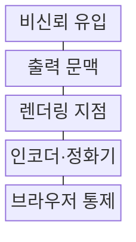
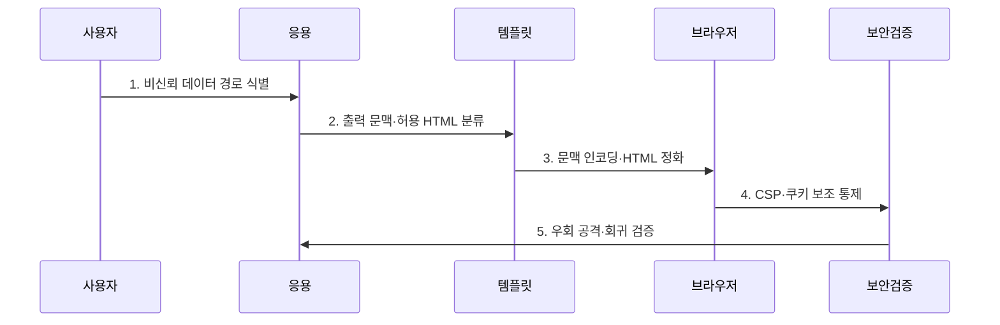

---
sidebar:
  order: 47
  label: "047. XSS (Cross-Site Scripting)"
  badge:
    text: "기출 · 30%"
    variant: note
title: "XSS (Cross-Site Scripting)"
date: "2026-07-27T23:59:59+09:00"
tags:
  - "notes-security"
weight: 47
extra:
  question_no: "047"
  source_status: "기출"
  source_history: "120회"
  priority: 30
  priority_note: "120회 기출이나 최신 독립 반복성은 낮아 보완 수준임"
---

## 미리 알고가기

- **교차 사이트 스크립팅(Cross-Site Scripting, XSS)**: 비신뢰 데이터가 피해자의 브라우저에서 스크립트로 실행되는 취약점이다.
- **문서 객체 모델(Document Object Model, DOM)**: HTML 문서를 객체 구조로 표현하고 스크립트로 변경하는 인터페이스이다.
- **출력 문맥**: 외부 데이터가 삽입되는 HTML 본문·속성·URL·스크립트 등의 해석 위치이다.
- **출력 인코딩**: 출력 문맥별 특수문자를 코드가 아닌 데이터로 표시하는 처리이다.
- **HTML 정화**: 사용자 HTML에서 위험 태그·속성·URL을 제거하고 허용 요소만 유지하는 처리이다.
- **콘텐츠 보안 정책(Content Security Policy, CSP)**: 실행 가능한 스크립트와 리소스 출처를 제한하는 브라우저 정책이다.
- **innerHTML**: 문자열을 HTML 구문으로 해석하여 DOM에 삽입하는 API이다.
- **MITRE CWE-79**: 웹 페이지 생성 중 입력의 부적절한 중화를 정의한 공식 XSS 약점 식별자이다.
- **OWASP ASVS 5.0.0**: 출력 인코딩·정화·브라우저 보안 요구를 제시한 공식 검증 표준이다.

## Ⅰ. 개요

- 정의/개념: 비신뢰 데이터가 코드를 실행하는 **웹 취약점**
- 배경/필요성: 출력 데이터와 **실행 문맥 분리 필요**

### 쉽게 이해하기 (학습용)

- 비신뢰 데이터가 브라우저 코드가 되면 피해자의 세션 권한으로 실행된다.

## Ⅱ. 특징

- 저장·반사·DOM의 **다중 실행 경로**
- HTML·속성·URL별 **문맥 인코딩**
- 정화·CSP·쿠키의 **다층 방어**

### 쉽게 이해하기 (학습용)

- 출력 문맥에 맞는 인코딩이 어긋나면 필터를 우회할 수 있다.

## Ⅲ. 구조 및 구성요소

| 구성요소 | 책임 |
|:---|:---|
| 비신뢰 유입 | 입력·URL·메시지·외부 API 수집 |
| 출력 문맥 | HTML·속성·URL·스크립트 구분 |
| 렌더링 지점 | 템플릿·DOM API에 데이터 반영 |
| 인코더·정화기 | 문맥 인코딩과 HTML 정화 |
| 브라우저 통제 | CSP·쿠키 속성으로 피해 제한 |

### 쉽게 이해하기 (학습용)

- 비신뢰 데이터가 렌더링 지점에서 코드로 해석되지 않게 경계를 지킨다.

## Ⅳ. 흐름도

**동작 원리**

1. **비신뢰 데이터 경로 식별**: 입력·URL·외부 API 추적
2. **출력 문맥·허용 HTML 분류**: 본문·속성·URL·스크립트 구분
3. **문맥 인코딩·HTML 정화**: 코드 해석과 위험 구문 차단
4. **CSP·쿠키 보조 통제**: 스크립트 출처와 세션 피해 제한
5. **우회 공격·회귀 검증**: 저장·반사·DOM 경로 시험

### 쉽게 이해하기 (학습용)

- 데이터 경로와 출력 문맥을 찾고 안전한 렌더링과 정화를 적용한다.

## Ⅴ. 종류 및 비교

| XSS 유형 | 저장형 | 반사형 | DOM 기반 |
|:---|:---|:---|:---|
| 적용 기준 | 저장값이 출력될 때 | 요청값이 반영될 때 | 클라이언트 반영 시 |
| 핵심 특징 | **저장 후 반복 실행** | **요청값 반영 실행** | DOM 변경 후 실행 |
| 한계 | 다수 사용자·관리자에게 지속 확산 | 조작 링크로 피해자 유도 필요 | 서버 응답 검사로 탐지 곤란 |

### 쉽게 이해하기 (학습용)

- 저장 위치와 반영 주체에 따라 저장형·반사형·DOM 기반으로 나뉜다.

## Ⅵ. 실무 고려사항 및 대책

| 고려사항 | 대책 | 효과 |
|:---|:---|:---|
| 출력 문맥 미분리 | **MITRE CWE-79 기준 제거** | 브라우저 코드 실행 차단 |
| 인코딩·정화 요구 누락 | **OWASP ASVS 5.0.0 적용** | 개발·검증 기준 일관화 |
| DOM 우회·세션 피해 | **안전 API·CSP·쿠키 적용** | 실행 경로·피해 범위 제한 |

### 쉽게 이해하기 (학습용)

- 사용자가 작성한 게시글은 HTML로 직접 삽입하지 않고 문맥에 맞게 이스케이프해 스크립트가 다른 이용자의 브라우저에서 실행되지 않게 한다.

## Ⅶ. 결론

- **출력 문맥·허용 HTML**로 XSS 통제 결정

### 쉽게 이해하기 (학습용)

- XSS는 출력 문맥별 인코딩과 HTML 정화를 함께 적용해야 한다.
