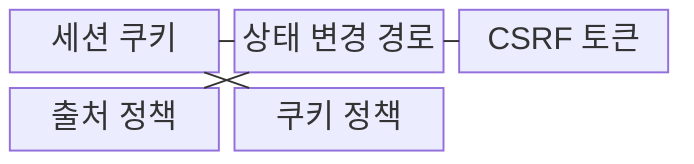
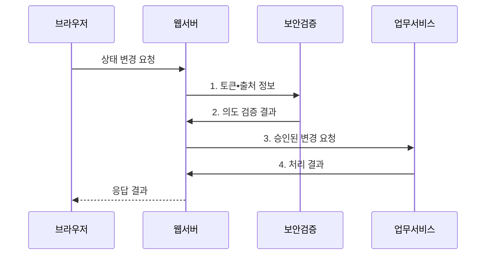

---
sidebar:
  order: 48
  label: "048. CSRF (Cross-Site Request Forgery)"
  badge:
    text: "기출 • 50%"
    variant: note
title: "CSRF (Cross-Site Request Forgery)"
date: "2026-08-04T10:34:00+09:00"
tags:
  - "notes-security"
weight: 48
extra:
  question_no: "048"
  source_status: "기출"
  source_history: "131회"
  priority: 50
  priority_note: "131회 기출이며 세션•브라우저 보안 비교에 유용함"
---

## Ⅰ. 개요

핵심 용어

- **CSRF(Cross-Site Request Forgery)** 는 로그인된 브라우저의 자동 인증 정보를 악용해 사용자가 의도하지 않은 상태 변경 요청을 보내는 공격이다.

- 정의/개념: **CSRF** 는 피해자의 브라우저가 자동으로 첨부하는 세션 인증정보를 이용해 사용자가 의도하지 않은 상태 변경 요청을 전송하게 하는 웹 공격
- 배경/필요성: 세션 인증만으로는 **사용자 의도 검증 불가**

#### 한줄 요약

- CSRF는 로그인 쿠키가 자동 전송되는 점을 악용하므로 서버가 요청 의도까지 검증해야 한다.

## Ⅱ. 특징

핵심 용어

- **세션 쿠키** 는 로그인 상태를 식별하며 브라우저가 대상 사이트 요청에 자동 첨부한다.
- **CSRF 토큰** 은 서버가 발급하고 상태 변경 요청에서 검증하는 예측 불가능한 요청 의도 확인값이다.
- **SameSite** 는 교차 사이트 요청에 세션 쿠키를 자동 전송할 범위를 제한하는 쿠키 속성이다.

- 브라우저 자동 인증의 **권한 대리 악용**
- 상태 변경 경로의 **토큰•출처 검증**
- 안전 메서드•SameSite의 **다층 방어**

#### 한줄 요약

- 토큰•출처 검사•SameSite 쿠키를 함께 적용하면 위조 요청이 상태 변경까지 도달하기 어렵다.

## Ⅲ. 구조 및 구성요소

핵심 용어

- **Origin** 은 요청을 생성한 출처의 스킴•호스트•포트를 전달하는 헤더다.
- **Referer** 는 요청을 보낸 이전 페이지의 주소를 전달하는 헤더다.
- **HTTP(Hypertext Transfer Protocol)** 는 웹 자원 요청과 응답의 형식•의미를 정의하는 통신 규약이다.
- **안전 메서드** 는 조회 의미만 가지며 서버 상태를 변경하지 않아야 하는 GET•HEAD 등의 HTTP 메서드다.

| 구성요소 | 책임 |
|:---|:---|
| 세션 쿠키 | 자동 첨부되는 **인증 상태** 제공 |
| 상태 변경 경로 | 자금•계정의 **변경 요청** 처리 |
| CSRF 토큰 | **요청 의도 검증값** 제공 |
| 출처 정책 | **Origin•Referer** 검증 |
| 쿠키 정책 | **SameSite•안전 메서드** 적용 |

#### 한줄 요약

- 공격자 페이지가 피해자의 인증 상태를 빌려 요청해도 서버 검증기가 정상 화면에서 발급한 증거가 없으면 거부한다.

## Ⅳ. 흐름도

핵심 용어

- **의도 검증** 은 토큰 일치•허용 출처•고위험 재인증으로 현재 사용자가 요청한 변경인지 확인한다.

**동작 원리**

1. **토큰•출처 정보**: 세션에 결속된 CSRF 토큰과 Origin•Referer 제공
2. **의도 검증 결과**: 토큰 일치•허용 출처•재인증 여부 판정
3. **승인된 변경 요청**: 검증을 통과한 상태 변경 명령 전달
4. **처리 결과**: 업무 변경 성공•실패 상태 제공

#### 한줄 요약

- 서버는 상태 변경 요청에서 토큰과 출처를 확인한 뒤에만 업무 처리를 수행한다.

## Ⅴ. 종류 및 비교

핵심 용어

| CSRF 방어 유형 | CSRF 토큰 | SameSite 쿠키 | 출처 검증 |
|:---|:---|:---|:---|
| 적용 기준 | **의도 직접 검증** | **쿠키 전송 제한** | **요청 출처 판정** |
| 핵심 특징 | **비밀 토큰 의도 확인** | **교차 쿠키 전송 제한** | Origin•Referer 확인 |
| 한계 | **토큰 노출•검증 누락** | 호환성•**예외 설정** 문제 | 헤더 부재•**중계 처리 오류** |

#### 한줄 요약

- 토큰은 요청 의도를 확인하고 SameSite와 출처 검증은 교차 요청을 제한한다.

## Ⅵ. 실무 고려사항 및 대책

핵심 용어

- **CWE(Common Weakness Enumeration)-352** 는 요청이 사용자 의도인지 충분히 검증하지 않는 약점을 정의한다.
- **IETF(Internet Engineering Task Force)** 는 인터넷 기술 표준을 개발•공개하는 국제 공동체다.
- **RFC(Request for Comments) 9110** 은 GET•HEAD 같은 안전 메서드와 요청 의미를 정의한다.
- **XSS(Cross-Site Scripting)** 는 비신뢰 데이터가 피해자 브라우저에서 스크립트로 실행되는 취약점이다.

| 문제 | 대책 | 효과 |
|:---|:---|:---|
| 세션 인증만 확인하면 위조 요청도 상태 변경 | **MITRE CWE-352** 기준으로 의도 검증 | 비승인 **상태 변경** 차단 |
| GET•HEAD가 상태를 바꾸면 외부 링크로 요청 유발 | **IETF RFC 9110** 의 안전 메서드 준수 | 조회 요청의 **업무 부작용** 방지 |
| XSS에 토큰이 노출되거나 검증이 누락되면 CSRF 방어 무력화 | **XSS 제거•출처 검증** 과 SameSite•재인증 결합 | **위조 요청 성공 가능성** 완화 |

#### 한줄 요약

- 은행 서버는 세션 쿠키만 믿지 않고 송금 폼의 예측 불가능한 CSRF 토큰을 검증해 다른 사이트가 사용자의 권한으로 송금하지 못하게 한다.

## Ⅶ. 결론

핵심 용어

- 모든 상태 변경은 **CSRF 토큰•출처 검증**, 고위험 요청은 **재인증** 추가

#### 한줄 요약

- CSRF 방어는 토큰•출처 검사•쿠키 정책과 XSS 제거를 함께 운영해야 한다.
