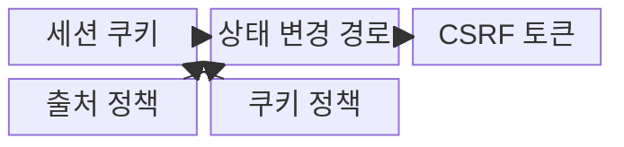

---
sidebar:
  order: 48
  label: "048. CSRF (Cross-Site Request Forgery)"
  badge:
    text: "기출 · 50%"
    variant: note
title: "CSRF (Cross-Site Request Forgery)"
date: "2026-07-31T01:57:17+09:00"
tags:
  - "notes-security"
weight: 48
extra:
  question_no: "048"
  source_status: "기출"
  source_history: "131회"
  priority: 50
  priority_note: "131회 기출이며 세션·브라우저 보안 비교에 유용함"
---

## 미리 알고가기

- **사이트 간 요청 위조(Cross-Site Request Forgery, CSRF)**: 로그인된 브라우저의 자동 인증 정보를 악용하여 사용자가 의도하지 않은 상태 변경 요청을 보내는 공격이다.
- **세션 쿠키(Session Cookie)**: 로그인 상태를 식별하며 브라우저가 대상 사이트 요청에 자동 첨부하는 값이다.
- **CSRF 토큰(CSRF Token)**: 서버가 발급하고 상태 변경 요청에서 검증하는 예측 불가능한 요청 의도 확인값이다.
- **Origin 헤더**: 요청을 만든 출처의 스킴·호스트·포트 정보를 전달하는 HTTP 헤더이다.
- **Referer 헤더**: 현재 요청을 발생시킨 이전 페이지의 주소 정보를 전달하는 HTTP 헤더이다.
- **SameSite 속성**: 교차 사이트 요청에 쿠키를 전송할 범위를 제한하는 속성이다.
- **안전 메서드(Safe Method)**: GET·HEAD처럼 서버 상태 변경을 요청하지 않는 HTTP 메서드이다.
- **교차 사이트 스크립팅(Cross-Site Scripting, XSS)**: 공격 스크립트가 대상 사이트의 브라우저 문맥에서 실행되는 취약점이다.
- **MITRE CWE-352**: 요청이 사용자의 의도인지 충분히 검증하지 않는 CSRF 약점의 공식 식별자이다.
- **IETF RFC 9110**: HTTP 메서드의 안전성·멱등성과 요청 의미를 정의한 공식 표준이다.

## Ⅰ. 개요

- 정의/개념: 자동 인증정보로 요청 의도를 위조하는 **웹 공격**
- 배경/필요성: 세션 인증만으로는 **사용자 의도 검증 불가**

### 쉽게 이해하기 (학습용)

- CSRF는 로그인 쿠키가 자동 전송되는 점을 악용하므로 서버가 요청 의도까지 검증해야 한다.

## Ⅱ. 특징

- 브라우저 자동 인증의 **권한 대리 악용**
- 상태 변경 경로의 **토큰·출처 검증**
- 안전 메서드·SameSite의 **다층 방어**

### 쉽게 이해하기 (학습용)

- 토큰·출처 검사·SameSite 쿠키를 함께 적용하면 위조 요청이 상태 변경까지 도달하기 어렵다.

## Ⅲ. 구조 및 구성요소

| 구성요소 | 책임 |
|:---|:---|
| 세션 쿠키 | 자동 첨부되는 **인증 상태** 제공 |
| 상태 변경 경로 | 자금·계정의 **변경 요청** 처리 |
| CSRF 토큰 | **요청 의도 검증값** 제공 |
| 출처 정책 | **Origin·Referer** 검증 |
| 쿠키 정책 | **SameSite·안전 메서드** 적용 |

### 쉽게 이해하기 (학습용)

- 공격자 페이지가 피해자의 인증 상태를 빌려 요청해도 서버 검증기가 정상 화면에서 발급한 증거가 없으면 거부한다.

## Ⅳ. 흐름도

**동작 원리**

1. **토큰·출처 정보**: 세션에 결속된 CSRF 토큰과 Origin·Referer 제공
2. **의도 검증 결과**: 토큰 일치·허용 출처·재인증 여부 판정
3. **승인된 변경 요청**: 검증을 통과한 상태 변경 명령 전달
4. **처리 결과**: 업무 변경 성공·실패 상태 제공

### 쉽게 이해하기 (학습용)

- 서버는 상태 변경 요청에서 토큰과 출처를 확인한 뒤에만 업무 처리를 수행한다.

## Ⅴ. 종류 및 비교

| CSRF 방어 유형 | CSRF 토큰 | SameSite 쿠키 | 출처 검증 |
|:---|:---|:---|:---|
| 적용 기준 | **의도 직접 검증** | **쿠키 전송 제한** | **요청 출처 판정** |
| 핵심 특징 | **비밀 토큰 의도 확인** | **교차 쿠키 전송 제한** | Origin·Referer 확인 |
| 한계 | **토큰 노출·검증 누락** | 호환성·**예외 설정** 문제 | 헤더 부재·**중계 처리 오류** |

### 쉽게 이해하기 (학습용)

- 토큰은 요청 의도를 확인하고 SameSite와 출처 검증은 교차 요청을 제한한다.

## Ⅵ. 실무 고려사항 및 대책

| 고려사항 | 대책 | 효과 |
|:---|:---|:---|
| 세션 인증만 확인하면 위조 요청도 상태 변경 | **MITRE CWE-352** 기준으로 의도 검증 | 비승인 **상태 변경** 차단 |
| GET·HEAD가 상태를 바꾸면 외부 링크로 요청 유발 | **IETF RFC 9110**의 안전 메서드 준수 | 조회 요청의 **업무 부작용** 방지 |
| 토큰 노출·검증 누락 시 단일 통제 우회 | **출처·SameSite·재인증** 결합 | 교차 요청의 **우회 가능성** 완화 |

### 쉽게 이해하기 (학습용)

- 은행 서버는 세션 쿠키만 믿지 않고 송금 폼의 예측 불가능한 CSRF 토큰을 검증해 다른 사이트가 사용자의 권한으로 송금하지 못하게 한다.

## Ⅶ. 결론

- 모든 상태 변경은 **CSRF 토큰·출처 검증**, 고위험 요청은 **재인증** 추가

### 쉽게 이해하기 (학습용)

- CSRF 방어는 토큰·출처 검사·쿠키 정책과 XSS 제거를 함께 운영해야 한다.
