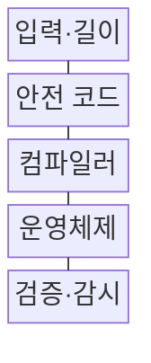
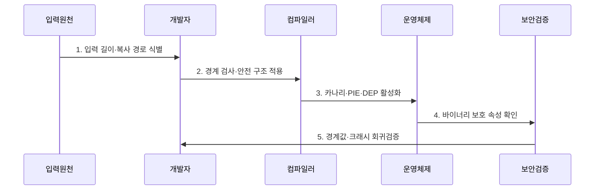

---
sidebar:
  order: 49
  label: "049. 버퍼 오버플로우 — 카나리·DEP·ASLR (Buffer Overflow Canary DEP ASLR)"
  badge:
    text: "기출 · 50%"
    variant: note
title: "버퍼 오버플로우 — 카나리·DEP·ASLR (Buffer Overflow Canary DEP ASLR)"
date: "2026-07-27T23:59:59+09:00"
tags:
  - "notes-security"
weight: 49
extra:
  question_no: "049"
  source_status: "기출"
  source_history: "125회"
  priority: 50
  priority_note: "125회 기출이나 고전 메모리 공격의 최근성은 낮음"
---

## 미리 알고가기

- **버퍼(Buffer)**: 입력·데이터를 임시 저장하도록 크기를 정해 확보한 메모리 영역이다.
- **버퍼 오버플로(Buffer Overflow)**: 쓰기 크기가 버퍼 경계를 넘어 인접 메모리를 손상시키는 취약점이다.
- **스택 카나리(Stack Canary)**: 반환 주소 앞의 임의 값을 대조해 스택 덮어쓰기를 탐지하는 보호값이다.
- **데이터 실행 방지·실행 금지(Data Execution Prevention/No-eXecute, DEP/NX)**: 데이터 메모리 영역의 코드 실행을 금지하는 보호이다.
- **주소 공간 배치 난수화(Address Space Layout Randomization, ASLR)**: 코드·라이브러리·스택 주소를 실행마다 무작위 배치하는 보호이다.
- **위치 독립 실행 파일(Position Independent Executable, PIE)**: 실행 파일도 임의 주소에 배치할 수 있게 만든 바이너리이다.
- **메모리 안전 언어(Memory-safe Language)**: 배열 경계와 객체 수명을 실행환경·타입 체계가 검사하는 언어이다.
- **크래시(Crash)**: 잘못된 메모리 접근 등으로 프로그램이 비정상 종료되는 현상이다.
- **MITRE CWE-787**: 할당된 버퍼 경계 밖에 데이터를 쓰는 약점의 공식 식별자이다.

## Ⅰ. 개요

- 정의/개념: 경계 초과 쓰기로 메모리를 손상하는 **취약점**
- 배경/필요성: 경계 미검사는 **제어 흐름 변조**로 연결

### 쉽게 이해하기 (학습용)

- 버퍼 경계를 넘은 쓰기는 인접 메모리와 제어 흐름을 바꾸므로 원천 코드와 실행 환경을 함께 보호해야 한다.

## Ⅱ. 특징

- 경계 초과 쓰기의 **데이터·제어정보 손상**
- 안전 코드·카나리의 **원인·변조 탐지**
- DEP·ASLR·PIE의 **다층 악용 억제**

### 쉽게 이해하기 (학습용)

- 경계 검사로 결함을 막고 실행 방지·주소 무작위화·스택 보호로 악용 가능성을 낮춘다.

## Ⅲ. 구조 및 구성요소

| 구성요소 | 책임 |
|:---|:---|
| 입력·길이 | 데이터 크기와 버퍼 필요량 결정 |
| 안전 코드 | 경계 검사와 안전한 접근 적용 |
| 컴파일러 | 카나리·PIE를 바이너리에 삽입 |
| 운영체제 | DEP·ASLR로 잔존 악용 제한 |
| 검증·감시 | 경계 시험·보호 속성·크래시 추적 |

### 쉽게 이해하기 (학습용)

- 외부 입력이 고정 크기 버퍼에 복사될 때 경계 검사가 초과 길이를 거부하고 실행 보호가 악용을 억제한다.

## Ⅳ. 흐름도

**동작 원리**

1. **입력 길이·복사 경로 식별**: 외부 크기와 버퍼 용량 추적
2. **경계 검사·안전 구조 적용**: 초과 입력을 복사 전에 거부
3. **카나리·PIE·DEP 활성화**: 변조·실행·주소 예측 억제
4. **바이너리 보호 속성 확인**: 최종 산출물 옵션 검사
5. **경계값·크래시 회귀검증**: 극단 입력과 비정상 종료 추적

### 쉽게 이해하기 (학습용)

- 취약한 입력 경로를 찾아 길이 검사를 고친 뒤 실제 산출물에 보호 옵션이 적용됐는지 확인한다.

## Ⅴ. 종류 및 비교

| 메모리 보호 유형 | 카나리 | DEP/NX | ASLR |
|:---|:---|:---|:---|
| 적용 기준 | 스택 오염 감지 시 | 데이터 실행 방지 시 | 주소 예측 난도 증가 |
| 핵심 특징 | **스택 오염 탐지** | **데이터 코드 실행 차단** | 메모리 주소 무작위화 |
| 한계 | 값 노출·비검사 영역 손상 | 코드 재사용 공격 가능 | 주소 누출 시 우회 가능 |

### 쉽게 이해하기 (학습용)

- 버퍼 오버플로과 대안의 선택 기준을 비교함

## Ⅵ. 실무 고려사항 및 대책

| 고려사항 | 대책 | 효과 |
|:---|:---|:---|
| 경계 밖 쓰기 | **MITRE CWE-787 기준 제거** | 메모리 손상 원인 차단 |
| 잔존 취약점 악용 | **카나리·PIE·DEP·ASLR 적용** | 코드 실행 성공률 저하 |
| 보호 옵션 누락 | **산출물 검사·퍼징·회귀시험** | 빌드 편차·우회 조기 발견 |

### 쉽게 이해하기 (학습용)

- 패킷에 표시된 길이를 버퍼 크기와 먼저 비교하고 범위를 넘는 입력은 복사 전에 거부해 인접 메모리 덮어쓰기를 막는다.

## Ⅶ. 결론

- **입력 길이·보호 속성**으로 메모리 통제 결정

### 쉽게 이해하기 (학습용)

- 버퍼 오버플로는 안전한 구현과 컴파일·실행 보호를 계층적으로 적용해야 한다.
