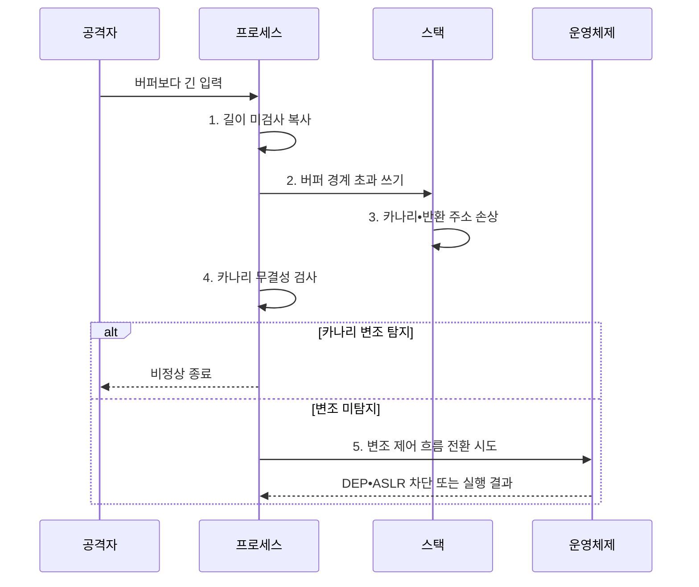

---
sidebar:
  order: 49
  label: "049. 버퍼 오버플로우 — 카나리•DEP•ASLR (Buffer Overflow Canary DEP ASLR)"
  badge:
    text: "기출 • 50%"
    variant: note
title: "버퍼 오버플로우 — 카나리•DEP•ASLR (Buffer Overflow Canary DEP ASLR)"
date: "2026-08-05T10:01:00+09:00"
tags:
  - "notes-security"
weight: 49
extra:
  question_no: "049"
  source_status: "기출"
  source_history: "125회"
  priority: 50
  priority_note: "125회 기출이나 고전 메모리 공격의 최근성은 낮음"
---

## Ⅰ. 개요

<details>
<summary>핵심 용어</summary>

- **버퍼 오버플로** 는 쓰기 크기가 버퍼 경계를 넘어 인접 메모리를 손상시키는 취약점이다.

</details>

- 정의/개념: **버퍼 오버플로** 는 프로그램이 할당된 버퍼 경계를 넘어 데이터를 써서 인접 메모리나 제어 정보를 손상시키는 메모리 안전 취약점
- 배경/필요성: 경계 미검사는 **제어 흐름 변조** 로 연결

#### 한줄 요약

- 버퍼 경계를 넘은 쓰기는 인접 메모리와 제어 흐름을 바꾸므로 원천 코드와 실행 환경을 함께 보호해야 한다.

## Ⅱ. 특징

<details>
<summary>핵심 용어</summary>

- **스택 카나리** 는 반환 주소 앞의 임의 값을 대조해 스택 덮어쓰기를 탐지한다.
- **DEP(Data Execution Prevention)** 는 데이터 메모리 영역의 코드 실행을 금지하는 보호 기법이다.
- **NX(No-eXecute)** 는 메모리 페이지에 실행 불가 속성을 부여하는 하드웨어 보호 기능이다.
- **ASLR(Address Space Layout Randomization)** 은 메모리 영역의 시작 주소를 무작위화하는 보호 기법이다.
- **PIE(Position Independent Executable)** 는 실행 파일의 코드와 데이터도 임의 주소에 배치할 수 있게 하는 형식이다.

</details>

- 경계 초과 쓰기의 **데이터•제어정보 손상**
- 안전 코드•카나리의 **원인•변조 탐지**
- PIE와 **DEP•ASLR** 의 다층 악용 억제

#### 한줄 요약

- 경계 검사로 결함을 막고 실행 방지•주소 무작위화•스택 보호로 악용 가능성을 낮춘다.

## Ⅲ. 구조 및 구성요소

<details>
<summary>핵심 용어</summary>

- **메모리 안전 언어** 는 배열 경계와 객체 수명을 실행환경•타입 체계가 검사한다.
</details>

```text
 [입력•길이] -- [안전 코드] -- [컴파일러]
                                    |
                               [운영체제]
                                    |
                               [검증•감시]
```

선의 의미: 입력 길이와 안전 코드가 결함 원인을 제한하고 컴파일러•운영체제 보호가 실행 환경을 보강하며, 검증•감시가 적용 상태를 확인하는 다층 방어 구조

| 구성요소 | 책임 |
|:---|:---|
| 입력•길이 | 데이터 크기와 **버퍼 필요량** 결정 |
| 안전 코드 | **경계 검사•안전한 접근** 적용 |
| 컴파일러 | 카나리•PIE를 **바이너리** 에 삽입 |
| 운영체제 | DEP•ASLR로 **잔존 악용** 제한 |
| 검증•감시 | **경계 시험•보호 속성•크래시** 추적 |

#### 한줄 요약

- 외부 입력이 고정 크기 버퍼에 복사될 때 경계 검사가 초과 길이를 거부하고 실행 보호가 악용을 억제한다.

## Ⅳ. 흐름도

<details>
<summary>핵심 용어</summary>

- **퍼징** 은 비정상•경계 입력을 반복 주입해 크래시와 보안 결함을 찾는 시험 기법이다.
- **크래시** 는 잘못된 메모리 접근 등으로 프로그램이 비정상 종료되는 현상이다.

</details>



**동작 원리**

1. **길이 미검사 복사**: 입력 크기를 확인하지 않고 고정 버퍼에 기록
2. **버퍼 경계 초과 쓰기**: 인접한 스택 메모리까지 데이터 덮어쓰기
3. **카나리•반환 주소 손상**: 보호값과 제어 정보를 공격값으로 변조
4. **카나리 무결성 검사**: 함수 반환 전에 보호값 변조 여부 확인
5. **변조 제어 흐름 전환 시도**: DEP•ASLR을 우회해 공격 코드로 이동

#### 한줄 요약

- 취약한 입력 경로를 찾아 길이 검사를 고친 뒤 실제 산출물에 보호 옵션이 적용됐는지 확인한다.

## Ⅴ. 종류 및 비교

<details>
<summary>핵심 용어</summary>

</details>

| 메모리 보호 유형 | 카나리 | DEP/NX | ASLR |
|:---|:---|:---|:---|
| 적용 기준 | **스택 오염 감지** | **데이터 실행 방지** | **주소 예측 난도** 증가 |
| 핵심 특징 | **스택 오염 탐지** | **데이터 코드 실행 차단** | 메모리 주소 무작위화 |
| 한계 | 값 노출•**비검사 영역 손상** | **코드 재사용 공격** 가능 | 주소 누출 시 **ASLR 무력화 가능** |

#### 한줄 요약

- 카나리는 스택 변조, DEP는 데이터 실행, ASLR은 주소 예측을 각각 억제한다.

## Ⅵ. 실무 고려사항 및 대책

<details>
<summary>핵심 용어</summary>

- **CWE(Common Weakness Enumeration)-787** 은 할당된 버퍼 경계 밖에 데이터를 쓰는 약점을 정의한다.
- **산출물 검사** 는 배포 바이너리에 카나리•PIE•DEP•ASLR 보호가 실제 적용됐는지 확인한다.

</details>

| 문제 | 대책 | 효과 |
|:---|:---|:---|
| 복사 전 길이 검사가 없으면 인접 메모리 손상 | **MITRE CWE-787** 기준으로 경계 검사 | **경계 밖 쓰기** 원인 차단 |
| 잔존 결함 하나로 제어 흐름 변조•코드 실행 | 카나리•PIE와 **DEP•ASLR** 적용 | 악용의 **코드 실행 성공률** 저하 |
| 빌드별 보호 옵션 차이로 방어 누락 | **산출물 검사•퍼징** 과 회귀시험 수행 | 빌드 편차와 **보호 옵션 우회 경로** 조기 발견 |

#### 한줄 요약

- 패킷에 표시된 길이를 버퍼 크기와 먼저 비교하고 범위를 넘는 입력은 복사 전에 거부해 인접 메모리 덮어쓰기를 막는다.

## Ⅶ. 결론

<details>
<summary>핵심 용어</summary>

- **다층 보호** 는 경계 검사로 원인을 제거하고 컴파일러•운영체제 보호로 잔존 결함의 악용을 억제한다.

</details>

- 원인은 **경계 검사**, 잔존 악용은 **다층 실행 보호** 로 억제

#### 한줄 요약

- 버퍼 오버플로는 안전한 구현과 컴파일•실행 보호를 계층적으로 적용해야 한다.
