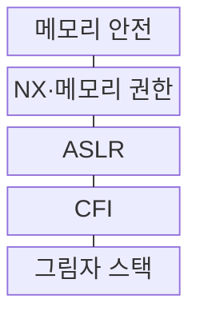
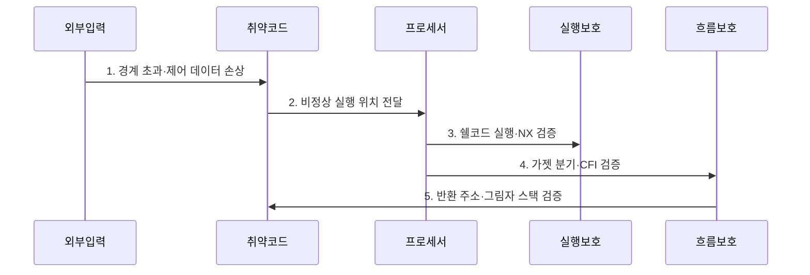

---
sidebar:
  order: 50
  label: "050. 쉘코드·ROP 공격 (Shellcode ROP)"
  badge:
    text: "기출 · 30%"
    variant: note
title: "쉘코드·ROP 공격 (Shellcode ROP)"
date: "2026-07-27T23:59:59+09:00"
tags:
  - "notes-security"
weight: 50
extra:
  question_no: "050"
  source_status: "기출"
  source_history: "125회"
  priority: 30
  priority_note: "125회 기출이며 메모리 방어 우회 비교로 보존함"
---

## 미리 알고가기

- **쉘코드(Shellcode)**: 취약한 프로세스에 주입해 공격자가 원하는 동작을 수행하는 짧은 기계어 코드이다.
- **반환 지향 프로그래밍(Return-Oriented Programming, ROP)**: 기존 실행 파일의 짧은 코드 조각을 반환 명령으로 연결하여 공격 동작을 구성하는 기법이다.
- **가젯(Gadget)**: ROP가 연결해 쓰는 짧은 기존 명령열로 주로 제어 이전 명령으로 종료한다.
- **코드 주입(Code Injection)**: 외부 데이터를 프로세스 메모리에 넣어 명령어로 실행하는 공격이다.
- **제어 데이터(Control Data)**: 반환 주소·함수 포인터처럼 다음 실행 위치를 정하는 값이다.
- **실행 방지(No-eXecute, NX)**: 데이터 메모리 페이지의 명령어 실행 권한을 제거하는 보호이다.
- **주소 공간 배치 무작위화(Address Space Layout Randomization, ASLR)**: 코드·라이브러리·스택·힙 주소를 실행마다 변경하는 보호이다.
- **제어 흐름 무결성(Control-Flow Integrity, CFI)**: 간접 분기·호출·반환이 허용 대상으로만 이동하는지 검사하는 보호이다.
- **그림자 스택(Shadow Stack)**: 반환 주소 사본을 별도 보관하고 함수 반환 시 대조하는 보호이다.
- **메모리 안전(Memory Safety)**: 허용된 객체 경계와 수명 안에서만 메모리를 읽고 쓰는 성질이다.
- **MITRE CWE-787**: 할당된 버퍼 경계 밖 쓰기로 제어 데이터가 손상되는 약점의 공식 식별자이다.
- **Intel Control-flow Enforcement Technology(CET)**: 간접 분기 추적과 하드웨어 그림자 스택으로 ROP를 억제하는 공식 기술이다.

## Ⅰ. 개요

- 정의/개념: 주입 코드·가젯으로 흐름을 탈취하는 **실행 공격**
- 배경/필요성: NX만으로는 **코드 재사용 공격 차단 불가**

### 쉽게 이해하기 (학습용)

- 쉘코드는 새 기계어를 넣어 실행하고 ROP는 이미 있는 짧은 코드를 이어 실행하므로, 메모리 오류 수정과 실행 흐름 보호가 모두 필요하다.

## Ⅱ. 특징

- 제어 데이터 손상의 **공통 공격 전제**
- NX·ASLR의 **실행·주소 예측 억제**
- CFI·그림자 스택의 **분기·반환 검증**

### 쉽게 이해하기 (학습용)

- NX는 데이터 영역의 쉘코드 실행을 막지만 기존 코드를 쓰는 ROP는 막지 못하므로, 주소 무작위화와 분기·반환 검사를 겹쳐 적용한다.

## Ⅲ. 구조 및 구성요소

| 구성요소 | 책임 |
|:---|:---|
| 메모리 안전 | 경계 밖 쓰기·수명 종료 접근 방지 |
| NX·메모리 권한 | 데이터 페이지 실행 금지 |
| ASLR | 코드·라이브러리·스택 주소 무작위화 |
| CFI | 허용 대상만 간접 분기·호출 허용 |
| 그림자 스택 | 반환 주소 사본 대조 |

### 쉽게 이해하기 (학습용)

- 입력 경계를 먼저 지키고, 오류가 남더라도 데이터 실행·주소 예측·비정상 분기·변조된 반환 주소를 차례로 제한한다.

## Ⅳ. 흐름도

**동작 원리**

1. **경계 초과·제어 데이터 손상**: 반환 주소·함수 포인터 변조
2. **비정상 실행 위치 전달**: 손상값을 다음 명령 주소로 사용
3. **쉘코드 실행·NX 검증**: 데이터 페이지 실행 차단
4. **가젯 분기·CFI 검증**: 허용되지 않은 간접 분기 차단
5. **반환 주소·그림자 스택 검증**: 원본 사본 불일치 탐지

### 쉽게 이해하기 (학습용)

- 공격자가 반환 주소를 바꾼 뒤 주입한 코드를 실행하면 NX가, 기존 가젯으로 이동하면 CFI와 그림자 스택이 차단한다.

## Ⅴ. 종류 및 비교

| 제어 탈취 유형 | 쉘코드 주입 | ROP |
|:---|:---|:---|
| 적용 기준 | 데이터 페이지 실행 가능 | NX 환경의 제어 흐름 손상 |
| 핵심 특징 | **외부 기계어 주입·실행** | **기존 가젯 연결·재사용** |
| 한계 | 악성 명령 직접 실행 | 정상 코드 기반 탐지·차단 곤란 |

### 쉽게 이해하기 (학습용)

- 새 코드를 넣는 쉘코드는 데이터 영역 실행 권한을 없애 제한하고, 기존 코드를 잇는 ROP는 허용된 제어 흐름인지 검사해 제한한다.

## Ⅵ. 실무 고려사항 및 대책

| 고려사항 | 대책 | 효과 |
|:---|:---|:---|
| 제어 데이터 손상 | **MITRE CWE-787 기준 제거** | 공격 전제인 메모리 결함 차단 |
| ROP 분기·반환 우회 | **Intel CET·CFI 적용** | 가젯 연결·반환 변조 억제 |
| 보호 옵션 누락 | **NX·ASLR·산출물 검사** | 주입 실행·주소 예측 제한 |

### 쉽게 이해하기 (학습용)

- 배포된 서버 바이너리에 NX·ASLR·CFI가 실제 적용됐는지 확인해 주입 코드 실행과 ROP 가젯 연결을 어렵게 한다.

## Ⅶ. 결론

- **가젯 재사용·모듈 호환성**으로 실행 보호 결정

### 쉽게 이해하기 (학습용)

- 메모리 결함을 먼저 고치고 NX·CFI·그림자 스택을 겹쳐 적용해야 새 코드 주입과 기존 코드 재사용 경로를 함께 줄일 수 있다.
