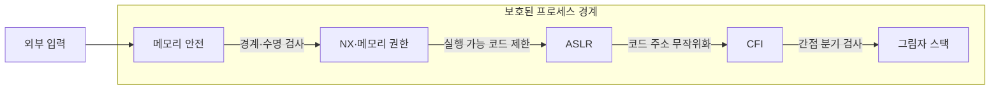
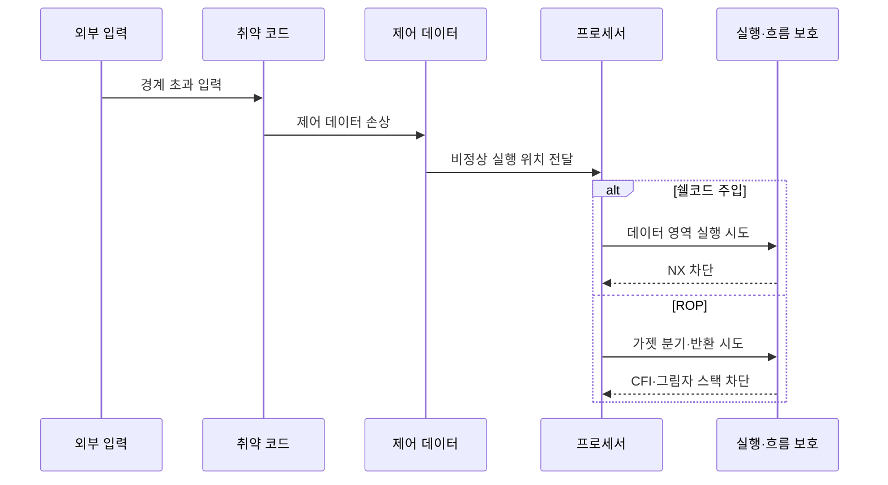

---
sidebar:
  order: 50
  label: "050. 쉘코드·ROP 공격 (Shellcode ROP)"
  badge:
    text: "기출 · 30%"
    variant: note
title: "쉘코드·ROP 공격 (Shellcode ROP)"
date: "2026-07-27T23:59:59+09:00"
tags:
  - "notes-security"
weight: 50
extra:
  question_no: "050"
  source_status: "기출"
  source_history: "125회"
  priority: 30
  priority_note: "125회 기출이며 메모리 방어 우회 비교로 보존함"
---

## 미리 알고가기

- **쉘코드(Shellcode, 쉘코드)**: 취약한 프로세스에 주입해 공격자가 원하는 동작을 수행하는 짧은 기계어 코드
- **반환 지향 프로그래밍(Return-Oriented Programming, ROP, 알오피)**: 영문 머리글자를 딴 명칭으로, 기존 코드 조각을 연결해 동작을 구성하는 공격
- **가젯(Gadget, 가젯)**: ROP가 연결해 쓰는 짧은 기존 명령열로, 주로 제어 이전 명령으로 종료
- **코드 주입(Code Injection)**: 외부 데이터를 프로세스 메모리에 넣어 명령어로 실행하는 공격
- **제어 데이터(Control Data)**: 반환 주소·함수 포인터처럼 다음 실행 위치를 정하는 값
- **실행 방지(No-eXecute, NX, 엔엑스)**: 데이터 메모리 페이지의 명령어 실행 권한을 제거
- **주소 공간 배치 무작위화(Address Space Layout Randomization, ASLR, 에이에스엘알)**: 코드·라이브러리·스택·힙 주소를 실행마다 변경
- **제어 흐름 무결성(Control-Flow Integrity, CFI, 씨에프아이)**: 간접 분기·호출·반환이 허용 대상으로만 이동하는지 검사
- **그림자 스택(Shadow Stack)**: 반환 주소 사본을 별도 보관하고 함수 반환 시 대조
- **메모리 안전(Memory Safety)**: 허용된 객체 경계와 수명 안에서만 메모리를 읽고 쓰는 성질

- **흐름 기호(↓·→·X)**: 아래·다음·차단의 절차 방향과 금지를 표시
## Ⅰ. 개요

- **정의/개념**: 주입 코드·기존 가젯으로 흐름 탈취
- **기존 한계**: NX만으로 기존 코드 재사용 공격 차단 불가
- **배경/필요성**: 메모리 결함과 제어 흐름 탈취의 다층 차단

### 쉽게 이해하기 (학습용)

- 쉘코드는 새 기계어를 넣어 실행하고 ROP는 이미 있는 짧은 코드를 이어 실행하므로, 메모리 오류 수정과 실행 흐름 보호가 모두 필요하다.

## Ⅱ. 특징

- 두 공격 모두 제어 데이터 손상에서 시작한다.
- NX는 쉘코드를 막지만 ROP를 직접 막지 못한다.
- 주소 노출은 ASLR의 가젯 위치 은닉을 약화한다.
- CFI·그림자 스택이 비정상 분기·반환을 제한한다.

### 쉽게 이해하기 (학습용)

- NX는 데이터 영역의 쉘코드 실행을 막지만 기존 코드를 쓰는 ROP는 막지 못하므로, 주소 무작위화와 분기·반환 검사를 겹쳐 적용한다.

## Ⅲ. 아키텍처 및 구성요소

| 설계 요소 | 설명 |
|:---|:---|
| 메모리 안전 | 경계 밖 쓰기·수명 종료 접근 방지 |
| NX·메모리 권한 | 쓰기 가능한 데이터 페이지 실행 금지 |
| ASLR | 코드·라이브러리·스택 주소 무작위화 |
| CFI | 허용 대상만 간접 분기·호출 허용 |
| 그림자 스택 | 반환 주소 사본 대조 |

> 요약: 결함·실행 권한·분기·반환을 계층 방어

### 쉽게 이해하기 (학습용)

- 입력 경계를 먼저 지키고, 오류가 남더라도 데이터 실행·주소 예측·비정상 분기·변조된 반환 주소를 차례로 제한한다.

## Ⅳ. 원리 및 절차 흐름도

| 절차 | 설명 |
|:---|:---|
| 경계 초과 입력 | 취약 함수가 허용 길이 밖까지 기록 |
| 제어 데이터 손상 | 반환 주소·함수 포인터 값 변경 |
| 비정상 실행 위치 전달 | 손상 값이 다음 명령 주소로 사용 |
| 데이터 영역 실행 시도 | 주입한 기계어 주소로 제어 이전 |
| NX 차단 | 실행 권한 없는 페이지에서 중단 |
| 가젯 분기·반환 시도 | 기존 코드 주소를 연속 재사용 |
| CFI·그림자 스택 차단 | 허용 분기·반환 주소 불일치 검출 |

> 요약: 제어 데이터 손상 후 공격 방식별 보호 적용

### 쉽게 이해하기 (학습용)

- 공격자가 반환 주소를 바꾼 뒤 주입한 코드를 실행하면 NX가, 기존 가젯으로 이동하면 CFI와 그림자 스택이 차단한다.

## Ⅴ. 종류 및 비교

| 판단 기준 | 쉘코드 주입 | ROP |
|:---|:---|:---|
| 적용 기준 | 데이터 페이지 실행 가능 | NX 환경의 제어 흐름 손상 |
| 핵심 특징 | 외부 기계어 주입·실행 | 기존 가젯 연결·재사용 |
| 한계 | 악성 명령 직접 실행 | 정상 코드 기반 탐지·차단 곤란 |

> 요약: 주입 실행은 NX, 코드 재사용은 CFI로 제한

### 쉽게 이해하기 (학습용)

- 새 코드를 넣는 쉘코드는 데이터 영역 실행 권한을 없애 제한하고, 기존 코드를 잇는 ROP는 허용된 제어 흐름인지 검사해 제한한다.

## Ⅵ. 실무 사례

1. 인터넷 서버는 NX·ASLR·CFI 적용 상태 검증
2. 외부 라이브러리는 그림자 스택 미적용 모듈 식별

### 쉽게 이해하기 (학습용)

- 인터넷 서버는 빌드·실행 환경에서 NX·ASLR·CFI가 실제 켜졌는지 확인해 단순 설정 누락을 찾는다.
- 외부 라이브러리 하나라도 그림자 스택을 지원하지 않으면 반환 보호가 끊길 수 있으므로 미적용 모듈을 찾아 교체하거나 격리한다.

## Ⅶ. 결론

- 메모리 결함 수정 후 NX·CFI·그림자 스택 적용

### 쉽게 이해하기 (학습용)

- 메모리 결함을 먼저 고치고 NX·CFI·그림자 스택을 겹쳐 적용해야 새 코드 주입과 기존 코드 재사용 경로를 함께 줄일 수 있다.
