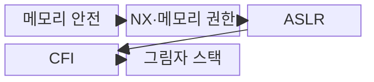
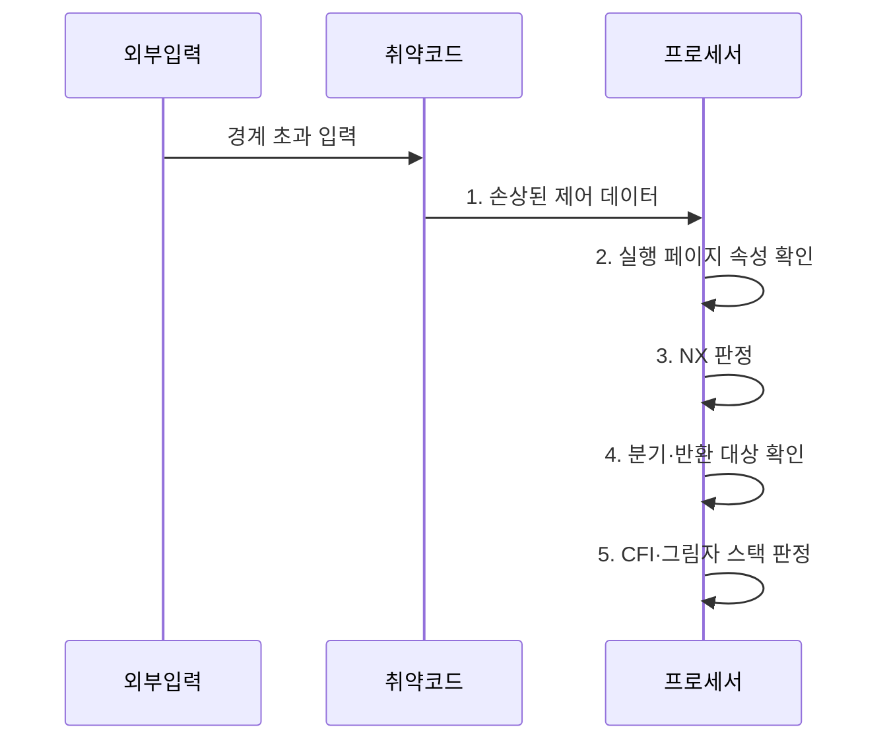

---
sidebar:
  order: 50
  label: "050. 쉘코드·ROP 공격 (Shellcode ROP)"
  badge:
    text: "기출 · 30%"
    variant: note
title: "쉘코드·ROP 공격 (Shellcode ROP)"
date: "2026-08-02T11:38:00+09:00"
tags:
  - "notes-security"
weight: 50
extra:
  question_no: "050"
  source_status: "기출"
  source_history: "125회"
  priority: 30
  priority_note: "125회 기출이며 메모리 방어 우회 비교로 보존함"
---

## Ⅰ. 개요

핵심 용어

- **쉘코드**는 취약한 프로세스에 주입해 공격 동작을 수행하는 기계어 코드이고, **ROP**는 기존 코드 조각을 연결해 공격 동작을 구성한다.

- 정의/개념: **쉘코드·ROP**는 각각 메모리에 주입한 명령 코드나 기존 실행 파일의 짧은 가젯 연쇄로 프로그램 제어 흐름을 탈취하는 코드 실행 공격 기법
- 배경/필요성: NX만으로는 **코드 재사용 공격 차단 불가**

#### 한줄 요약

- 쉘코드는 새 기계어를 넣어 실행하고 ROP는 이미 있는 짧은 코드를 이어 실행하므로, 메모리 오류 수정과 실행 흐름 보호가 모두 필요하다.

## Ⅱ. 특징

핵심 용어

- **제어 데이터**는 반환 주소·함수 포인터처럼 다음 실행 위치를 정하는 값이다.
- **NX·ASLR·CFI·그림자 스택**은 실행 권한, 주소 예측, 간접 분기, 반환 주소를 각각 검증한다.

- 제어 데이터 손상의 **공통 공격 전제**
- NX·ASLR의 **실행·주소 예측 억제**
- CFI·그림자 스택의 **분기·반환 검증**

#### 한줄 요약

- NX는 데이터 영역의 쉘코드 실행을 막지만 기존 코드를 쓰는 ROP는 막지 못하므로, 주소 무작위화와 분기·반환 검사를 겹쳐 적용한다.

## Ⅲ. 구조 및 구성요소

핵심 용어

- **메모리 안전**은 허용된 객체 경계와 수명 안에서만 메모리를 읽고 쓰는 성질이다.
- **가젯**은 ROP가 연결해 사용하는 짧은 기존 명령열이다.

| 구성요소 | 책임 |
|:---|:---|
| 메모리 안전 | **경계 밖 쓰기·수명 종료 접근** 방지 |
| NX·메모리 권한 | **데이터 페이지 실행** 금지 |
| ASLR | 코드·라이브러리·스택 **주소 무작위화** |
| CFI | 허용 대상만 **간접 분기·호출** 허용 |
| 그림자 스택 | **반환 주소 사본** 대조 |

#### 한줄 요약

- 입력 경계를 먼저 지키고, 오류가 남더라도 데이터 실행·주소 예측·비정상 분기·변조된 반환 주소를 차례로 제한한다.

## Ⅳ. 흐름도

핵심 용어

- **코드 주입**은 외부 데이터를 프로세스 메모리에 넣어 명령어로 실행하는 공격이다.
- **흐름 검증**은 간접 분기·호출·반환이 허용 대상과 보존된 반환 주소로만 이동하는지 확인한다.

**동작 원리**

1. **손상된 제어 데이터**: 변조된 반환 주소·함수 포인터를 실행 위치로 제공
2. **실행 페이지 속성 확인**: 다음 명령 주소가 속한 페이지의 실행 권한 확인
3. **NX 판정**: 데이터 페이지의 쉘코드 실행을 거부
4. **분기·반환 대상 확인**: 가젯의 간접 분기와 반환 주소를 검증 대상으로 확인
5. **CFI·그림자 스택 판정**: 허용 경로·반환 주소 사본 불일치를 탐지

#### 한줄 요약

- 공격자가 반환 주소를 바꾼 뒤 주입한 코드를 실행하면 NX가, 기존 가젯으로 이동하면 CFI와 그림자 스택이 차단한다.

## Ⅴ. 종류 및 비교

핵심 용어

- **쉘코드 주입·ROP**는 각각 새 기계어 실행과 기존 가젯 재사용으로 제어 흐름을 탈취한다.

| 제어 탈취 유형 | 쉘코드 주입 | ROP |
|:---|:---|:---|
| 적용 기준 | **데이터 페이지 실행** 가능 | NX 환경의 **제어 흐름 손상** |
| 핵심 특징 | **외부 기계어 주입·실행** | **기존 가젯 연결·재사용** |
| 한계 | **악성 명령** 직접 실행 | 정상 코드 기반 **탐지·차단 곤란** |

#### 한줄 요약

- 새 코드를 넣는 쉘코드는 데이터 영역 실행 권한을 없애 제한하고, 기존 코드를 잇는 ROP는 허용된 제어 흐름인지 검사해 제한한다.

## Ⅵ. 실무 고려사항 및 대책

핵심 용어

- **MITRE CWE-787**은 경계 밖 쓰기로 제어 데이터가 손상되는 약점을 정의한다.
- **Intel CET(Control-flow Enforcement Technology)**는 간접 분기 추적과 하드웨어 그림자 스택으로 ROP를 억제한다.

| 문제 | 대책 | 효과 |
|:---|:---|:---|
| 경계 밖 쓰기로 제어 데이터가 손상되면 실행 탈취 | **MITRE CWE-787** 기준으로 원인 제거 | 공격 전제인 **메모리 결함** 차단 |
| ROP가 허용되지 않은 분기·반환을 연결 | **Intel CET·CFI** 적용 | 가젯 연결과 **반환 변조** 억제 |
| 빌드별 보호 옵션 누락으로 코드 주입·주소 예측 가능 | 산출물 검사로 **NX·ASLR** 적용 확인 | 코드 주입과 **주소 예측** 제한 |

#### 한줄 요약

- 배포된 서버 바이너리에 NX·ASLR·CFI가 실제 적용됐는지 확인해 주입 코드 실행과 ROP 가젯 연결을 어렵게 한다.

## Ⅶ. 결론

핵심 용어

- **방어 원칙**은 메모리 결함을 먼저 제거하고 NX·ASLR·CFI·그림자 스택을 겹쳐 잔존 공격 경로를 줄이는 것이다.

- 코드 주입은 **NX**, 가젯 재사용은 **CFI·그림자 스택**, 주소 예측은 **ASLR**로 억제

#### 한줄 요약

- 메모리 결함을 먼저 고치고 NX·CFI·그림자 스택을 겹쳐 적용해야 새 코드 주입과 기존 코드 재사용 경로를 함께 줄일 수 있다.
