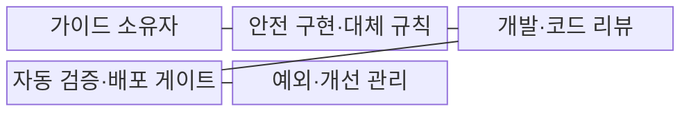
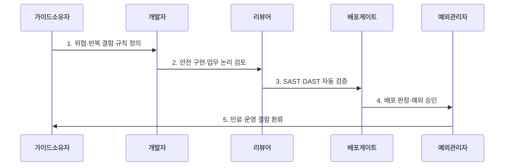

---
sidebar:
  order: 51
  label: "051. 시큐어 코딩 가이드 (Secure Coding Guide)"
  badge:
    text: "기출 · 50%"
    variant: note
title: "시큐어 코딩 가이드 (Secure Coding Guide)"
date: "2026-07-30T19:00:00+09:00"
tags:
  - "notes-security"
weight: 51
extra:
  question_no: "051"
  source_status: "기출"
  source_history: "126회"
  priority: 50
  priority_note: "126회 기출이며 개발 전주기 보안의 기본 답안임"
---

## 미리 알고가기

- **시큐어 코딩(Secure Coding)**: 구현 단계에서 입력·권한·암호·오류·자원 처리 결함을 예방하는 코딩 규칙·검증 활동이다.
- **위협 모델(Threat Model)**: 보호 자산·신뢰 경계·공격 경로·통제를 식별해 구현 우선순위를 정하는 모델이다.
- **응용 프로그래밍 인터페이스(Application Programming Interface, API)**: 소프트웨어가 기능과 데이터를 정해진 규격으로 호출하는 접점이다.
- **정적 응용 보안 시험(Static Application Security Testing, SAST)**: 프로그램을 실행하지 않고 소스 코드의 취약 패턴과 데이터 흐름을 분석하는 시험이다.
- **동적 응용 보안 시험(Dynamic Application Security Testing, DAST)**: 실행 중인 애플리케이션에 입력을 보내 실제 취약 동작을 확인하는 시험이다.
- **배포 게이트(Deployment Gate)**: 필수 보안 검사·승인 기준에 미달한 변경의 배포를 차단하는 관문이다.
- **보상 통제(Compensating Control)**: 원래 통제를 적용할 수 없을 때 동등한 위험 감소를 제공하는 대체 통제이다.
- **안전 기본값(Secure Default)**: 별도 설정이 없어도 최소 권한·거부·보호 상태를 적용하는 기본 동작이다.
- **예외 만료(Exception Expiry)**: 보안 규칙 예외가 재검토 없이 영구화되지 않게 효력을 끝내는 시점이다.
- **NIST SP 800-218 SSDF 1.1**: 안전한 소프트웨어 개발 관행을 준비·보호·생산·대응으로 제시한 공식 지침이다.
- **ISO/IEC 27034-1**: 조직의 애플리케이션 보안 관리 개념·절차·통제를 정의한 국제표준이다.
## Ⅰ. 개요

- 정의/개념: 구현 결함을 예방하는 **코드·검토·검증 규칙**
- 배경/필요성: 임의 구현의 **취약점 반복·품질 편차**

### 쉽게 이해하기 (학습용)

- 공격 입력을 안전하게 처리하는 규칙을 코드와 배포 검사에 넣어 같은 결함이 반복되지 않게 한다.

## Ⅱ. 특징

- **위협 모델·반복 결함**을 언어·프레임워크 규칙으로 구체화한다.
- **안전 기본값·대체 API**로 위험 구현 경로를 줄인다.
- **코드 리뷰·SAST·DAST·배포 게이트**를 결합하고 예외를 만료한다.

### 쉽게 이해하기 (학습용)

- 사람은 업무 권한과 복합 논리를 살피고 자동 도구는 반복 취약 패턴을 빠짐없이 검사한다.

## Ⅲ. 구조 및 구성요소

| 구성요소 | 책임 |
|:---|:---|
| 가이드 소유자 | **위협·결함별 규칙 우선순위 결정** |
| 안전 구현·대체 규칙 | **입력·권한·암호·오류 기준** |
| 개발·코드 리뷰 | **템플릿 적용·업무 논리 검토** |
| 자동 검증·배포 게이트 | **SAST·DAST 미달 배포 차단** |
| 예외·개선 관리 | **보상 통제·담당자·만료 관리** |

### 쉽게 이해하기 (학습용)

- 개발자가 안전한 템플릿을 쓰고 자동 검사가 기준 미달 배포를 막으며 예외는 만료 뒤 다시 검토한다.

## Ⅳ. 흐름도

1. **위협·반복 결함 규칙 정의**: 안전 기본값·대체 API 결정
2. **안전 구현·업무 논리 검토**: 규칙 적용과 권한·위험 경로를 함께 검토
3. **SAST·DAST 자동 검증**: 취약 패턴·실행 동작 검사
4. **배포 판정·예외 승인**: 미달 차단·보상 통제 기록
5. **만료·운영 결함 환류**: 예외·사고를 규칙에 반영

### 쉽게 이해하기 (학습용)

- 안전 규칙을 적용한 코드는 사람의 논리 검토와 자동 검사를 통과해야 배포된다.

## Ⅴ. 종류 및 비교

| 시큐어 코딩 통제 | 가이드·리뷰 | 자동 보안 검사 | 안전 기본값·프레임워크 |
|:---|:---|:---|:---|
| 적용 기준 | 설계·권한·업무 규칙 | 주입·비밀·위험 함수 검사 | 공통 인증·인코딩·오류 처리 |
| 핵심 특징 | **업무 맥락·논리 판단** | **반복 취약 패턴 검사** | 위험 구현 경로 축소 |
| 한계 | 숙련도·검토 시간 편차 | 오탐·데이터 흐름 한계 | 우회 API·설정 오류 |

### 쉽게 이해하기 (학습용)

- 업무 논리는 사람의 리뷰, 반복 패턴은 자동 검사, 공통 기능은 안전한 프레임워크가 효과적이다.

## Ⅵ. 실무 고려사항 및 대책

| 고려사항 | 대책 | 효과 |
|:---|:---|:---|
| 개발 관행 누락 | **NIST SSDF 1.1 적용** | 개발·검증·대응 절차 정렬 |
| 앱 보안 거버넌스 | **ISO/IEC 27034-1 연계** | 조직·프로젝트 책임 연결 |
| 검사 우회·예외 영구화 | **배포 게이트·만료일 적용** | 반복 결함·기술 부채 억제 |

### 쉽게 이해하기 (학습용)

- 개발자가 문자열 결합 SQL을 만들지 않도록 공통 결제 API 템플릿에 입력 검증과 매개변수 바인딩을 기본 구현한다.

## Ⅶ. 결론

- **업무논리·검출가능성·예외수명**으로 코딩 통제를 결정한다.

### 쉽게 이해하기 (학습용)

- 안전한 대체 API와 배포 게이트를 기본 경로로 만들고 예외는 만료 시 재검토한다.
