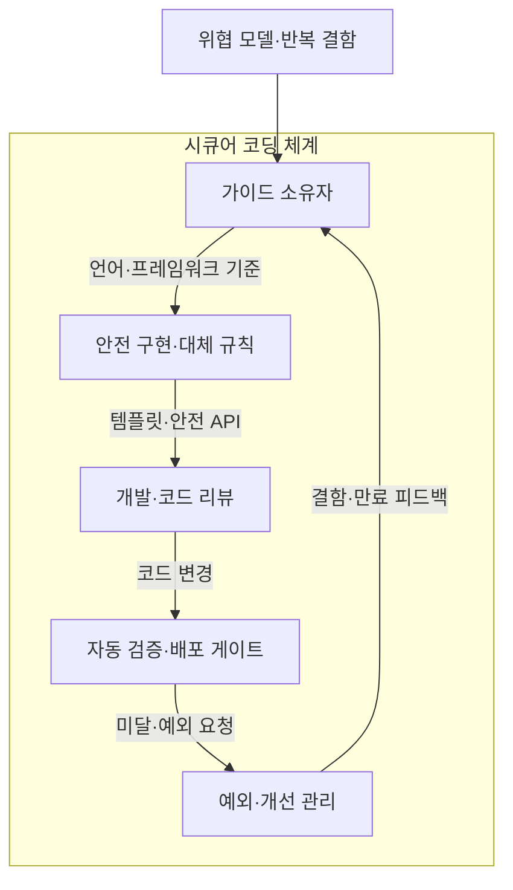
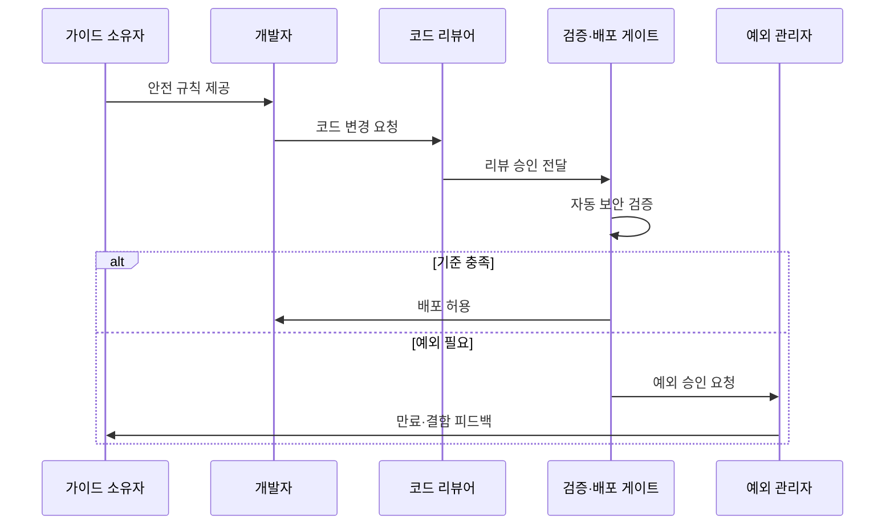

---
sidebar:
  order: 51
  label: "051. 시큐어 코딩 가이드 (Secure Coding Guide)"
  badge:
    text: "기출 · 50%"
    variant: note
title: "시큐어 코딩 가이드 (Secure Coding Guide)"
date: "2026-07-25T21:51:00+09:00"
tags:
  - "notes-security"
weight: 51
extra:
  question_no: "051"
  source_status: "기출"
  source_history: "126회"
  priority: 50
  priority_note: "126회 기출이며 개발 전주기 보안의 기본 답안임"
---

## 미리 알고가기

- 시큐어 코딩(Secure Coding): [읽기: 시큐어 코딩; 표기 이유: 한글명 뒤 영문 원어 병기] 구현 단계에서 입력·권한·암호·오류·자원 처리 결함을 예방하는 코딩 규칙과 검증 활동
- 위협 모델(Threat Model): [읽기: 위협 모델; 표기 이유: 한글명 뒤 영문 원어 병기] 보호 자산·신뢰 경계·공격 경로·통제를 식별해 구현 우선순위를 정하는 모델
- 응용 프로그래밍 인터페이스(Application Programming Interface, API): [읽기: 에이피아이; 표기 이유: 영문 머리글자] 소프트웨어 기능과 데이터의 호출 방식을 정의한 계약
- 정적 응용 보안 시험(Static Application Security Testing, SAST): [읽기: 에스에이에스티; 표기 이유: 영문 머리글자] 프로그램을 실행하지 않고 코드·바이너리의 취약 패턴과 데이터 흐름을 분석하는 시험
- 동적 응용 보안 시험(Dynamic Application Security Testing, DAST): [읽기: 디에이에스티; 표기 이유: 영문 머리글자] 실행 중인 응용의 외부 인터페이스에 입력을 보내 취약 동작을 확인하는 시험
- 배포 게이트(Deployment Gate): [읽기: 배포 게이트; 표기 이유: 한글명 뒤 영문 원어 병기] 필수 보안 검사·승인 기준을 충족하지 못한 변경의 배포를 차단하는 관문
- 보상 통제(Compensating Control): [읽기: 보상 통제; 표기 이유: 한글명 뒤 영문 원어 병기] 원래 통제를 적용할 수 없을 때 동등한 위험 감소를 제공하는 대체 통제
- 안전 기본값(Secure Default): [읽기: 안전 기본값; 표기 이유: 한글명 뒤 영문 원어 병기] 별도 설정이 없어도 최소 권한·거부·보호 상태가 적용되는 기본 동작
- 예외 만료(Exception Expiry): [읽기: 예외 만료; 표기 이유: 한글명 뒤 영문 원어 병기] 보안 규칙 예외가 재검토 없이 영구화되지 않도록 효력이 끝나는 시점

- **흐름 기호(↓·→·X)**: [읽기: 흐름 기호; 표기 이유: 한글명 뒤 영문 원어 병기] 아래로·다음으로·차단으로 읽으며 순서·분기·금지를 나타냄
## Ⅰ. 개요

- **정의/개념**: 구현 결함을 예방하는 코드·검증 규칙
- **배경/필요성**: 위협 통제를 개발·배포 판단으로 변환

### 쉽게 이해하기 (학습용)

- 공격 입력을 안전하게 처리하는 규칙을 코드와 배포 검사에 넣어 같은 결함이 반복되지 않게 한다.

## Ⅱ. 특징

- 공통 원칙을 언어·프레임워크 규칙으로 구체화한다.
- 금지 패턴을 안전한 대체 API·예제와 연결한다.
- 리뷰는 업무 논리, 자동 검사는 반복 패턴에 강하다.
- 예외 만료가 임시 위험 수용의 영구화를 막는다.

### 쉽게 이해하기 (학습용)

- 사람은 업무 권한과 복합 논리를 살피고 자동 도구는 반복 취약 패턴을 빠짐없이 검사한다.

## Ⅲ. 아키텍처 및 구성요소

| 설계 요소 | 설명 |
|:---|:---|
| 가이드 소유자 | 위협·결함으로 규칙 우선순위 결정 |
| 안전 구현·대체 규칙 | 입력·권한·암호·오류 처리 기준 제공 |
| 개발·코드 리뷰 | 템플릿 적용과 업무 논리 검토 |
| 자동 검증·배포 게이트 | SAST·DAST 결과로 기준 미달 차단 |
| 예외·개선 관리 | 보상 통제·담당자·만료·피드백 관리 |

> 요약: 안전 경로 제공과 배포 차단을 피드백으로 개선

### 쉽게 이해하기 (학습용)

- 개발자가 안전한 템플릿을 쓰고 자동 검사가 기준 미달 배포를 막으며 예외는 만료 뒤 다시 검토한다.

## Ⅳ. 원리 및 절차 흐름도

| 절차 | 설명 |
|:---|:---|
| 안전 규칙 제공 | 안전 기본값·대체 API·실패 조건 제시 |
| 코드 변경 요청 | 템플릿과 규칙을 구현에 적용 |
| 리뷰 승인 전달 | 권한·업무 논리와 위험 경로 검토 |
| 자동 보안 검증 | 반복 취약 패턴·실행 동작 검사 |
| 배포 허용 | 필수 검사·승인 통과 변경만 배포 |
| 예외 승인 요청 | 근거·보상 통제·담당자·만료 기록 |
| 만료·결함 피드백 | 예외·운영 결함을 규칙에 반영 |

> 요약: 결함 분석부터 리뷰·검증 차단까지 수행

### 쉽게 이해하기 (학습용)

- 안전 규칙을 적용한 코드는 사람의 논리 검토와 자동 검사를 통과해야 배포된다.

## Ⅴ. 종류 및 비교

| 판단 기준 | 개발자 가이드·리뷰 | 자동 정적 검사 | 안전 기본값·프레임워크 |
|:---|:---|:---|:---|
| 핵심 특징 | 업무 맥락·복합 논리 판단 | 반복 패턴의 일관된 전수 검사 | 위험 구현 경로 자체 축소 |
| 적용 기준 | 설계·권한·업무 규칙 | 주입·비밀·위험 함수 검사 | 공통 인증·인코딩·오류 처리 |
| 주요 위험 | 숙련도·검토 시간 편차 | 오탐·데이터 흐름 한계 | 우회 API·설정 오류 |

### 쉽게 이해하기 (학습용)

- 업무 논리는 사람의 리뷰, 반복 패턴은 자동 검사, 공통 기능은 안전한 프레임워크가 효과적이다.

## Ⅵ. 실무 사례

1. 결제 API는 매개변수 바인딩 템플릿을 기본 제공
2. 보안 예외는 보상 통제·담당자·만료일 등록

### 쉽게 이해하기 (학습용)

- 결제 API는 문자열을 직접 이어 붙이지 않고 매개변수 바인딩 템플릿으로 주입을 방지한다.
- 보안 예외에는 대체 보호조치와 담당자·만료일을 기록해 임시 허용이 영구화되지 않게 한다.

## Ⅶ. 결론

- 대체 API·배포 게이트·예외 만료로 안전 경로 강제

### 쉽게 이해하기 (학습용)

- 안전한 대체 API와 배포 게이트를 기본 경로로 만들고 예외는 만료 시 재검토한다.
