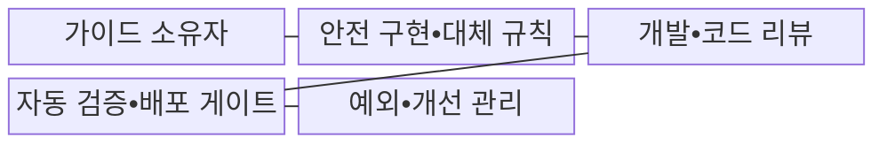
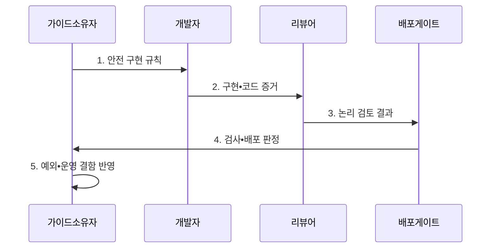

---
sidebar:
  order: 51
  label: "051. 시큐어 코딩 가이드 (Secure Coding Guide)"
  badge:
    text: "기출 • 50%"
    variant: note
title: "시큐어 코딩 가이드 (Secure Coding Guide)"
date: "2026-08-04T10:47:00+09:00"
tags:
  - "notes-security"
weight: 51
extra:
  question_no: "051"
  source_status: "기출"
  source_history: "126회"
  priority: 50
  priority_note: "126회 기출이며 개발 전주기 보안의 기본 답안임"
---

## Ⅰ. 개요

핵심 용어

- **시큐어 코딩** 은 구현 단계에서 입력•권한•암호•오류•자원 처리 결함을 예방하는 코딩 규칙과 검증 활동이다.

- 정의/개념: 구현 결함을 예방하는 **코드•검토•검증 규칙**
- 배경/필요성: 임의 구현의 **취약점 반복•품질 편차**

#### 한줄 요약

- 공격 입력을 안전하게 처리하는 규칙을 코드와 배포 검사에 넣어 같은 결함이 반복되지 않게 한다.

## Ⅱ. 특징

핵심 용어

- **위협 모델** 은 보호 자산•신뢰 경계•공격 경로•통제를 식별해 구현 우선순위를 정한다.
- **안전 기본값** 은 별도 설정이 없어도 최소 권한•거부•보호 상태를 적용한다.
- **SAST(Static Application Security Testing)** 는 소스 코드의 취약 패턴을 실행 전에 검사한다.
- **DAST(Dynamic Application Security Testing)** 는 실행 중인 애플리케이션의 취약 동작을 외부에서 검사한다.
- **배포 게이트** 는 필수 보안 검사 기준에 미달한 변경의 배포를 차단한다.

- **위협 모델•반복 결함** 의 언어•프레임워크 규칙 구체화
- **안전 기본값•대체 API** 를 통한 위험 구현 경로 축소
- **코드 리뷰•SAST•DAST•배포 게이트** 결합과 예외 만료

#### 한줄 요약

- 사람은 업무 권한과 복합 논리를 살피고 자동 도구는 반복 취약 패턴을 빠짐없이 검사한다.

## Ⅲ. 구조 및 구성요소

핵심 용어

| 구성요소 | 책임 |
|:---|:---|
| 가이드 소유자 | **위협•결함별 규칙 우선순위 결정** |
| 안전 구현•대체 규칙 | **입력•권한•암호•오류 기준** |
| 개발•코드 리뷰 | **템플릿 적용•업무 논리 검토** |
| 자동 검증•배포 게이트 | **SAST•DAST 미달 배포 차단** |
| 예외•개선 관리 | **보상 통제•담당자•만료 관리** |

#### 한줄 요약

- 개발자가 안전한 템플릿을 쓰고 자동 검사가 기준 미달 배포를 막으며 예외는 만료 뒤 다시 검토한다.

## Ⅳ. 흐름도

핵심 용어

- **코드 리뷰** 는 자동 도구가 놓치기 쉬운 업무 권한•복합 논리와 안전 API 적용을 사람이 검토한다.
- **안전 API(Application Programming Interface)** 는 검증된 입력•인증•암호•오류 처리 기능을 제공하는 인터페이스다.

**동작 원리**

1. **안전 구현 규칙**: 위협•반복 결함별 안전 기본값•대체 API 제공
2. **구현•코드 증거**: 규칙 적용 코드와 권한•업무 흐름 자료 제공
3. **논리 검토 결과**: 업무 권한•위험 경로의 사람 검토 결과 전달
4. **검사•배포 판정**: SAST•DAST 결과와 기준 미달 차단 여부 제공
5. **예외•운영 결함 반영**: 보상 통제•만료일•운영 사고를 규칙 개선에 반영

#### 한줄 요약

- 안전 규칙을 적용한 코드는 사람의 논리 검토와 자동 검사를 통과해야 배포된다.

## Ⅴ. 종류 및 비교

핵심 용어

| 시큐어 코딩 통제 | 가이드•리뷰 | 자동 보안 검사 | 안전 기본값•프레임워크 |
|:---|:---|:---|:---|
| 적용 기준 | **설계•권한•업무 규칙** | 주입•비밀•**위험 함수 검사** | 공통 **인증•인코딩•오류 처리** |
| 핵심 특징 | **업무 맥락•논리 판단** | **반복 취약 패턴 검사** | 위험 구현 경로 축소 |
| 한계 | 숙련도•**검토 시간 편차** | 오탐•**데이터 흐름 한계** | 프레임워크 외 API•**설정 오류** |

#### 한줄 요약

- 업무 논리는 사람의 리뷰, 반복 패턴은 자동 검사, 공통 기능은 안전한 프레임워크가 효과적이다.

## Ⅵ. 실무 고려사항 및 대책

핵심 용어

- **NIST(National Institute of Standards and Technology)** 는 미국의 기술 표준과 지침을 개발하는 기관이다.
- **SSDF(Secure Software Development Framework) 1.1** 은 안전한 소프트웨어 개발 관행을 제시한다.
- **ISO(International Organization for Standardization)** 는 국제 표준을 개발•발행하는 기구다.
- **IEC(International Electrotechnical Commission)** 는 전기•전자 분야 국제 표준을 개발하는 기구다.
- **ISO/IEC 27034-1** 은 애플리케이션 보안 관리 개념•절차•통제를 정의한다.
- **예외 만료** 는 보상 통제와 담당자를 둔 보안 예외가 재검토 없이 영구화되지 않게 한다.

| 문제 | 대책 | 효과 |
|:---|:---|:---|
| 개발 단계별 보안 관행이 달라 반복 결함 발생 | **NIST SSDF 1.1** 적용 | 개발•검증•대응의 **절차 정렬** |
| 조직과 프로젝트의 앱 보안 책임이 분리 | **ISO/IEC 27034-1** 연계 | 조직•프로젝트의 **책임 연결** |
| 배포 검사 우회와 만료 없는 예외로 기술 부채 증가 | **배포 게이트•만료일** 적용 | 반복 결함과 **기술 부채** 억제 |

#### 한줄 요약

- 개발자가 문자열 결합 SQL을 만들지 않도록 공통 결제 API 템플릿에 입력 검증과 매개변수 바인딩을 기본 구현한다.

## Ⅶ. 결론

핵심 용어

- 업무 논리는 **코드 리뷰**, 반복 패턴은 **자동 검사**, 예외는 만료•재승인 적용

#### 한줄 요약

- 안전한 대체 API와 배포 게이트를 기본 경로로 만들고 예외는 만료 시 재검토한다.
