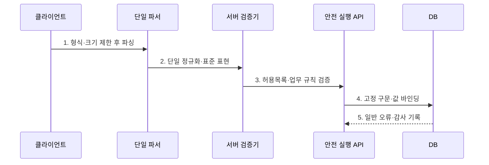

---
sidebar:
  order: 52
  label: "052. 입력값 검증·파라미터 바인딩 (Input Validation Parameter Binding)"
  badge:
    text: "기출 · 50%"
    variant: note
title: "입력값 검증·파라미터 바인딩 (Input Validation Parameter Binding)"
date: "2026-07-30T19:00:00+09:00"
tags:
  - "notes-security"
weight: 52
extra:
  question_no: "052"
  source_status: "기출"
  source_history: "123회"
  priority: 50
  priority_note: "123회 기출이며 입력 경계와 SQL 방어에 재사용됨"
---

## 미리 알고가기

- **입력값 검증(Input Validation)**: 외부 입력이 허용된 형식·길이·범위에 맞는지 확인하는 통제이다.
- **파라미터 바인딩(Parameter Binding)**: 실행 구문과 외부 입력값을 분리하여 데이터가 명령으로 해석되지 않게 전달하는 방식이다.
- **허용 목록(Allowlist)**: 미리 승인한 값이나 형식만 통과시키는 검증 기준이다.
- **정규화(Normalization)**: 같은 의미를 가진 여러 입력 표현을 하나의 표준 표현으로 바꾸는 처리이다.
- **파서(Parser)**: 입력 문자열을 정해진 문법 구조에 따라 해석하는 구성요소이다.
- **구조화 질의 언어(Structured Query Language, SQL)**: 관계형 데이터베이스의 데이터를 조회·조작하는 질의 언어이다.
- **객체 관계 매핑(Object-Relational Mapping, ORM)**: 객체의 데이터 연산을 관계형 데이터베이스 질의로 변환하는 기술이다.
- **동적 식별자**: 실행 중 결정되는 테이블명·열 이름·정렬 기준처럼 바인딩하기 어려운 질의 구성요소이다.
- **원시 질의(Raw Query)**: ORM의 추상화나 보호 기능을 거치지 않고 직접 작성한 데이터베이스 질의이다.
- **응용 프로그래밍 인터페이스(Application Programming Interface, API)**: 프로그램이 명령과 데이터를 정해진 구조로 교환하는 호출 규격이다.
- **마스킹(Masking)**: 로그에 기록된 민감한 값을 식별할 수 없도록 가리는 처리이다.
- **MITRE CWE-20**: 제품이 입력의 유효성·속성을 잘못 검증하는 약점의 공식 식별자이다.
- **OWASP ASVS 5.0.0**: 입력 검증·인코딩·정화·인젝션 방지 요구를 제시한 공식 표준이다.

## Ⅰ. 개요

- 정의/개념: 입력의 **허용 범위 판정·구문값 분리**
- 배경/필요성: 차단 목록의 **우회 표현·직접 호출**

### 쉽게 이해하기 (학습용)

- 입력값 검증은 외부 값을 업무 계약에 맞는 데이터로 제한해 구문·자원·권한 공격의 출발점을 줄인다.

## Ⅱ. 특징

- **단일 정규화 후 서버 허용 목록**으로 형식·길이·범위를 판정한다.
- **파라미터 바인딩**으로 외부 값을 실행 구문이 아닌 데이터로 처리한다.
- **동적 식별자**는 승인된 테이블·열 이름에 코드로 매핑한다.

### 쉽게 이해하기 (학습용)

- 허용 목록과 길이·형식·범위 검사는 입력을 제한하지만 출력 인코딩이나 매개변수화 질의를 대신하지 않는다.

## Ⅲ. 구조 및 구성요소

| 구성요소 | 책임 |
|:---|:---|
| 입력 계약 | **형식·길이·범위 규칙 정의** |
| 단일 파서 | **인코딩·콘텐츠 형식 통일** |
| 서버 검증기 | **허용 목록·업무 규칙 판정** |
| 안전 실행 API | **구문·외부 값 분리 전달** |
| 오류·감사 | **일반 오류 응답·차단 기록** |

### 쉽게 이해하기 (학습용)

- 계약 스키마가 구조와 크기를 제한하고 정규화·업무 검증을 통과한 값만 안전한 처리기에 전달한다.

## Ⅳ. 흐름도

1. **형식·크기 제한 후 파싱**: 계약 위반 입력을 조기 거부
2. **단일 정규화·표준 표현**: 인코딩·중복 표현을 통일
3. **허용목록·업무 규칙 검증**: 값·권한·상태를 판정
4. **고정 구문·값 바인딩**: 데이터의 명령 해석을 차단
5. **일반 오류·감사 기록**: 내부 정보 은닉·차단 추적

### 쉽게 이해하기 (학습용)

- 서버는 입력을 일관된 형태로 정규화하고 계약과 업무 규칙을 확인한 뒤 고정 구문에 값으로 결합한다.

## Ⅴ. 종류 및 비교

| 입력 처리 통제 | 입력 검증 | 정규화 | 파라미터 바인딩 |
|:---|:---|:---|:---|
| 적용 기준 | 업무 허용 범위 확인 | 중복 표현 제거 | 질의 값 안전 전달 |
| 핵심 특징 | **값 적합성 판정** | **표현 방식 통일** | 구문·값 분리 |
| 한계 | 문맥별 인코딩 대체 불가 | 이중 정규화 시 의미 변경 | 동적 식별자 분리 불가 |

### 쉽게 이해하기 (학습용)

- 입력값 검증과 대안의 선택 기준을 비교함

## Ⅵ. 실무 고려사항 및 대책

| 고려사항 | 대책 | 효과 |
|:---|:---|:---|
| 입력 계약 검증 누락 | **MITRE CWE-20 기준 제거** | 비정상 형식·범위 조기 차단 |
| 문맥별 처리 혼동 | **OWASP ASVS 5.0.0 적용** | 검증·인코딩·바인딩 구분 |
| 동적 식별자·자원 고갈 | **허용목록·깊이·크기 제한** | 주입 우회·과부하 방지 |

### 쉽게 이해하기 (학습용)

- API 계약에 문자열 길이, 배열 개수, 중첩 깊이와 전체 본문 크기를 정하고 이를 넘는 요청은 처리 전에 거부한다.

## Ⅶ. 결론

- **데이터계약·사용문맥·크기한도**로 입력 통제를 결정한다.

### 쉽게 이해하기 (학습용)

- 입력값 검증은 계약 제한과 문맥별 안전 처리, 자원 제한을 함께 적용해야 한다.
