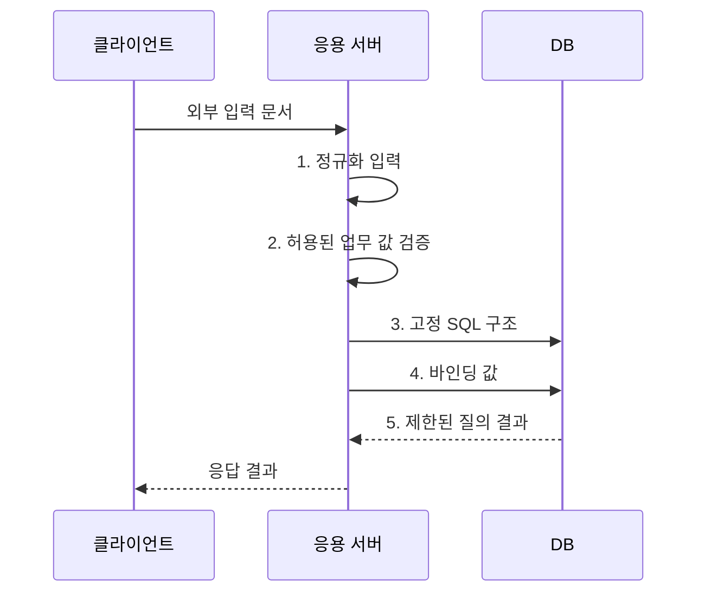

---
sidebar:
  order: 52
  label: "052. 입력값 검증·파라미터 바인딩 (Input Validation Parameter Binding)"
  badge:
    text: "기출 · 50%"
    variant: note
title: "입력값 검증·파라미터 바인딩 (Input Validation Parameter Binding)"
date: "2026-08-02T11:42:00+09:00"
tags:
  - "notes-security"
weight: 52
extra:
  question_no: "052"
  source_status: "기출"
  source_history: "123회"
  priority: 50
  priority_note: "123회 기출이며 입력 경계와 SQL 방어에 재사용됨"
---

## Ⅰ. 개요

핵심 용어

- **입력값 검증**은 외부 입력이 허용된 형식·길이·범위에 맞는지 확인한다.
- **파라미터 바인딩**은 실행 구문과 외부 입력값을 분리해 데이터가 명령으로 해석되지 않게 한다.

- 정의/개념: 외부 입력을 허용 범위로 제한하고 실행 구문과 분리하는 **입력 보안 통제**
- 배경/필요성: 차단 목록과 클라이언트 검증만으로는 변형 입력과 **검증 우회를 일관되게 차단하기 어려움**

#### 한줄 요약

- 입력값 검증은 외부 값을 업무 계약에 맞는 데이터로 제한해 구문·자원·권한 공격의 출발점을 줄인다.

## Ⅱ. 특징

핵심 용어

- **허용 목록**은 승인한 값이나 형식만 통과시키고, **정규화**는 같은 의미의 여러 표현을 하나의 표준 표현으로 바꾼다.

- **단일 정규화 후 서버 허용 목록**을 통한 형식·길이·범위 판정
- **파라미터 바인딩**을 통한 외부 값의 데이터 처리
- **동적 식별자**의 승인된 테이블·열 이름 매핑

#### 한줄 요약

- 허용 목록과 길이·형식·범위 검사는 입력을 제한하지만 출력 인코딩이나 매개변수화 질의를 대신하지 않는다.

## Ⅲ. 구조 및 구성요소

핵심 용어

- **파서**는 입력 문자열을 정해진 문법 구조에 따라 해석한다.
- **안전 실행 API**는 고정 구문과 검증된 값을 분리해 실행점에 전달한다.

| 구성요소 | 책임 |
|:---|:---|
| 입력 계약 | **형식·길이·범위 규칙 정의** |
| 단일 파서 | **인코딩·콘텐츠 형식 통일** |
| 서버 검증기 | **허용 목록·업무 규칙 판정** |
| 안전 실행 API | **구문·외부 값 분리 전달** |
| 오류·감사 | **일반 오류 응답·차단 기록** |

#### 한줄 요약

- 계약 스키마가 구조와 크기를 제한하고 정규화·업무 검증을 통과한 값만 안전한 처리기에 전달한다.

## Ⅳ. 흐름도

핵심 용어

- **입력 계약**은 형식·길이·범위·배열 개수·중첩 깊이와 전체 크기를 제한한다.

**동작 원리**

1. **정규화 입력**: 인코딩·중복 표현을 하나의 표준 표현으로 변환
2. **허용된 업무 값 검증**: 형식·길이·범위·권한·상태 확인
3. **고정 SQL 구조**: 외부 값과 분리된 실행 명령 구조 전달
4. **바인딩 값**: 외부 입력을 명령이 아닌 매개변수 값으로 전달
5. **제한된 질의 결과**: 내부 정보를 숨긴 결과·오류 상태 제공

#### 한줄 요약

- 서버는 입력을 일관된 형태로 정규화하고 계약과 업무 규칙을 확인한 뒤 고정 구문에 값으로 결합한다.

## Ⅴ. 종류 및 비교

핵심 용어

- **입력 검증·정규화·바인딩**은 각각 값 적합성 판정, 표현 통일, 실행 구문과 값 분리를 담당한다.

| 입력 처리 통제 | 입력 검증 | 정규화 | 파라미터 바인딩 |
|:---|:---|:---|:---|
| 적용 기준 | **업무 허용 범위** 확인 | **중복 표현** 제거 | 질의 값의 **안전한 전달** |
| 핵심 특징 | **값 적합성 판정** | **표현 방식 통일** | 구문·값 분리 |
| 한계 | **문맥별 인코딩** 대체 불가 | 이중 정규화 시 **의미 변경** | **동적 식별자** 분리 불가 |

#### 한줄 요약

- 입력 검증은 값의 적합성, 정규화는 표현 통일, 바인딩은 구문 분리를 담당한다.

## Ⅵ. 실무 고려사항 및 대책

핵심 용어

- **MITRE CWE-20**은 입력의 유효성·속성을 잘못 검증하는 약점을 정의하고, **OWASP ASVS 5.0.0**은 입력·인젝션 방지 요구를 제시한다.
- **동적 식별자**는 바인딩하기 어려운 테이블·열 이름이므로 코드 허용목록으로 매핑한다.

| 문제 | 대책 | 효과 |
|:---|:---|:---|
| 입력 계약 검증이 없으면 비정상 값이 실행점 도달 | **MITRE CWE-20** 기준으로 서버 검증 | 비정상 **형식·범위** 조기 차단 |
| 검증과 인코딩·바인딩을 혼동하면 주입 경로 잔존 | **OWASP ASVS 5.0.0** 적용 | 문맥별 **통제 책임** 구분 |
| **ORM 원시 질의**의 동적 식별자와 과대 입력으로 주입·자원 고갈 | **허용목록·크기 제한**과 깊이 제한 적용 | 식별자 주입과 **과부하** 방지 |

#### 한줄 요약

- API 계약에 문자열 길이, 배열 개수, 중첩 깊이와 전체 본문 크기를 정하고 이를 넘는 요청은 처리 전에 거부한다.

## Ⅶ. 결론

핵심 용어

- **방어 경계**는 서버에서 계약 검증과 자원 제한을 수행하고 값은 바인딩, 식별자는 코드 매핑으로 처리한다.

- 값은 **허용 목록 검증·바인딩**, 식별자는 코드 매핑, 입력은 깊이·크기 제한

#### 한줄 요약

- 입력값 검증은 계약 제한과 문맥별 안전 처리, 자원 제한을 함께 적용해야 한다.
