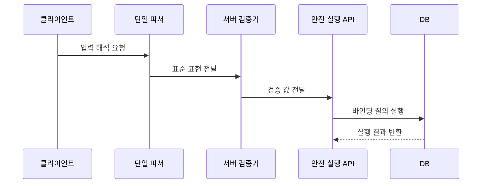

---
sidebar:
  order: 52
  label: "052. 입력값 검증·파라미터 바인딩 (Input Validation Parameter Binding)"
  badge:
    text: "기출 · 50%"
    variant: note
title: "입력값 검증·파라미터 바인딩 (Input Validation Parameter Binding)"
date: "2026-07-27T23:59:59+09:00"
tags:
  - "notes-security"
weight: 52
extra:
  question_no: "052"
  source_status: "기출"
  source_history: "123회"
  priority: 50
  priority_note: "123회 기출이며 입력 경계와 SQL 방어에 재사용됨"
---

## 미리 알고가기

- **입력값 검증(Input Validation)**: [읽기: 입력값 검증; 표기 이유: 한글명 뒤 영문 원어 병기] 외부 값이 허용된 형식·범위인지 판정하는 통제
- **파라미터 바인딩(Parameter Binding)**: [읽기: 파라미터 바인딩; 표기 이유: 한글명 뒤 영문 원어 병기] 실행 구문과 외부 값을 분리해 전달하는 방식
- **허용 목록(Allowlist)**: [읽기: 허용 목록; 표기 이유: 한글명 뒤 영문 원어 병기] 미리 승인한 값이나 형식만 통과시키는 기준
- **정규화(Normalization)**: [읽기: 정규화; 표기 이유: 한글명 뒤 영문 원어 병기] 여러 표현을 하나의 표준 표현으로 바꾸는 처리
- **파서(Parser)**: [읽기: 파서; 표기 이유: 한글명 뒤 영문 원어 병기] 입력 문자열을 정해진 문법 구조로 해석하는 구성요소
- **구조화 질의 언어(Structured Query Language, SQL)**: ‘에스큐엘’로 읽고 세 영문 단어의 머리글자를 딴 표기이며 관계형 데이터베이스를 조회·조작함
- **객체 관계 매핑(Object-Relational Mapping, ORM)**: ‘오알엠’으로 읽고 세 영문 핵심어의 머리글자를 딴 표기이며 객체 연산을 데이터베이스 질의로 변환함
- **동적 식별자**: [읽기: 동적 식별자; 표기 이유: 한국어 통용어 표기] 실행 중 결정되는 테이블명·열 이름·정렬 기준
- **원시 질의(Raw Query)**: [읽기: 원시 질의; 표기 이유: 한글명 뒤 영문 원어 병기] ORM의 안전한 추상화를 거치지 않고 직접 작성한 질의
- **응용 프로그래밍 인터페이스(Application Programming Interface, API)**: ‘에이피아이’로 읽고 세 영문 단어의 머리글자를 딴 표기이며 명령과 값을 구조화해 받는 호출 규격임
- **마스킹(Masking)**: [읽기: 마스킹; 표기 이유: 한글명 뒤 영문 원어 병기] 로그의 민감한 값을 알아볼 수 없게 가리는 처리

## Ⅰ. 개요

- 정의/개념: 입력 검증은 **허용 범위 판정**, 바인딩은 **구문·값 분리**
- **배경/필요성**: 차단 목록·클라이언트 검증은 **우회 표현·직접 호출에 취약**

### 쉽게 이해하기 (학습용)

- 입력값 검증은 외부 값을 업무 계약에 맞는 데이터로 제한해 구문·자원·권한 공격의 출발점을 줄인다.

## Ⅱ. 특징

- **단일 정규화 후 서버 허용 목록**으로 형식·길이·범위를 판정한다.
- **파라미터 바인딩**으로 외부 값을 실행 구문이 아닌 데이터로 처리한다.
- **동적 식별자**는 승인된 테이블·열 이름에 코드로 매핑한다.

### 쉽게 이해하기 (학습용)

- 허용 목록과 길이·형식·범위 검사는 입력을 제한하지만 출력 인코딩이나 매개변수화 질의를 대신하지 않는다.

## Ⅲ. 구성요소 및 구조

| 설계 요소 | 설명 |
|:---|:---|
| 입력 계약 | **형식·길이·범위 규칙 정의** |
| 단일 파서 | **인코딩·콘텐츠 형식 통일** |
| 서버 검증기 | **허용 목록·업무 규칙 판정** |
| 안전 실행 API | **구문·외부 값 분리 전달** |
| 오류·감사 | **일반 오류 응답·차단 기록** |

### 쉽게 이해하기 (학습용)

- 계약 스키마가 구조와 크기를 제한하고 정규화·업무 검증을 통과한 값만 안전한 처리기에 전달한다.

## Ⅳ. 원리 및 절차 흐름도

| 절차 | 설명 |
|:---|:---|
| 입력 해석 요청 | 형식·크기 제한 후 해석 |
| 표준 표현 전달 | 인코딩과 표현을 하나로 통일 |
| 검증 값 전달 | 허용 규칙과 권한 통과 |
| 바인딩 질의 실행 | 고정 구문에 값을 별도 결합 |
| 실행 결과 반환 | 일반 응답과 감사 기록 생성 |

> 요약: 검증된 값만 고정 구문에 결합한다.

### 쉽게 이해하기 (학습용)

- 서버는 입력을 일관된 형태로 정규화하고 계약과 업무 규칙을 확인한 뒤 고정 구문에 값으로 결합한다.

## Ⅴ. 종류 및 비교

| 입력 처리 통제 | 입력 검증 | 정규화 | 파라미터 바인딩 |
|:---|:---|:---|:---|
| 적용 기준 | 업무 허용 범위 확인 | 중복 표현 제거 | 질의 값 안전 전달 |
| 핵심 특징 | 값의 적합성 판정 | 표현 방식 통일 | 구문과 값 분리 |
| 한계 | 문맥별 인코딩 대체 불가 | 이중 정규화 시 의미 변경 | 동적 식별자 분리 불가 |

### 쉽게 이해하기 (학습용)

- 입력값 검증과 대안의 선택 기준을 비교함

## Ⅵ. 실무 사례

1. JSON 요청의 **깊이·개수·크기 제한**

### 쉽게 이해하기 (학습용)

- API 계약에 문자열 길이, 배열 개수, 중첩 깊이와 전체 본문 크기를 정하고 이를 넘는 요청은 처리 전에 거부한다.

## Ⅶ. 결론

- 비정상 입력의 주입과 자원 고갈을 막기 위해 데이터 계약·정규화 시점·사용 문맥·크기 한도를 검토하여, 검증·바인딩·자원 제한을 함께 적용해야 한다.

### 쉽게 이해하기 (학습용)

- 입력값 검증은 계약 제한과 문맥별 안전 처리, 자원 제한을 함께 적용해야 한다.
