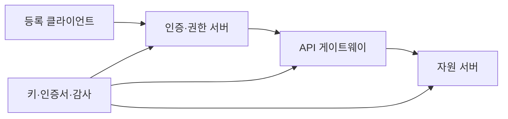
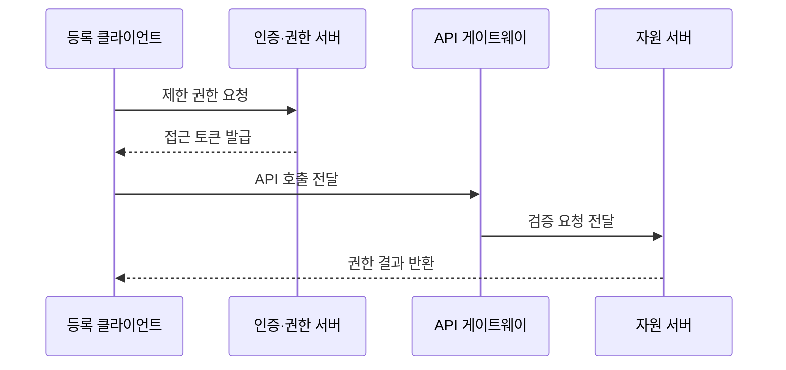

---
sidebar:
  order: 53
  label: "053. 보안 응용 프로그래밍 인터페이스 설계 (Secure API Design)"
  badge:
    text: "기출 · 50%"
    variant: note
title: "보안 응용 프로그래밍 인터페이스 설계 (Secure API Design)"
date: "2026-07-25T21:53:00+09:00"
tags:
  - "notes-security"
weight: 53
extra:
  question_no: "053"
  source_status: "기출"
  source_history: "123회"
  priority: 50
  priority_note: "123회 기출이며 현대 API 인증·인가 설계성이 높음"
---

## 미리 알고가기

- **API(Application Programming Interface)**: [읽기: 에이피아이; 표기 이유: 영문 머리글자] 프로그램이 기능과 데이터를 정해진 규격으로 호출하는 접점
- **API 게이트웨이(API Gateway)**: [읽기: 에이피아이; 표기 이유: 영문 머리글자] API 요청을 받아 인증·라우팅·호출량 통제를 수행하는 관문
- **JWT(JSON Web Token)**: [읽기: 제이더블유티; 표기 이유: 영문 머리글자] 서명된 주장을 JSON 형식으로 전달하는 토큰
- **개방형 권한 위임(Open Authorization 2.0, OAuth 2.0)**: [읽기: 오어스 이점영; 표기 이유: 영문 명칭 축약] 제한 권한을 위임하는 표준
- **접근 토큰(Access Token)**: [읽기: 접근 토큰; 표기 이유: 한글명 뒤 영문 원어 병기] 보호 자원에 대한 제한 권한을 나타내는 증표
- **범위(Scope)**: [읽기: 범위; 표기 이유: 한글명 뒤 영문 원어 병기] 접근 토큰이 허용하는 자원과 행위의 범위
- **PKCE(Proof Key for Code Exchange)**: [읽기: 피케이씨이; 표기 이유: 영문 머리글자] 권한 코드와 일회성 검증값을 결합해 탈취 코드의 재사용을 막는 방식
- **상호 전송 계층 보안(Mutual Transport Layer Security, mTLS)**: [읽기: 엠티엘에스; 표기 이유: mutual의 소문자와 TLS 결합] 양측 인증서를 검증함
- **호출률 제한(Rate Limiting)**: [읽기: 호출률 제한; 표기 이유: 한글명 뒤 영문 원어 병기] 일정 시간 동안 허용할 API 요청 수를 제한하는 통제
- **객체 수준 인가**: [읽기: 객체 수준 인가; 표기 이유: 한국어 통용어 표기] 요청 주체가 특정 데이터 객체에 접근할 권한이 있는지 확인하는 통제
- **재전송 공격(Replay Attack)**: [읽기: 재전송 공격; 표기 이유: 한글명 뒤 영문 원어 병기] 탈취한 정상 요청이나 토큰을 다시 보내 권한을 악용하는 공격
- **키 회전(Key Rotation)**: [읽기: 키 회전; 표기 이유: 한글명 뒤 영문 원어 병기] 암호 키를 주기적으로 새 키로 교체하는 관리 활동

- **흐름 기호(↓·→·X)**: [읽기: 흐름 기호; 표기 이유: 한글명 뒤 영문 원어 병기] 아래로·다음으로·차단으로 읽으며 순서·분기·금지를 나타냄
## Ⅰ. 개요

- **정의/개념**: 호출 전 과정을 통제하는 설계
- **배경/필요성**: 신원·토큰·객체·처리 자원
- **목적**: 무단 호출과 자원 남용을 함께 차단

### 쉽게 이해하기 (학습용)

- 보안 API는 호출자 인증만으로 끝내지 않고 매 요청의 객체·행위 권한과 자원 소비를 제한해야 한다.

## Ⅱ. 특징

- 인증과 객체·기능 인가를 분리해 적용한다.
- 토큰의 발급자·대상·범위·만료를 검증한다.
- 요청 크기와 호출률로 자원 고갈을 제한한다.
- 키·인증서·토큰의 수명주기를 관리한다.
- 인가 누락은 다른 사용자의 객체 노출로 이어진다.

### 쉽게 이해하기 (학습용)

- 짧고 제한된 토큰, 객체 수준 권한 검사, 호출률 제한을 결합해 자격 탈취와 대량 남용의 영향을 줄인다.

## Ⅲ. 구성요소 및 구조

| 설계 요소 | 설명 |
|:---|:---|
| 등록 클라이언트 | 호출 주체와 접속 정보 식별 |
| 인증·권한 서버 | 인증과 제한 토큰 발급 |
| API 게이트웨이 | 토큰·채널·호출률 검증 |
| 자원 서버 | 객체·기능 권한 집행 |
| 키·인증서·감사 | 신뢰 수명과 호출 이력 관리 |

### 쉽게 이해하기 (학습용)

- 게이트웨이가 공통 검사를 수행하고 서비스가 업무 객체의 권한을 다시 확인하며 로그가 두 판정을 연결한다.

## Ⅳ. 원리 및 절차 흐름도

| 절차 | 설명 |
|:---|:---|
| 제한 권한 요청 | 인증·동의와 PKCE 확인 |
| 접근 토큰 발급 | 대상·범위·수명 제한 |
| API 호출 전달 | mTLS와 토큰 함께 제시 |
| 검증 요청 전달 | 토큰·크기·호출률 통과 |
| 권한 결과 반환 | 객체 인가 후 최소 응답 |

> 요약: 제한 토큰과 객체 권한을 연속 검증한다.

### 쉽게 이해하기 (학습용)

- 토큰의 발급자·대상·기한을 확인한 뒤 요청 객체에 대한 호출자의 권한을 검증하고 제한된 결과만 반환한다.

## Ⅴ. 종류 및 비교

| 비교축 | 보안 API 설계 | JWT | OAuth 2.0 | mTLS |
|:---|:---|:---|:---|:---|
| 핵심 특징 | 호출 전 계층 통제 | 서명 주장 표현 | 제한 권한 위임 | 통신 주체 상호 인증 |
| 적용 기준 | API 전체 보호 | 주장 자체 전달 | 타 앱에 권한 부여 | 서비스 간 신원 확인 |
| 주요 위험 | 통제 누락과 불일치 | 탈취·오검증 | 과도한 범위 부여 | 객체 권한은 미판정 |

### 쉽게 이해하기 (학습용)

- 보안 API과 대안의 선택 기준을 비교함

## Ⅵ. 실무 사례

- **사례 1**: 결제 API에 객체 소유권 검사 적용
- **사례 2**: 공개 API에 호출률·크기 제한 적용
- **사례 3**: 서비스 토큰을 mTLS 인증서에 결속
- **사례 4**: 서명 키 교체와 폐기 절차 자동화

### 쉽게 이해하기 (학습용)

- 사례 1은 결제 식별자를 바꿔 다른 고객의 거래를 조회하지 못하게 한다.
- 사례 2는 요청 횟수와 본문 크기를 제한해 자동 남용과 자원 고갈을 억제한다.
- 사례 3은 탈취한 서비스 토큰을 다른 단말에서 재사용하지 못하게 한다.
- 사례 4는 새 키 배포와 이전 키 폐기를 겹쳐 정상 호출 중단과 장기 노출을 막는다.

## Ⅶ. 결론

- 외부 API이면 계층별 권한과 한도를 집행한다.

### 쉽게 이해하기 (학습용)

- 보안 API는 토큰 검증과 객체 권한, 자원 제한, 키 수명 관리를 함께 운영해야 한다.
