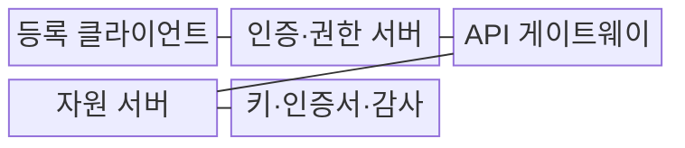
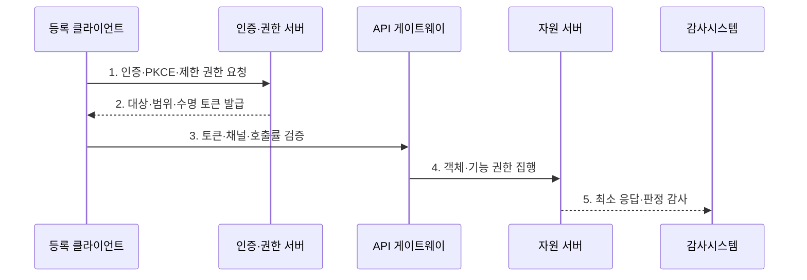

---
sidebar:
  order: 53
  label: "053. 보안 응용 프로그래밍 인터페이스 설계 (Secure API Design)"
  badge:
    text: "기출 · 50%"
    variant: note
title: "보안 응용 프로그래밍 인터페이스 설계 (Secure API Design)"
date: "2026-07-30T19:00:00+09:00"
tags:
  - "notes-security"
weight: 53
extra:
  question_no: "053"
  source_status: "기출"
  source_history: "123회"
  priority: 50
  priority_note: "123회 기출이며 현대 API 인증·인가 설계성이 높음"
---

## 미리 알고가기

- **응용 프로그래밍 인터페이스(Application Programming Interface, API)**: 프로그램이 기능과 데이터를 정해진 규격으로 호출하는 접점이다.
- **API 게이트웨이(API Gateway)**: API 요청을 받아 인증·인가·라우팅·호출량 제한을 일관되게 적용하는 관문이다.
- **JSON 웹 토큰(JSON Web Token, JWT)**: 주체와 권한에 관한 주장을 서명된 JSON 형식으로 전달하는 토큰이다.
- **OAuth 2.0 권한 부여 프레임워크(OAuth 2.0 Authorization Framework)**: 자원 소유자의 제한된 접근 권한을 클라이언트에 위임하는 표준이다.
- **접근 토큰(Access Token)**: 보호 자원에 허용된 접근 권한과 범위를 나타내는 증표이다.
- **범위(Scope)**: 접근 토큰이 허용하는 자원과 행위의 범위이다.
- **코드 교환 증명 키(Proof Key for Code Exchange, PKCE)**: 권한 코드와 일회성 검증값을 결합하여 탈취된 코드의 재사용을 막는 OAuth 보안 확장이다.
- **상호 전송 계층 보안(Mutual Transport Layer Security, mTLS)**: 통신 양측이 인증서를 서로 검증하여 서버와 클라이언트의 신원을 함께 확인하는 방식이다.
- **호출률 제한(Rate Limiting)**: 일정 시간 동안 주체별로 허용할 API 요청 수를 제한하는 통제이다.
- **객체 수준 인가(Object-Level Authorization)**: 요청 주체가 특정 데이터 객체에 접근할 권한이 있는지 확인하는 통제이다.
- **재전송 공격(Replay Attack)**: 탈취한 정상 요청이나 토큰을 다시 전송하여 권한을 악용하는 공격이다.
- **키 회전(Key Rotation)**: 암호 키의 노출 영향을 줄이기 위해 주기적으로 새 키로 교체하는 관리 활동이다.
- **IETF RFC 9700**: OAuth 2.0의 최신 공격 모델과 안전한 구현 관행을 정의한 보안 모범 사례이다.
- **OWASP API Security Top 10:2023**: 객체 인가·인증·자원 소비 등 주요 API 위험을 분류한 공식 자료이다.

## Ⅰ. 개요

- 정의/개념: API의 **채널·토큰·객체·자원 통제**
- 배경/필요성: 호출자 인증의 **객체 접근·남용 미통제**

### 쉽게 이해하기 (학습용)

- 보안 API는 호출자 인증만으로 끝내지 않고 매 요청의 객체·행위 권한과 자원 소비를 제한해야 한다.

## Ⅱ. 특징

- **인증·객체·기능 인가**를 요청마다 분리해 집행한다.
- **토큰 발급자·대상·범위·만료**와 채널 결속을 검증한다.
- **요청 크기·호출률·키 수명주기**로 남용·장기 노출을 제한한다.

### 쉽게 이해하기 (학습용)

- 짧고 제한된 토큰, 객체 수준 권한 검사, 호출률 제한을 결합해 자격 탈취와 대량 남용의 영향을 줄인다.

## Ⅲ. 구조 및 구성요소

| 구성요소 | 책임 |
|:---|:---|
| 등록 클라이언트 | **호출 주체·접속 정보 식별** |
| 인증·권한 서버 | **인증·제한 토큰 발급** |
| API 게이트웨이 | **토큰·채널·호출률 검증** |
| 자원 서버 | **객체·기능 권한 집행** |
| 키·인증서·감사 | **신뢰 수명·호출 이력 관리** |

### 쉽게 이해하기 (학습용)

- 게이트웨이가 공통 검사를 수행하고 서비스가 업무 객체의 권한을 다시 확인하며 로그가 두 판정을 연결한다.

## Ⅳ. 흐름도

1. **인증·PKCE·제한 권한 요청**: 주체·동의·코드 결속 확인
2. **대상·범위·수명 토큰 발급**: 최소 권한·짧은 만료 적용
3. **토큰·채널·호출률 검증**: 공통 보안·자원 한도 판정
4. **객체·기능 권한 집행**: 서비스가 대상·행위 재검증
5. **최소 응답·판정 감사**: 허용 필드·결정 근거 기록

### 쉽게 이해하기 (학습용)

- 토큰의 발급자·대상·기한을 확인한 뒤 요청 객체에 대한 호출자의 권한을 검증하고 제한된 결과만 반환한다.

## Ⅴ. 종류 및 비교

| API 보안 통제 | 계층형 설계 | JWT | OAuth 2.0 | mTLS |
|:---|:---|:---|:---|:---|
| 적용 기준 | API 전체 보호 | 주장 자체 전달 | 타 앱에 권한 부여 | 서비스 간 신원 확인 |
| 핵심 특징 | **호출 전 계층 통제** | **서명 주장 표현** | 제한 권한 위임 | 통신 주체 상호 인증 |
| 한계 | 통제 누락·불일치 | 탈취·오검증 | 과도한 범위 부여 | 객체 권한 미판정 |

### 쉽게 이해하기 (학습용)

- 보안 API과 대안의 선택 기준을 비교함

## Ⅵ. 실무 고려사항 및 대책

| 고려사항 | 대책 | 효과 |
|:---|:---|:---|
| OAuth 공격·오구성 | **IETF RFC 9700 적용** | 토큰 탈취·재전송 위험 완화 |
| 객체 인가·자원 남용 | **OWASP API Top 10:2023 점검** | BOLA·과도한 소비 방지 |
| 게이트웨이 단일 의존 | **자원 서버 세부 인가·감사** | 우회 호출·권한 오용 차단 |

### 쉽게 이해하기 (학습용)

- 인증된 사용자가 거래 식별자를 바꿔 요청해도 서버가 해당 거래의 소유자를 다시 확인해 다른 고객의 정보를 반환하지 않는다.

## Ⅶ. 결론

- **토큰대상·객체소유권·호출비용**으로 API 통제를 결정한다.

### 쉽게 이해하기 (학습용)

- 보안 API는 토큰 검증과 객체 권한, 자원 제한, 키 수명 관리를 함께 운영해야 한다.
