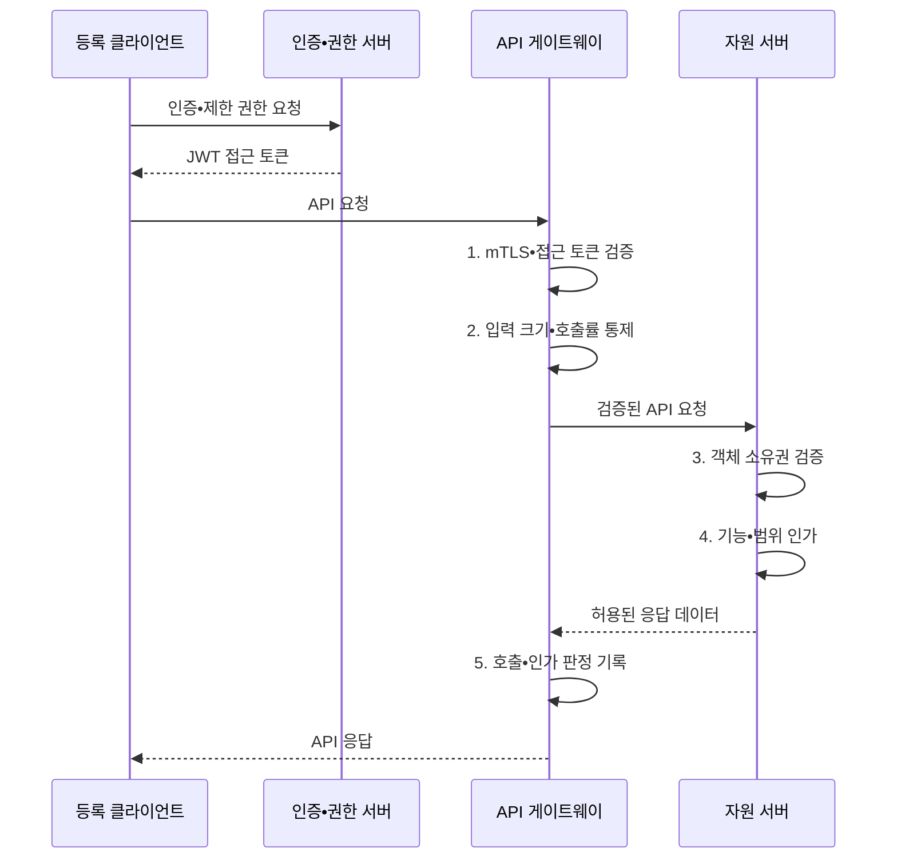

---
sidebar:
  order: 53
  label: "053. 보안 응용 프로그래밍 인터페이스 설계 (Secure API Design)"
  badge:
    text: "기출 • 50%"
    variant: note
title: "보안 응용 프로그래밍 인터페이스 설계 (Secure API Design)"
date: "2026-08-05T10:05:00+09:00"
tags:
  - "notes-security"
weight: 53
extra:
  question_no: "053"
  source_status: "기출"
  source_history: "123회"
  priority: 50
  priority_note: "123회 기출이며 현대 API 인증•인가 설계성이 높음"
---

## Ⅰ. 개요

<details><summary>핵심 용어</summary>

- **API(Application Programming Interface)** 는 서비스 기능과 데이터를 정해진 요청•응답 형식으로 제공하는 경계다.
- **보안 API 설계** 는 요청의 채널•토큰•객체 권한•자원 사용을 매 호출마다 검증하는 응용 보안 설계다.

</details>

- 정의/개념: API 요청의 채널•토큰•객체•자원 사용을 검증하는 **응용 보안 설계**
- 배경/필요성: 호출자 인증만으로는 **객체별 권한과 호출 자원 남용을 통제하기 어려움**

#### 한줄 요약

- 보안 API는 호출자 인증만으로 끝내지 않고 매 요청의 객체•행위 권한과 자원 소비를 제한해야 한다.

## Ⅱ. 특징

<details><summary>핵심 용어</summary>

- **접근 토큰** 은 보호 자원에 대한 제한된 접근 권한을 나타내는 자격 증명이다.
- **범위** 는 접근 토큰으로 허용된 자원과 행위의 경계를 나타낸다.
- **객체 인가** 는 호출자가 특정 자원 인스턴스에 접근할 권한이 있는지 확인한다.
- **기능 인가** 는 호출자가 특정 업무 기능을 수행할 권한이 있는지 확인한다.
- **호출률 제한** 은 일정 시간 동안 주체별 API 요청 수를 제한한다.

</details>

- **인증•객체•기능 인가** 의 요청별 분리 집행
- **토큰 발급자•대상•범위•만료** 와 채널 결속 검증
- **요청 크기•호출률•키 수명주기** 를 통한 남용•장기 노출 제한

#### 한줄 요약

- 짧고 제한된 토큰, 객체 수준 권한 검사, 호출률 제한을 결합해 자격 탈취와 대량 남용의 영향을 줄인다.

## Ⅲ. 구조 및 구성요소

<details><summary>핵심 용어</summary>

- **API 게이트웨이** 는 인증•인가•라우팅•호출률 제한을 공통 적용하는 진입점이다.
- **인증•권한 서버** 는 검증된 주체에게 제한된 접근 토큰을 발급한다.
- **자원 서버** 는 토큰 주체의 객체•기능 권한을 집행한다.

</details>

```text
                 [인증•권한 서버]
                    /           \
          [등록 클라이언트] -- [API 게이트웨이] -- [자원 서버]
                    \           |           /
                     [키•인증서•감사]
```

선의 의미: 등록 클라이언트가 인증•권한 서버와 API 게이트웨이의 신뢰 경계에 연결되고, 게이트웨이가 자원 서버를 보호하며 키•인증서•감사 영역이 전체 호출 구조를 공통 지원하는 관계

| 구성요소 | 책임 |
|:---|:---|
| 등록 클라이언트 | **호출 주체•접속 정보 식별** |
| 인증•권한 서버 | **접근 토큰 발급** |
| API 게이트웨이 | **토큰•채널•호출률 검증** |
| 자원 서버 | **객체•기능 권한 집행** |
| 키•인증서•감사 | **신뢰 수명•호출 이력 관리** |

#### 한줄 요약

- 게이트웨이가 공통 검사를 수행하고 서비스가 업무 객체의 권한을 다시 확인하며 로그가 두 판정을 연결한다.

## Ⅳ. 흐름도

<details><summary>핵심 용어</summary>

- **JSON(JavaScript Object Notation)** 은 속성과 값을 구조화해 교환하는 경량 데이터 형식이다.
- **JWT(JSON Web Token)** 는 주체•권한 주장을 서명된 JSON으로 전달하는 토큰 형식이다.
- **mTLS(Mutual Transport Layer Security)** 는 통신 양측의 인증서를 검증하는 상호 인증 방식이다.

</details>



**동작 원리**

1. **mTLS•접근 토큰 검증**: 채널과 발급자•대상•만료•서명 확인
2. **입력 크기•호출률 통제**: 주체별 자원 소비와 요청 계약 제한
3. **객체 소유권 검증**: 호출자의 대상 자원 접근 권한 확인
4. **기능•범위 인가**: 요청 행위와 토큰 허용 범위 대조
5. **호출•인가 판정 기록**: 주체•객체•결정 근거를 감사 기록으로 보존


#### 한줄 요약

- 토큰의 발급자•대상•기한을 확인한 뒤 요청 객체에 대한 호출자의 권한을 검증하고 제한된 결과만 반환한다.

## Ⅴ. 종류 및 비교

<details><summary>핵심 용어</summary>

- **OAuth(Open Authorization) 2.0** 은 보호 자원에 대한 제한된 접근 권한을 제3자 응용에 위임하는 인가 프레임워크다.
- **PKCE(Proof Key for Code Exchange)** 는 권한 요청과 토큰 교환을 일회성 검증값으로 결합하는 확장 절차다.

</details>

| 통제 지점 | 대표 수단 | 역할•잔여 위험 |
|:---|:---|:---|
| **API 호출 경계** | **계층형 인증•인가•입력 검증** | 전체 경로를 보호하되 계층 간 정책 일치 필요 |
| **주장 전달** | **JWT** | 서명 주장을 전달하되 탈취•검증 오류 방지 필요 |
| **권한 위임** | **OAuth 2.0•PKCE** | 제한 권한을 위임하되 범위•대상 제한 필요 |
| **서비스 신원** | **mTLS** | 통신 주체를 상호 인증하되 객체 권한은 별도 판정 |

#### 한줄 요약

- 계층형 통제는 전체 경로, JWT는 주장, OAuth는 위임, mTLS는 통신 주체를 보호한다.

## Ⅵ. 실무 고려사항 및 대책

<details><summary>핵심 용어</summary>

- **IETF(Internet Engineering Task Force)** 는 인터넷 기술 표준을 개발•공개하는 국제 공동체다.
- **RFC(Request for Comments) 9700** 은 OAuth 보안 모범 사례를 제시한다.
- **OWASP(Open Worldwide Application Security Project)** 는 애플리케이션 보안 지침을 공개하는 비영리 프로젝트다.
- **OWASP API Top 10:2023** 은 API의 주요 보안 위험 범주를 제시한다.
- **BOLA(Broken Object Level Authorization)** 는 객체 식별자의 소유권•권한 검사가 빠진 인가 결함이다.

</details>

| 문제 | 대책 | 효과 |
|:---|:---|:---|
| OAuth 흐름 오구성으로 토큰 탈취•재전송 | **IETF RFC 9700** 적용 | 토큰 탈취와 **재전송 위험** 완화 |
| 객체 인가 누락•무제한 호출로 정보 유출•과부하 | **OWASP API Top 10:2023** 점검 | **BOLA•자원 소비 남용** 방지 |
| 게이트웨이를 거치지 않은 직접 호출은 세부 권한 미검증 | 자원 서버의 **객체•기능 인가** 와 감사 수행 | 직접 호출의 **권한 오용** 차단 |

#### 한줄 요약

- 인증된 사용자가 거래 식별자를 바꿔 요청해도 서버가 해당 거래의 소유자를 다시 확인해 다른 고객의 정보를 반환하지 않는다.

## Ⅶ. 결론

<details><summary>핵심 용어</summary>

</details>

- 외부 위임은 **OAuth•PKCE**, 서비스 신원은 **mTLS**, 모든 요청은 **객체 인가•호출률 제한**

#### 한줄 요약

- 보안 API는 토큰 검증과 객체 권한, 자원 제한, 키 수명 관리를 함께 운영해야 한다.
