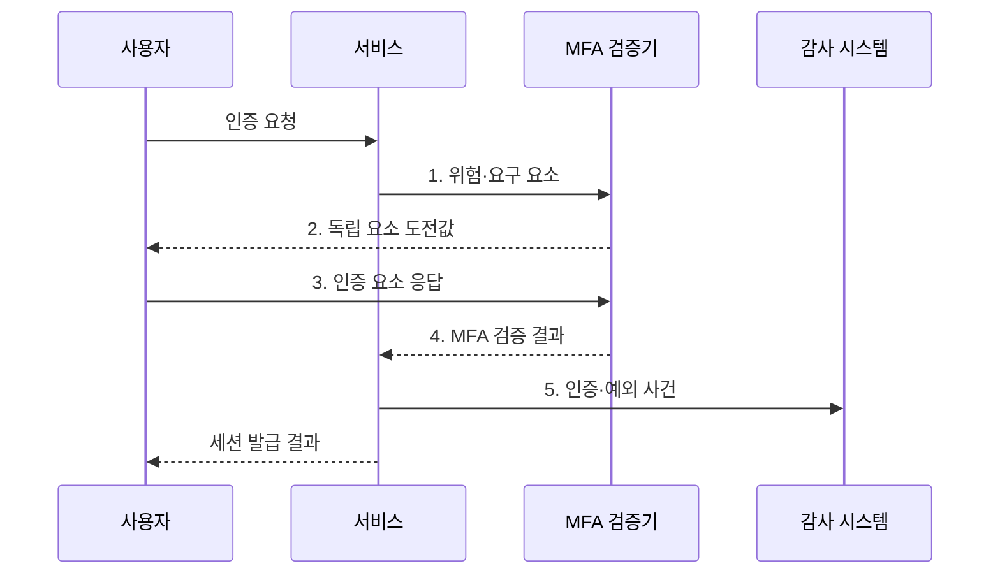

---
sidebar:
  order: 54
  label: "054. MFA 다중 인증 (Multi-Factor Authentication)"
  badge:
    text: "미출제 · 50%"
    variant: note
title: "MFA 다중 인증 (Multi-Factor Authentication)"
date: "2026-08-02T11:46:00+09:00"
tags:
  - "notes-security"
weight: 54
extra:
  question_no: "054"
  source_status: "미출제"
  source_history: ""
  priority: 50
  priority_note: "피싱저항·등록·복구를 묶는 인증 설계가 독립적임"
---

## Ⅰ. 개요

핵심 용어

- **MFA**는 지식·소유·생체 중 서로 다른 종류의 인증 요소를 둘 이상 확인하는 방식이다.

- 정의/개념: 지식·소유·생체 중 서로 다른 요소를 둘 이상 검증하는 **사용자 인증 방식**
- 배경/필요성: 단일 자격 증명의 **탈취·재사용**

#### 한줄 요약

- MFA는 비밀번호 하나가 유출돼도 독립된 추가 요소 없이는 계정을 탈취하기 어렵게 한다.

## Ⅱ. 특징

핵심 용어

- **지식·소유·생체 요소**는 각각 사용자가 아는 정보, 가진 물건, 신체 특성을 검증한다.
- **피싱 저항성**은 가짜 서비스가 인증 정보를 중계·재사용해도 성공하지 못하는 성질이다.

- 지식·소유·생체의 **독립 요소 결합**
- 방식별 **피싱·중계 공격 저항성**
- 등록·변경·복구의 **동등 보증 강도**

#### 한줄 요약

- 요소 수보다 독립성과 피싱 저항성이 중요하며 등록·변경·복구 경로도 같은 강도로 보호해야 한다.

## Ⅲ. 구조 및 구성요소

핵심 용어

- **인증기 등록**은 강한 신원 확인 뒤 사용자와 소유 기기를 결합하는 절차다.
- **비상 계정**은 일반 인증 체계 장애 때만 제한적으로 사용하는 복구용 계정이다.

| 구성요소 | 책임 |
|:---|:---|
| 위험·보증 정책 | 행위별 **인증 요소·강도** 정의 |
| 인증기 등록 | 신원 확인 후 **사용자·기기 결합** |
| MFA 검증기 | **독립 요소의 응답** 확인 |
| 인증 세션 | 검증 결과와 **유효 시간** 유지 |
| 복구·감사 | **분실 복구·예외 사용** 추적 |

#### 한줄 요약

- 인증 정책이 위험에 맞는 요소를 요구하고 검증기가 각 증거를 확인한 뒤 제한된 세션을 발급한다.

## Ⅳ. 흐름도

핵심 용어

- **재인증**은 로그인 후 중요한 행위 전에 인증 요소를 다시 확인한다.

**동작 원리**

1. **위험·요구 요소**: 행위·보증 수준에 맞는 독립 요소와 강도 제공
2. **독립 요소 도전값**: 등록 기기에 요청 맥락과 일회성 검증값 제공
3. **인증 요소 응답**: 사용자 지식·소유·생체의 검증 증거 전달
4. **MFA 검증 결과**: 기기 결속·피싱 저항·응답 유효성 판정 제공
5. **인증·예외 사건**: 실패·변경·복구·비상 계정 이력 기록

#### 한줄 요약

- 첫 요소가 맞아도 별도 인증기의 증명과 요청 맥락을 확인해야 최종 세션을 발급한다.

## Ⅴ. 종류 및 비교

핵심 용어

- **OTP·푸시·FIDO**는 각각 일회성 코드, 기기 알림 승인, 서비스별 공개키 서명을 사용한다.

| MFA 인증 유형 | MFA | SMS·OTP | 푸시 승인 | FIDO 인증 |
|:---|:---|:---|:---|:---|
| 적용 기준 | **단일 요소 위험** 축소 | 기존 환경의 **보조 인증** | 모바일 중심 **간편 승인** | 중요 계정의 **강한 인증** |
| 핵심 특징 | **다른 요소 결합** | **코드 직접 입력** | 등록 기기 승인 | 서비스별 공개키 서명 |
| 한계 | **복구 경로 약화** | **피싱·SIM 교체** | **중계·승인 피로** | **기기 분실·복구 실패** |

#### 한줄 요약

- SMS·OTP는 도입이 쉽고 푸시는 편리하며 FIDO는 피싱 저항성이 높다.

## Ⅵ. 실무 고려사항 및 대책

핵심 용어

- **NIST SP 800-63B-4**는 인증 보증수준과 인증기·세션·복구 요구사항을 정의한다.
- **승인 피로·SIM 교체**는 각각 반복 푸시 오승인과 전화번호 탈취로 인증을 우회한다.

| 문제 | 대책 | 효과 |
|:---|:---|:---|
| 업무 위험보다 약한 요소를 선택하면 계정 탈취 | **NIST SP 800-63B-4** 적용 | 위험별 **인증 강도** 정렬 |
| 피싱 중계·반복 푸시로 사용자 오승인 | **FIDO 인증·번호 일치** 적용 | 중계와 **오승인 가능성** 축소 |
| 약한 등록·분실 복구로 강한 MFA 무력화 | **강한 신원 확인·복구 감사** 수행 | 등록·복구 경로의 **계정 탈취** 방지 |

#### 한줄 요약

- 관리자는 비밀번호 외에 서비스 도메인에 결합된 FIDO 인증을 사용해 가짜 로그인 화면에서 인증 정보가 재사용되지 않게 한다.

## Ⅶ. 결론

핵심 용어

- **동등 보증 강도**는 등록·변경·복구 경로도 본 인증과 같은 수준으로 보호해야 한다는 원칙이다.

- 중요 계정은 **FIDO**, 고위험 행위는 **재인증**, 복구는 같은 강도로 보호

#### 한줄 요약

- MFA는 강한 요소 선택과 안전한 등록·변경·복구 절차를 함께 설계해야 한다.
