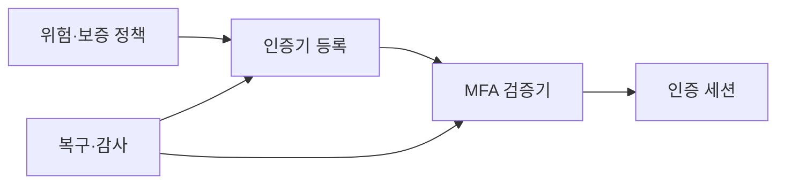
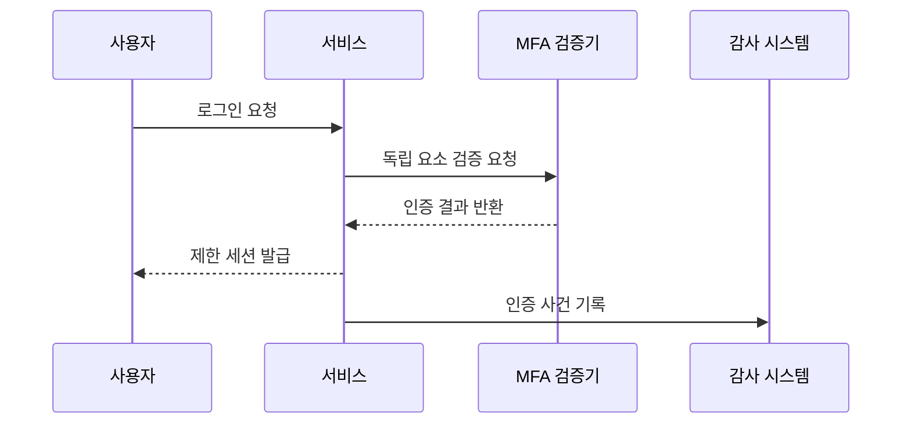

---
sidebar:
  order: 54
  label: "054. MFA 다중 인증 (Multi-Factor Authentication)"
  badge:
    text: "미출제 · 50%"
    variant: note
title: "MFA 다중 인증 (Multi-Factor Authentication)"
date: "2026-07-25T21:54:00+09:00"
tags:
  - "notes-security"
weight: 54
extra:
  question_no: "054"
  source_status: "미출제"
  source_history: ""
  priority: 50
  priority_note: "피싱저항·등록·복구를 묶는 인증 설계가 독립적임"
---

## 미리 알고가기

- **MFA(Multi-Factor Authentication)**: [읽기: 엠에프에이; 표기 이유: 영문 머리글자] 서로 다른 종류의 인증 요소를 둘 이상 확인하는 다중 인증
- **지식 요소**: [읽기: 지식 요소; 표기 이유: 한국어 통용어 표기] 비밀번호처럼 사용자가 알고 있는 정보
- **소유 요소**: [읽기: 소유 요소; 표기 이유: 한국어 통용어 표기] 보안키나 휴대전화처럼 사용자가 가진 물건
- **생체 요소**: [읽기: 생체 요소; 표기 이유: 한국어 통용어 표기] 지문이나 얼굴처럼 사용자 몸의 특성
- **OTP(One-Time Password)**: [읽기: 오티피; 표기 이유: 영문 머리글자] 한 번 또는 짧은 시간만 유효한 일회용 비밀번호
- **푸시 인증(Push Authentication)**: [읽기: 푸시 인증; 표기 이유: 한글명 뒤 영문 원어 병기] 등록 기기의 알림에서 로그인 요청을 승인하는 방식
- **FIDO(Fast Identity Online)**: [읽기: 에프아이디오; 표기 이유: 영문 머리글자] 서비스별 공개키로 사용자를 인증하는 피싱 저항 표준
- **피싱 저항성**: [읽기: 피싱 저항성; 표기 이유: 한국어 통용어 표기] 가짜 서비스가 인증 정보를 중계하거나 재사용하지 못하게 하는 성질
- **승인 피로(Push Fatigue)**: [읽기: 승인 피로; 표기 이유: 한글명 뒤 영문 원어 병기] 반복된 인증 알림 때문에 사용자가 잘못 승인하는 현상
- **SIM 교체 공격**: [읽기: 에스아이엠; 표기 이유: 영문 머리글자] 피해자의 전화번호를 공격자 유심으로 이전해 문자를 가로채는 공격
- **재인증**: [읽기: 재인증; 표기 이유: 한국어 통용어 표기] 로그인 후 중요한 행위 전에 인증 요소를 다시 확인하는 절차
- **비상 계정**: [읽기: 비상 계정; 표기 이유: 한국어 통용어 표기] 일반 인증 체계 장애 때만 제한적으로 사용하는 복구용 계정

- **흐름 기호(↓·→·X)**: [읽기: 흐름 기호; 표기 이유: 한글명 뒤 영문 원어 병기] 아래로·다음으로·차단으로 읽으며 순서·분기·금지를 나타냄
## Ⅰ. 개요

- **정의**: 서로 다른 인증 요소를 함께 검증
- **배경/필요성**: 단일 자격 증명 탈취의 피해 축소
- **핵심**: 요소 독립성과 피싱 저항성 확보

### 쉽게 이해하기 (학습용)

- MFA는 비밀번호 하나가 유출돼도 독립된 추가 요소 없이는 계정을 탈취하기 어렵게 한다.

## Ⅱ. 특징

- 지식·소유·생체 중 서로 다른 요소를 결합한다.
- 같은 종류의 증거 반복은 MFA로 보지 않는다.
- 방식마다 피싱과 중계 공격 저항성이 다르다.
- 등록·변경·복구도 같은 강도로 보호한다.
- 약한 복구 경로는 강한 인증 요소를 우회시킨다.

### 쉽게 이해하기 (학습용)

- 요소 수보다 독립성과 피싱 저항성이 중요하며 등록·변경·복구 경로도 같은 강도로 보호해야 한다.

## Ⅲ. 구성요소 및 구조

| 설계 요소 | 설명 |
|:---|:---|
| 위험·보증 정책 | 행위별 요소와 강도 정의 |
| 인증기 등록 | 신원 확인 후 기기 결합 |
| MFA 검증기 | 독립 요소의 응답 확인 |
| 인증 세션 | 검증 결과와 유효 시간 유지 |
| 복구·감사 | 분실 복구와 예외 사용 추적 |

### 쉽게 이해하기 (학습용)

- 인증 정책이 위험에 맞는 요소를 요구하고 검증기가 각 증거를 확인한 뒤 제한된 세션을 발급한다.

## Ⅳ. 원리 및 절차 흐름도

| 절차 | 설명 |
|:---|:---|
| 로그인 요청 | 계정과 첫 요소 제출 |
| 독립 요소 검증 요청 | 위험에 맞는 추가 요소 요구 |
| 인증 결과 반환 | 등록·응답·저항성 확인 |
| 제한 세션 발급 | 권한과 유효 시간 적용 |
| 인증 사건 기록 | 실패·변경·예외 이력 저장 |

> 요약: 독립 요소를 확인해 제한 세션을 발급한다.

### 쉽게 이해하기 (학습용)

- 첫 요소가 맞아도 별도 인증기의 증명과 요청 맥락을 확인해야 최종 세션을 발급한다.

## Ⅴ. 종류 및 비교

| 비교축 | MFA | SMS·OTP | 푸시 승인 | FIDO 인증 |
|:---|:---|:---|:---|:---|
| 핵심 특징 | 다른 요소 결합 | 코드 직접 입력 | 등록 기기에서 승인 | 서비스별 공개키 서명 |
| 적용 기준 | 단일 요소 위험 축소 | 기존 환경의 보조 인증 | 모바일 중심 간편 승인 | 중요 계정의 강한 인증 |
| 주요 위험 | 복구 경로 약화 | 피싱·SIM 교체 | 중계·승인 피로 | 기기 분실·복구 실패 |

### 쉽게 이해하기 (학습용)

- MFA과 대안의 선택 기준을 비교함

## Ⅵ. 실무 사례

1. 관리자 계정에 **피싱 저항성 FIDO 인증 적용**

### 쉽게 이해하기 (학습용)

- 관리자는 비밀번호 외에 서비스 도메인에 결합된 FIDO 인증을 사용해 가짜 로그인 화면에서 인증 정보가 재사용되지 않게 한다.

## Ⅶ. 결론

- 고위험 인증이면 피싱 저항 요소를 적용한다.

### 쉽게 이해하기 (학습용)

- MFA는 강한 요소 선택과 안전한 등록·변경·복구 절차를 함께 설계해야 한다.
