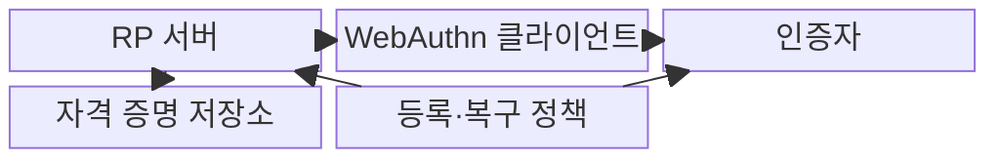
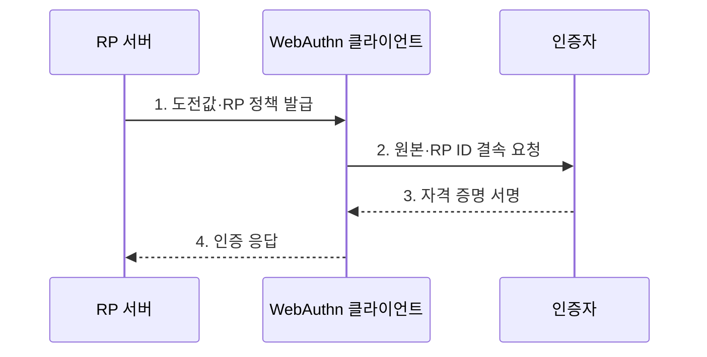

---
sidebar:
  order: 55
  label: "055. FIDO2·WebAuthn (FIDO2 WebAuthn)"
  badge:
    text: "기출 · 70%"
    variant: note
title: "FIDO2·WebAuthn (FIDO2 WebAuthn)"
date: "2026-08-02T11:48:00+09:00"
tags:
  - "notes-security"
weight: 55
extra:
  question_no: "055"
  source_status: "기출"
  source_history: "138회"
  priority: 70
  priority_note: "138회 최신 기출이며 피싱저항 인증의 핵심 표준임"
---

## Ⅰ. 개요

핵심 용어

- **FIDO2** 는 WebAuthn과 CTAP2를 결합해 비밀번호 없는 공개키 인증을 제공하는 표준이다.
- **RP(Relying Party)** 는 사용자의 공개키 자격 증명을 등록하고 인증 서명을 검증하는 서비스다.

- 정의/개념: WebAuthn·CTAP2 기반 **RP 결속 공개키 인증**
- 배경/필요성: 공유 비밀의 **피싱·재사용·서버 유출**

#### 한줄 요약

- FIDO2는 사이트별 공개키와 원본 검증으로 비밀번호 공유와 피싱 재사용 위험을 줄인다.

## Ⅱ. 특징

핵심 용어

- **RP ID·원본** 은 자격 증명을 특정 서비스 도메인과 웹 출처에 결속한다.
- **도전값·사용자 검증** 은 재전송과 무단 개인키 사용을 차단한다.
- **사용자 존재** 는 인증 동작 때 사용자가 인증기를 직접 조작했음을 확인하는 성질이다.

- **인증자 개인키 비노출·서비스별 공개키** 를 통한 서버 비밀 유출 축소
- **RP ID·원본 결속** 을 통한 피싱 사이트의 서명 요청 거부
- **도전값·사용자 존재·사용자 검증** 을 통한 재전송·무단 사용 차단

#### 한줄 요약

- 인증기는 현재 사이트의 새 도전값에만 서명하며 서버에는 재사용 가능한 개인키를 저장하지 않는다.

## Ⅲ. 구조 및 구성요소

핵심 용어

- **RP 서버** 는 공개키 서명을 검증하고, **인증자** 는 개인키를 보호해 사용자 승인 후 서명한다.

| 구성요소 | 책임 |
|:---|:---|
| RP 서버 | **도전값 발급·서명 검증** |
| WebAuthn 클라이언트 | **원본 확인·요청 중계** |
| 인증자 | **개인키 보관·서명 수행** |
| 자격 증명 저장소 | **공개키·식별자 관리** |
| 등록·복구 정책 | **인증자 추가·분실 통제** |

#### 한줄 요약

- 브라우저가 사이트 원본을 인증기에 전달하고 인증기는 RP별 키로 서명하며 서버가 등록 공개키로 검증한다.

## Ⅳ. 흐름도

핵심 용어

- **자격 증명 ID** 는 서버가 등록 공개키를 찾는 식별자다.

**동작 원리**

1. **도전값·RP 정책 발급**: 무작위 값과 사용자 검증 요구 제공
2. **원본·RP ID 결속 요청**: 서비스 도메인·도전값·검증 정책 전달
3. **자격 증명 서명**: 사용자 검증 후 RP별 개인키로 도전값 서명
4. **인증 응답**: 자격 증명 ID·인증자 데이터·서명을 RP 서버에 전달

#### 한줄 요약

- 서버가 만든 일회성 도전값을 인증기가 현재 RP 정보와 묶어 서명해야 로그인 요청이 승인된다.

## Ⅴ. 종류 및 비교

핵심 용어

- **WebAuthn** 은 브라우저·서버 연동, **CTAP2** 는 클라이언트·외부 인증자 통신을 정의한다.

| FIDO2 구성 역할 | FIDO2 | WebAuthn | CTAP2 |
|:---|:---|:---|:---|
| 적용 기준 | **비밀번호 없는 인증** 설계 | **브라우저·서버 연동** | **보안키·휴대전화 연동** |
| 핵심 특징 | **전체 공개키 인증 체계** | **웹 자격 증명 API** | 외부 인증자 통신 |
| 한계 | **등록·복구 경로** 약화 | **원본 검증 오류** | 악성 **클라이언트 중계** |

#### 한줄 요약

- FIDO2는 전체 체계, WebAuthn은 웹 연동, CTAP2는 외부 인증자 통신을 담당한다.

## Ⅵ. 실무 고려사항 및 대책

핵심 용어

- **W3C WebAuthn Level 2·FIDO CTAP 2.2** 는 웹 자격 증명과 외부 인증자 통신의 상호운용 규격이다.
- **XSS** 는 신뢰 원본 안에서 인증 요청을 조작할 수 있어 별도 방어가 필요하다.

| 문제 | 대책 | 효과 |
|:---|:---|:---|
| RP·원본·도전값 검증이 다르면 인증 우회·실패 | **W3C WebAuthn Level 2** 준수 | 웹 자격 증명의 **상호운용성** 확보 |
| 외부 인증자 통신 차이로 기기 연동 실패 | **FIDO CTAP 2.2** 적용 | 보안키·휴대전화의 **연동 호환성** 확보 |
| XSS가 신뢰 원본에서 인증 요청을 조작 | **XSS 방어·콘텐츠 보안 정책** 적용 | 신뢰 원본의 **스크립트 변조** 방지 |
| 단일 인증자 분실·약한 복구로 계정 잠금·탈취 | **강한 신원 확인·복수 인증자** 등록 | 약한 복구를 통한 **계정 탈취** 방지 |

#### 한줄 요약

- 서버는 일회성 도전값과 서비스의 원본·RP ID에 대한 인증자 서명을 검증해 피싱 사이트나 재사용 응답의 로그인을 거부한다.

## Ⅶ. 결론

핵심 용어

- **인증자 수명 관리** 는 추가 등록·분실·복구·폐기 경로를 강한 신원 확인으로 보호한다.

- 피싱 저항이 필요한 서비스는 **FIDO2**, 등록·복구는 강한 신원 확인과 복수 인증자 적용

#### 한줄 요약

- FIDO2는 도전값·원본·RP ID 검증과 안전한 인증자 수명 관리를 함께 적용해야 한다.
