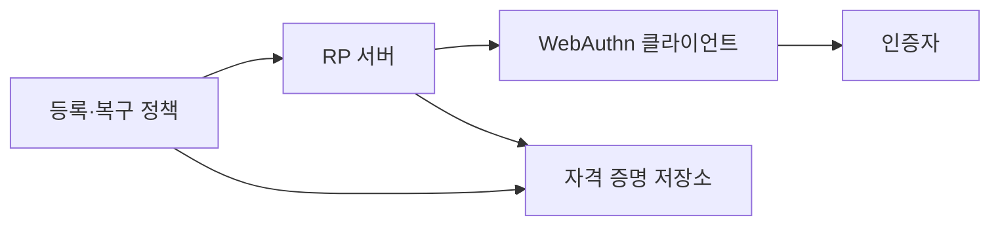
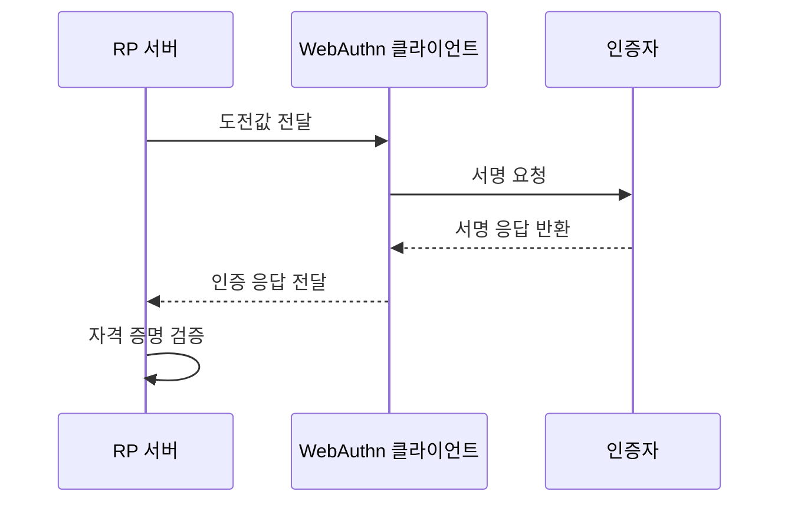

---
sidebar:
  order: 55
  label: "055. FIDO2·WebAuthn (FIDO2 WebAuthn)"
  badge:
    text: "기출 · 70%"
    variant: note
title: "FIDO2·WebAuthn (FIDO2 WebAuthn)"
date: "2026-07-25T21:55:00+09:00"
tags:
  - "notes-security"
weight: 55
extra:
  question_no: "055"
  source_status: "기출"
  source_history: "138회"
  priority: 70
  priority_note: "138회 최신 기출이며 피싱저항 인증의 핵심 표준임"
---

## 미리 알고가기

- **FIDO2(Fast Identity Online 2)**: [읽기: 에프아이디오2; 표기 이유: 영문 머리글자] WebAuthn과 CTAP을 결합한 공개키 인증 체계
- **웹 인증(Web Authentication, WebAuthn)**: [읽기: 웹오센; 표기 이유: Web Authentication 축약] 공개키 자격 증명 표준 API임
- **CTAP(Client to Authenticator Protocol)**: [읽기: 씨티에이피; 표기 이유: 영문 머리글자] 클라이언트와 외부 인증자가 통신하는 프로토콜
- **RP(Relying Party)**: [읽기: 알피; 표기 이유: 영문 머리글자] 사용자 인증 결과를 신뢰해 서비스를 제공하는 서버
- **RP ID(Relying Party Identifier)**: [읽기: 알피; 표기 이유: 영문 머리글자] 자격 증명을 사용할 수 있는 서비스 도메인 범위
- **원본(Origin)**: [읽기: 원본; 표기 이유: 한글명 뒤 영문 원어 병기] 프로토콜·호스트·포트로 구분한 웹 호출 출처
- **인증자(Authenticator)**: [읽기: 인증자; 표기 이유: 한글명 뒤 영문 원어 병기] 개인키를 보관하고 사용자 승인 후 서명하는 장치나 기능
- **자격 증명 ID(Credential ID)**: [읽기: 아이디; 표기 이유: 영문 머리글자] 서버가 등록된 공개키 자격 증명을 찾는 식별자
- **도전값(Challenge)**: [읽기: 도전값; 표기 이유: 한글명 뒤 영문 원어 병기] 서버가 매 인증마다 생성하는 예측 불가능한 일회성 값
- **사용자 존재(User Presence)**: [읽기: 사용자 존재; 표기 이유: 한글명 뒤 영문 원어 병기] 사용자가 인증기 조작에 참여했음을 확인하는 조건
- **사용자 검증(User Verification)**: [읽기: 사용자 검증; 표기 이유: 한글명 뒤 영문 원어 병기] PIN이나 생체 정보로 실제 사용자를 로컬 확인하는 조건
- **XSS(Cross-Site Scripting)**: [읽기: 엑스에스에스; 표기 이유: 영문 머리글자] 신뢰 웹 원본에서 공격자 스크립트가 실행되는 취약점
- **재전송 공격(Replay Attack)**: [읽기: 재전송 공격; 표기 이유: 한글명 뒤 영문 원어 병기] 이전의 정상 인증 응답을 다시 보내 인증을 우회하는 공격

- **흐름 기호(↓·→·X)**: [읽기: 흐름 기호; 표기 이유: 한글명 뒤 영문 원어 병기] 아래로·다음으로·차단으로 읽으며 순서·분기·금지를 나타냄
## Ⅰ. 개요

- **정의/개념**: 공개키 기반 피싱 저항 인증 체계
- **배경/필요성**: 웹의 자격 증명 등록·인증 규격
- **목적**: 비밀 공유 없이 피싱·재전송 차단

### 쉽게 이해하기 (학습용)

- FIDO2는 사이트별 공개키와 원본 검증으로 비밀번호 공유와 피싱 재사용 위험을 줄인다.

## Ⅱ. 특징

- 개인키는 인증자 밖으로 내보내지 않는다.
- 서비스마다 서로 다른 공개키 자격 증명을 쓴다.
- RP ID와 원본으로 사용할 사이트를 제한한다.
- 도전값으로 과거 서명의 재사용을 차단한다.
- 약한 등록·복구 경로는 피싱 저항성을 우회한다.

### 쉽게 이해하기 (학습용)

- 인증기는 현재 사이트의 새 도전값에만 서명하며 서버에는 재사용 가능한 개인키를 저장하지 않는다.

## Ⅲ. 구성요소 및 구조

| 설계 요소 | 설명 |
|:---|:---|
| RP 서버 | 도전값 발급과 서명 검증 |
| WebAuthn 클라이언트 | 원본 확인과 요청 중계 |
| 인증자 | 개인키 보관과 서명 수행 |
| 자격 증명 저장소 | 공개키와 식별자 관리 |
| 등록·복구 정책 | 인증자 추가·분실 통제 |

### 쉽게 이해하기 (학습용)

- 브라우저가 사이트 원본을 인증기에 전달하고 인증기는 RP별 키로 서명하며 서버가 등록 공개키로 검증한다.

## Ⅳ. 원리 및 절차 흐름도

| 절차 | 설명 |
|:---|:---|
| 도전값 전달 | 무작위 값과 RP 정책 제공 |
| 서명 요청 | 원본·RP ID와 요청 결합 |
| 서명 응답 반환 | 사용자 확인 후 개인키 서명 |
| 인증 응답 전달 | 식별자와 서명 결과 전송 |
| 자격 증명 검증 | 도전값·원본·서명 확인 |

> 요약: 현재 사이트의 새 도전값에만 서명한다.

### 쉽게 이해하기 (학습용)

- 서버가 만든 일회성 도전값을 인증기가 현재 RP 정보와 묶어 서명해야 로그인 요청이 승인된다.

## Ⅴ. 종류 및 비교

| 비교축 | FIDO2 | WebAuthn | CTAP |
|:---|:---|:---|:---|
| 핵심 특징 | 전체 인증 생태계 | 웹 인증 API | 외부 인증자 통신 |
| 적용 기준 | 비밀번호 없는 인증 설계 | 브라우저와 서버 연동 | 보안키·휴대전화 연동 |
| 주요 위험 | 등록·복구 경로 약화 | 원본 검증 오류 | 악성 클라이언트 중계 |

### 쉽게 이해하기 (학습용)

- FIDO2과 대안의 선택 기준을 비교함

## Ⅵ. 실무 사례

- **사례 1**: 도전값을 서버에서 생성해 단기 사용
- **사례 2**: 허용 원본과 RP ID를 함께 검증
- **사례 3**: 관리자 로그인에 사용자 검증 요구
- **사례 4**: 인증자 추가에 기존 인증기 요구

### 쉽게 이해하기 (학습용)

- 사례 1은 짧게 만료되는 일회성 도전값으로 이전 서명의 재전송을 막는다.
- 사례 2는 원본과 RP ID를 검증해 닮은 피싱 도메인의 서명을 거부한다.
- 사례 3은 관리자 작업에서 PIN이나 생체 확인을 거친 서명만 인정한다.
- 사례 4는 이미 신뢰한 인증기로 새 인증자 등록을 승인하게 한다.

## Ⅶ. 결론

- 피싱 위협이면 RP 결합 공개키 인증을 적용한다.

### 쉽게 이해하기 (학습용)

- FIDO2는 도전값·원본·RP ID 검증과 안전한 인증자 수명 관리를 함께 적용해야 한다.
