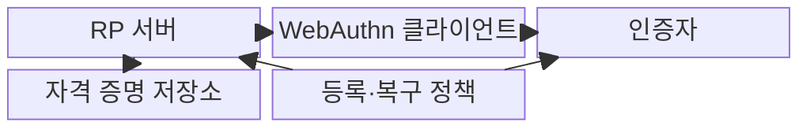
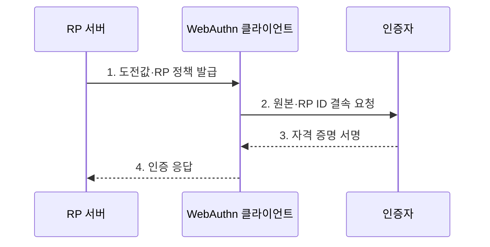

---
sidebar:
  order: 55
  label: "055. FIDO2·WebAuthn (FIDO2 WebAuthn)"
  badge:
    text: "기출 · 70%"
    variant: note
title: "FIDO2·WebAuthn (FIDO2 WebAuthn)"
date: "2026-07-31T02:02:20+09:00"
tags:
  - "notes-security"
weight: 55
extra:
  question_no: "055"
  source_status: "기출"
  source_history: "138회"
  priority: 70
  priority_note: "138회 최신 기출이며 피싱저항 인증의 핵심 표준임"
---

## 미리 알고가기

- **온라인 신속 신원 확인 2(Fast IDentity Online 2, FIDO2)**: WebAuthn과 CTAP2를 결합하여 비밀번호 없는 공개키 인증을 제공하는 표준이다.
- **웹 인증(Web Authentication, WebAuthn)**: 브라우저와 서버가 공개키 자격 증명을 생성·사용하도록 정의한 웹 인증 표준이다.
- **인증자 연결 프로토콜 2(Client to Authenticator Protocol 2, CTAP2)**: 클라이언트와 외부 인증자 사이의 인증 요청·응답을 정의한 통신 규격이다.
- **신뢰 당사자(Relying Party, RP)**: 공개키 서명을 검증하고 인증 결과에 따라 서비스를 제공하는 서버이다.
- **신뢰 당사자 식별자(Relying Party Identifier, RP ID)**: 공개키 자격 증명을 사용할 수 있는 서비스 도메인 범위를 지정하는 식별자이다.
- **원본(Origin)**: 프로토콜·호스트·포트의 조합으로 구분한 웹 요청의 출처이다.
- **인증자(Authenticator)**: 개인키를 안전하게 보관하고 사용자 승인 후 인증 서명을 생성하는 장치나 기능이다.
- **자격 증명 ID(Credential ID)**: 서버가 등록된 공개키 자격 증명을 찾는 식별자이다.
- **도전값(Challenge)**: 서버가 인증마다 생성하여 재전송 공격을 막는 예측 불가능한 일회성 값이다.
- **사용자 존재(User Presence)**: 사용자가 인증자 조작에 참여했음을 확인하는 조건이다.
- **사용자 검증(User Verification)**: PIN이나 생체 정보로 실제 사용자를 인증자 내부에서 확인하는 조건이다.
- **사이트 간 스크립팅(Cross-Site Scripting, XSS)**: 신뢰할 수 있는 웹 원본에서 공격자의 스크립트가 실행되는 취약점이다.
- **재전송 공격(Replay Attack)**: 이전의 정상 인증 응답을 다시 전송하여 인증을 우회하는 공격이다.
- **W3C WebAuthn Level 2**: 웹 공개키 자격 증명의 생성·사용을 정의한 W3C 권고 표준이다.
- **FIDO CTAP 2.2**: 플랫폼과 외부 인증자 간 USB·NFC·BLE 통신을 정의한 FIDO 표준이다.

## Ⅰ. 개요

- 정의/개념: WebAuthn·CTAP 기반 **RP 결속 공개키 인증**
- 배경/필요성: 공유 비밀의 **피싱·재사용·서버 유출**

### 쉽게 이해하기 (학습용)

- FIDO2는 사이트별 공개키와 원본 검증으로 비밀번호 공유와 피싱 재사용 위험을 줄인다.

## Ⅱ. 특징

- **인증자 개인키 비노출·서비스별 공개키**를 통한 서버 비밀 유출 축소
- **RP ID·원본 결속**을 통한 피싱 사이트의 서명 요청 거부
- **도전값·사용자 존재·사용자 검증**을 통한 재전송·무단 사용 차단

### 쉽게 이해하기 (학습용)

- 인증기는 현재 사이트의 새 도전값에만 서명하며 서버에는 재사용 가능한 개인키를 저장하지 않는다.

## Ⅲ. 구조 및 구성요소

| 구성요소 | 책임 |
|:---|:---|
| RP 서버 | **도전값 발급·서명 검증** |
| WebAuthn 클라이언트 | **원본 확인·요청 중계** |
| 인증자 | **개인키 보관·서명 수행** |
| 자격 증명 저장소 | **공개키·식별자 관리** |
| 등록·복구 정책 | **인증자 추가·분실 통제** |

### 쉽게 이해하기 (학습용)

- 브라우저가 사이트 원본을 인증기에 전달하고 인증기는 RP별 키로 서명하며 서버가 등록 공개키로 검증한다.

## Ⅳ. 흐름도

**동작 원리**

1. **도전값·RP 정책 발급**: 무작위 값과 사용자 검증 요구 제공
2. **원본·RP ID 결속 요청**: 서비스 도메인·도전값·검증 정책 전달
3. **자격 증명 서명**: 사용자 검증 후 RP별 개인키로 도전값 서명
4. **인증 응답**: 자격 증명 ID·인증자 데이터·서명을 RP 서버에 전달

### 쉽게 이해하기 (학습용)

- 서버가 만든 일회성 도전값을 인증기가 현재 RP 정보와 묶어 서명해야 로그인 요청이 승인된다.

## Ⅴ. 종류 및 비교

| FIDO2 구성 역할 | FIDO2 | WebAuthn | CTAP2 |
|:---|:---|:---|:---|
| 적용 기준 | **비밀번호 없는 인증** 설계 | **브라우저·서버 연동** | **보안키·휴대전화 연동** |
| 핵심 특징 | **전체 공개키 인증 체계** | **웹 자격 증명 API** | 외부 인증자 통신 |
| 한계 | **등록·복구 경로** 약화 | **원본 검증 오류** | 악성 **클라이언트 중계** |

### 쉽게 이해하기 (학습용)

- FIDO2는 전체 체계, WebAuthn은 웹 연동, CTAP2는 외부 인증자 통신을 담당한다.

## Ⅵ. 실무 고려사항 및 대책

| 고려사항 | 대책 | 효과 |
|:---|:---|:---|
| RP·원본·도전값 검증이 다르면 인증 우회·실패 | **W3C WebAuthn Level 2** 준수 | 웹 자격 증명의 **상호운용성** 확보 |
| 외부 인증자 통신 차이로 기기 연동 실패 | **FIDO CTAP 2.2** 적용 | 보안키·휴대전화의 **연동 호환성** 확보 |
| 단일 인증자 분실·약한 복구로 계정 잠금·탈취 | **강한 신원 확인·복수 인증자** 등록 | 계정 잠금과 **복구 우회** 방지 |

### 쉽게 이해하기 (학습용)

- 서버는 일회성 도전값과 서비스의 원본·RP ID에 대한 인증자 서명을 검증해 피싱 사이트나 재사용 응답의 로그인을 거부한다.

## Ⅶ. 결론

- 피싱 저항이 필요한 서비스는 **FIDO2**, 등록·복구는 강한 신원 확인과 복수 인증자 적용

### 쉽게 이해하기 (학습용)

- FIDO2는 도전값·원본·RP ID 검증과 안전한 인증자 수명 관리를 함께 적용해야 한다.
