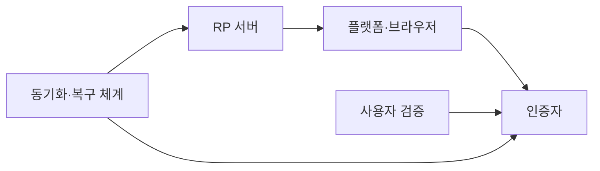
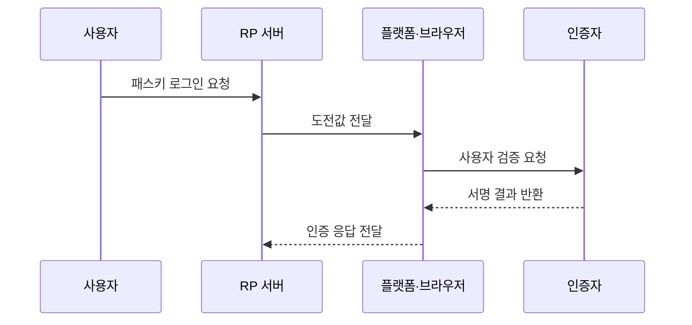

---
sidebar:
  order: 56
  label: "056. 패스키 비밀번호 없는 인증 (Passkey Passwordless)"
  badge:
    text: "기출 · 70%"
    variant: note
title: "패스키 비밀번호 없는 인증 (Passkey Passwordless)"
date: "2026-07-25T21:56:00+09:00"
tags:
  - "notes-security"
weight: 56
extra:
  question_no: "056"
  source_status: "기출"
  source_history: "138회"
  priority: 70
  priority_note: "138회 기출과 비밀번호 없는 인증 전환성이 강함"
---

## 미리 알고가기

- **패스키(Passkey, 패스키)**: 열쇠를 뜻하는 이름처럼 서비스별 공개키 자격 증명으로 비밀번호를 대신하는 인증 수단
- **온라인 신속 신원 확인 2(Fast IDentity Online 2, FIDO2)**: `FIDO`는 영문 머리글자를 딴 공식 표기라 “파이도 투”로 읽으며, WebAuthn과 인증자 통신 규격을 결합해 패스키 인증 기반을 이룬다
- **웹 인증(Web Authentication, WebAuthn)**: `Web Authentication`을 줄인 공식 표기라 “웹오슨”으로 읽으며, 서비스가 공개키 자격 증명을 생성·사용하게 하는 표준
- **신뢰 당사자(Relying Party, RP)**: 영문 머리글자를 딴 공식 표기라 “알피”로 읽으며, 패스키 서명을 검증하고 서비스를 제공하는 서버
- **응용 프로그래밍 인터페이스(Application Programming Interface, API)**: 영문 머리글자를 딴 공식 표기라 “에이피아이”로 읽으며, WebAuthn 기능을 브라우저와 서비스가 호출하는 접점
- **인증자(Authenticator, 어센티케이터)**: 개인키를 보호하고 사용자 승인 후 서명하는 장치나 기능
- **개인 식별 번호(Personal Identification Number, PIN)**: 영문 머리글자를 딴 공식 표기라 “핀”으로 읽으며, 인증자에서 개인키 사용자를 확인하는 비밀 번호
- **신뢰 당사자 식별자(Relying Party Identifier, RP ID)**: `RP`와 `Identifier`를 줄인 공식 표기라 “알피 아이디”로 읽으며, 서명을 특정 서비스 원본에 결속한다
- **사용자 검증(User Verification, 유저 베리피케이션)**: PIN이나 생체 정보로 개인키 사용자를 로컬 확인하는 절차
- **동기화 패스키(Synced Passkey)**: 신뢰 플랫폼을 통해 여러 기기에서 사용할 수 있는 패스키
- **기기 결합 패스키(Device-Bound Passkey)**: 개인키가 특정 인증자에서 이동하지 않는 패스키
- **휴대형 보안키(Roaming Security Key)**: 여러 기기에 연결해 쓰는 물리적 외부 인증자
- **복구 경로**: 기기 분실이나 교체 후 계정 접근을 되찾는 절차
- **자격 증명 폐기**: 분실·유출된 패스키가 더는 인증에 쓰이지 않게 만드는 처리
- **세션(Session, 세션)**: 인증 결과를 일정 시간 유지하는 서버 상태

## Ⅰ. 개요

- **정의**: WebAuthn 기반 비밀번호 없는 인증 수단
- **배경/필요성**: 로컬 승인 후 서비스별 개인키로 서명
- **목적**: 피싱 저항성과 사용 편의 동시 확보

### 쉽게 이해하기 (학습용)

- 사용자는 기기 잠금을 풀듯 승인하고 서비스는 비밀번호 대신 자기 사이트에만 맞는 공개키 서명을 확인한다.

## Ⅱ. 특징

- 서비스마다 다른 공개키 자격 증명을 사용한다.
- 개인키는 인증자 보호 영역에서만 사용한다.
- 동기화형은 기기 교체와 복구가 편리하다.
- 기기 결합형은 키 이동을 더 엄격히 제한한다.
- 등록·복구 강도가 실제 인증 보증 수준을 좌우한다.

### 쉽게 이해하기 (학습용)

- 패스키 자체는 피싱에 강하지만 새 기기를 추가하거나 계정을 복구하는 문이 약하면 그 문으로 우회될 수 있다.

## Ⅲ. 아키텍처 및 구성요소

| 설계 요소 | 설명 |
|:---|:---|
| RP 서버 | 도전값 발급과 공개키 검증 |
| 플랫폼·브라우저 | 원본 확인과 인증 요청 중계 |
| 인증자 | 개인키 보호와 서명 생성 |
| 사용자 검증 | PIN·생체로 키 사용 승인 |
| 동기화·복구 체계 | 기기 이전과 분실 대응 |

### 쉽게 이해하기 (학습용)

- 서버가 새 질문을 보내면 플랫폼이 올바른 사이트인지 확인하고 인증자가 사용자 승인 후 서명한다.

## Ⅳ. 원리 및 절차 흐름도

| 절차 | 설명 |
|:---|:---|
| 패스키 로그인 요청 | 계정과 패스키 사용 선택 |
| 도전값 전달 | RP ID와 일회 값 제공 |
| 사용자 검증 요청 | PIN·생체로 키 사용 승인 |
| 서명 결과 반환 | 서비스별 개인키로 서명 |
| 인증 응답 전달 | 서버가 원본·도전값 검증 |

> 요약: 로컬 승인으로 서비스별 서명을 만든다.

### 쉽게 이해하기 (학습용)

- 기기에서 본인을 확인해도 생체 정보는 서버로 가지 않고 승인된 개인키의 서명 결과만 전달된다.

## Ⅴ. 종류 및 비교

| 비교축 | 패스키 공통 | 동기화 패스키 | 기기 결합 패스키 | 휴대형 보안키 |
|:---|:---|:---|:---|:---|
| 핵심 특징 | 서비스별 공개키 인증 | 여러 기기로 안전 이전 | 특정 기기에 키 고정 | 별도 물리 장치 사용 |
| 적용 기준 | 비밀번호 대체 | 소비자 편의·복구 | 조직의 이동 제한 | 강한 물리 분리 |
| 주요 위험 | 약한 대체 로그인 | 동기화 계정 탈취 | 분실 시 복구 부담 | 배포·회수·예비 키 |

### 쉽게 이해하기 (학습용)

- 같은 패스키라도 편리한 동기화, 이동을 막는 기기 결합, 별도 보관하는 보안키 중 운영 목적에 맞춰 선택한다.

## Ⅵ. 실무 사례

- **사례 1**: 소비자 계정에 동기화 패스키 제공
- **사례 2**: 관리자 계정에 기기 결합 키 적용
- **사례 3**: 새 패스키 등록에 기존 키 요구
- **사례 4**: 분실 기기의 자격 증명 즉시 폐기

### 쉽게 이해하기 (학습용)

- 사례 1은 기기를 바꿔도 비밀번호 재설정 없이 신뢰 계정에서 패스키를 복원하게 한다.
- 사례 2는 높은 권한의 개인키가 승인되지 않은 다른 기기로 이동하지 못하게 한다.
- 사례 3은 계정을 일부 탈취한 공격자가 자기 기기를 새 인증 수단으로 추가하지 못하게 한다.
- 사례 4는 잃어버린 기기의 패스키와 기존 세션이 계속 출입 수단으로 남지 않게 한다.

## Ⅶ. 결론

- 편의 우선이면 복구 보호형 동기화 패스키 선택

### 쉽게 이해하기 (학습용)

- 패스키 전환은 비밀번호 제거로 끝나지 않으며 기기 추가·동기화·분실 복구를 같은 인증 강도로 설계해야 완성된다.
