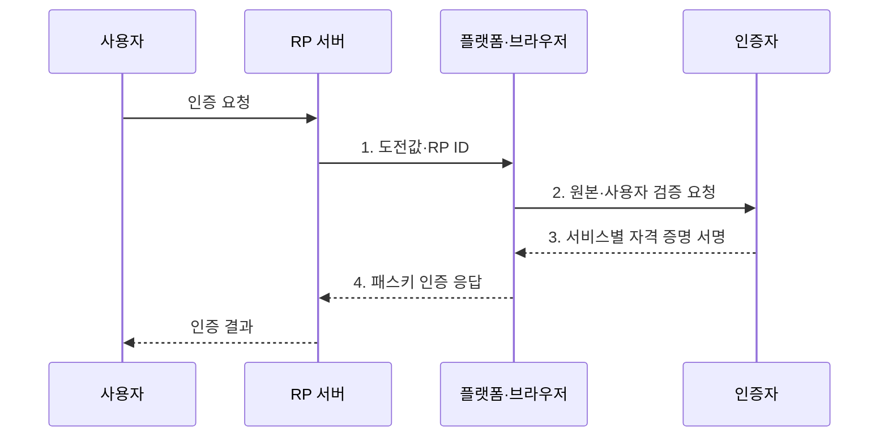

---
sidebar:
  order: 56
  label: "056. 패스키 비밀번호 없는 인증 (Passkey Passwordless)"
  badge:
    text: "기출 · 70%"
    variant: note
title: "패스키 비밀번호 없는 인증 (Passkey Passwordless)"
date: "2026-08-02T11:50:00+09:00"
tags:
  - "notes-security"
weight: 56
extra:
  question_no: "056"
  source_status: "기출"
  source_history: "138회"
  priority: 70
  priority_note: "138회 기출과 비밀번호 없는 인증 전환성이 강함"
---

## Ⅰ. 개요

핵심 용어

- **패스키**는 서비스별 공개키 자격 증명으로 비밀번호를 대신하는 피싱 저항 인증 수단이다.

- 정의/개념: WebAuthn 기반 **서비스별 공개키 인증**
- 배경/필요성: 비밀번호의 **피싱·재사용·서버 유출**

#### 한줄 요약

- 사용자는 기기 잠금을 풀듯 승인하고 서비스는 비밀번호 대신 자기 사이트에만 맞는 공개키 서명을 확인한다.

## Ⅱ. 특징

핵심 용어

- **RP ID·사용자 검증**은 패스키를 서비스 도메인과 로컬 사용자에게 결속한다.
- **동기화·기기 결합 패스키**는 각각 여러 기기 이전과 특정 인증자 고정을 제공한다.

- **RP별 공개키·원본 결속**을 통한 피싱 사이트 재사용 차단
- **동기화 패스키**의 기기 이전성과 **기기 결합형**의 이동 제한
- **기기 추가·복구·세션 폐기 강도**에 따른 실제 인증 보증 결정

#### 한줄 요약

- 패스키 자체는 피싱에 강하지만 등록·복구 절차가 약하면 공격자가 계정을 탈취할 수 있다.

## Ⅲ. 구조 및 구성요소

핵심 용어

- **인증자**는 개인키를 보호하고 PIN·생체 승인 후 서명한다.
- **복구 경로**는 기기 분실·교체 뒤 계정 접근을 되찾는 절차다.

| 구성요소 | 책임 |
|:---|:---|
| RP 서버 | **도전값 발급·공개키 검증** |
| 플랫폼·브라우저 | **원본 확인·인증 요청 중계** |
| 인증자 | **개인키 보호·서명 생성** |
| 사용자 검증 | **PIN·생체로 키 사용 승인** |
| 동기화·복구 체계 | **기기 이전·분실 대응** |

#### 한줄 요약

- 서버가 새 질문을 보내면 플랫폼이 올바른 사이트인지 확인하고 인증자가 사용자 승인 후 서명한다.

## Ⅳ. 흐름도

핵심 용어

- **WebAuthn**은 서비스가 브라우저를 통해 공개키 자격 증명을 생성·사용하도록 정의한다.

**동작 원리**

1. **도전값·RP ID**: 일회성 값과 자격 증명을 사용할 서비스 경계 제공
2. **원본·사용자 검증 요청**: 현재 사이트와 PIN·생체 검증 요구 전달
3. **서비스별 자격 증명 서명**: RP별 비노출 개인키로 도전값 서명
4. **패스키 인증 응답**: 자격 증명 ID·인증자 데이터·서명 전달

#### 한줄 요약

- 기기에서 본인을 확인해도 생체 정보는 서버로 가지 않고 승인된 개인키의 서명 결과만 전달된다.

## Ⅴ. 종류 및 비교

핵심 용어

- **동기화·기기 결합·휴대형 보안키**는 편의·이동 제한·물리 분리 요구에 따라 선택한다.

| 패스키 보관 방식 | 공통 | 동기화 패스키 | 기기 결합 패스키 | 휴대형 보안키 |
|:---|:---|:---|:---|:---|
| 적용 기준 | **비밀번호 대체** | 소비자 **편의·복구** | 조직의 **이동 제한** | 강한 **물리 분리** |
| 핵심 특징 | **서비스별 공개키 인증** | **여러 기기 안전 이전** | 특정 기기에 키 고정 | 별도 물리 장치 사용 |
| 한계 | **약한 대체 로그인** | **동기화 계정 탈취** | 분실 시 **복구 부담** | **배포·회수·예비 키** |

#### 한줄 요약

- 같은 패스키라도 편리한 동기화, 이동을 막는 기기 결합, 별도 보관하는 보안키 중 운영 목적에 맞춰 선택한다.

## Ⅵ. 실무 고려사항 및 대책

핵심 용어

- **W3C WebAuthn Level 2**는 RP 결속 자격 증명을, **NIST SP 800-63B-4**는 인증기·세션·복구 요구를 정의한다.
- **자격 증명 폐기**는 분실·유출된 패스키를 더 이상 인증에 쓰지 못하게 한다.

| 문제 | 대책 | 효과 |
|:---|:---|:---|
| RP·원본·서명 검증 오류로 피싱·재전송 허용 | **W3C WebAuthn Level 2** 준수 | 피싱·재전송에 대한 **저항성** 확보 |
| 동기화 계정 탈취로 여러 기기의 패스키 노출 | **NIST SP 800-63B-4** 적용 | 동기화·세션의 **인증 위험** 통제 |
| 단일 기기 분실·약한 복구로 잠금·계정 탈취 | **복수 인증자·강한 복구**와 자격 증명 폐기 적용 | 분실 **자격 증명 재사용** 방지 |

#### 한줄 요약

- 사용자는 새 휴대전화에서도 플랫폼 계정을 통해 동기화된 패스키를 복원해 비밀번호 없이 서비스에 로그인한다.

## Ⅶ. 결론

핵심 용어

- **전환 완성 조건**은 비밀번호 제거뿐 아니라 기기 추가·동기화·분실 복구를 같은 강도로 보호하는 것이다.

- 소비자 편의는 **동기화 패스키**, 이동 제한은 **기기 결합형**, 물리 분리는 보안키 선택

#### 한줄 요약

- 패스키 전환은 비밀번호 제거로 끝나지 않으며 기기 추가·동기화·분실 복구를 같은 인증 강도로 설계해야 완성된다.
