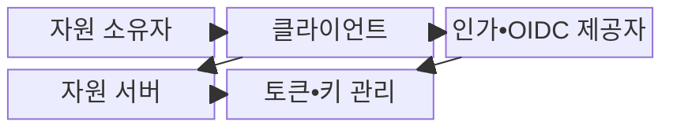
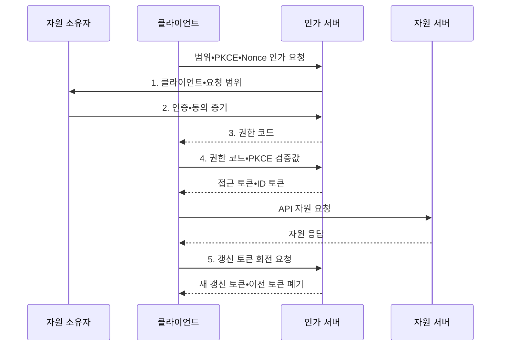

---
sidebar:
  order: 57
  label: "057. OAuth 2.0•OIDC (OAuth 2.0 OIDC)"
  badge:
    text: "기출 • 50%"
    variant: note
title: "OAuth 2.0•OIDC (OAuth 2.0 OIDC)"
date: "2026-08-03T08:48:47+09:00"
tags:
  - "notes-security"
weight: 57
extra:
  question_no: "057"
  source_status: "기출"
  source_history: "123회"
  priority: 50
  priority_note: "123회 기출이며 웹•모바일 권한위임의 기본 구조임"
---

## Ⅰ. 개요

핵심 용어

- **OAuth 2.0**: 자원 소유자의 제한된 접근 권한을 클라이언트에 위임하는 인가 프레임워크이다.
- **OpenID Connect(OIDC)**: OAuth 2.0 위에서 사용자 인증 결과와 신원 정보를 전달하는 인증 프로토콜이다.

- 정의/개념: OAuth의 **권한 위임** 과 OIDC의 **신원 인증**
- 배경/필요성: 비밀번호 공유의 **과잉 권한•자격 유출**

#### 한줄 요약

- OAuth는 필요한 일만 맡기는 위임장이고 OIDC는 그 위임 과정에서 확인한 사용자의 신원 확인서를 함께 전달한다.

## Ⅱ. 특징

핵심 용어

- **권한 코드•PKCE•Redirect URI**: 짧은 수명의 코드를 원래 요청한 클라이언트와 등록 반환 주소에 결속하여 코드 탈취와 오용을 막는 장치이다.
- **접근 토큰•ID 토큰**: 접근 토큰은 보호 API 권한을 나타내고 ID 토큰은 인증된 사용자의 신원 주장을 클라이언트에 전달한다.
- **Nonce•갱신 토큰 회전**: 로그인 응답을 요청 거래에 결속하고 토큰 갱신 때 이전 토큰을 폐기하여 재전송과 재사용을 막는다.

- 권한 코드와 **PKCE•정확한 Redirect URI** 를 통한 코드 탈취 차단
- API 권한용 **접근 토큰** 과 클라이언트 인증용 **ID 토큰** 분리
- 발급자•대상과 **범위•만료** 검증, Nonce 검증과 갱신 토큰 회전

#### 한줄 요약

- 임시 교환권은 요청한 앱만 바꾸게 하고 API 출입증과 로그인 확인서를 목적에 맞게 구분해야 한다.

## Ⅲ. 구조 및 구성요소

핵심 용어

- **자원 소유자•클라이언트**: 자원 권한을 가진 사용자가 클라이언트 애플리케이션에 제한된 접근을 위임한다.
- **인가 서버•자원 서버**: 인가 서버는 코드와 토큰을 발급하고 자원 서버는 접근 토큰을 검증해 보호 API를 제공한다.

| 구성요소 | 책임 |
|:---|:---|
| 자원 소유자 | **인증•제한 권한 동의** |
| 클라이언트 | **인가 요청•토큰 사용** |
| 인가•OIDC 제공자 | **코드•토큰•신원 주장 발급** |
| 자원 서버 | **대상•범위•객체 권한 집행** |
| 토큰•키 관리 | **서명 키•토큰 수명 관리** |

#### 한줄 요약

- 제공자는 토큰을 발급하고 클라이언트는 목적에 맞게 사용하며 자원 서버는 실제 API 권한을 다시 확인한다.

## Ⅳ. 흐름도

핵심 용어

- **Nonce**: 인증 요청과 ID 토큰을 같은 거래에 결속하여 응답 재전송을 막는 일회성 값이다.
- **갱신 토큰 회전**: 갱신할 때마다 새 토큰을 발급하고 이전 토큰을 폐기하여 탈취 토큰의 재사용을 탐지•차단하는 방식이다.

**동작 원리**

1. **클라이언트•요청 범위**: 사용자에게 요청 앱과 권한 범위 표시
2. **인증•동의 증거**: 사용자 신원 확인과 허용 범위 결과 전달
3. **권한 코드**: 등록된 Redirect URI로 짧은 수명의 일회 코드 제공
4. **권한 코드•PKCE 검증값**: 코드와 원래 클라이언트의 결속 증거 전달
5. **갱신 토큰 회전 요청**: 새 접근•갱신 토큰을 받고 이전 갱신 토큰을 폐기

#### 한줄 요약

- 앱은 사용자의 동의를 받은 일회 코드를 자기만 아는 검증값과 함께 토큰으로 바꾼 뒤 허용된 API만 호출한다.

## Ⅴ. 종류 및 비교

핵심 용어

- **개방형 권한 위임(Open Authorization, OAuth) 2.0**: 응용 프로그래밍 인터페이스 접근 권한을 위임하는 프레임워크이다.
- **오픈아이디 연결(OpenID Connect, OIDC)**: OAuth 2.0 흐름에 사용자 인증 결과를 추가하는 신원 계층이다.

| 표준 | 역할 | 검증 초점 |
|:---|:---|:---|
| **개방형 권한 위임(Open Authorization, OAuth) 2.0** | **보호 자원의 제한 권한 위임** | 범위•대상•리디렉션 주소 제한 |
| **오픈아이디 연결(OpenID Connect, OIDC)** | **사용자 인증 결과 전달** | 발급자•대상•Nonce 검증 |

#### 한줄 요약

- API 사용 권한을 맡기려면 OAuth를 쓰고 사용자가 누구인지 앱에 알려주려면 OIDC를 추가한다.

## Ⅵ. 실무 고려사항 및 대책

핵심 용어

- **IETF RFC 9700**: OAuth 2.0의 최신 공격 모델과 안전한 구현 관행을 정의한 보안 모범 사례이다.
- **OpenID Connect Core 1.0**: ID 토큰과 사용자 인증 흐름, 발급자•대상•Nonce 검증을 정의한 공식 규격이다.

| 문제 | 대책 | 효과 |
|:---|:---|:---|
| 코드•토큰 탈취로 다른 클라이언트가 권한 획득 | **IETF RFC 9700** 적용 | 코드•토큰 탈취와 **재사용 차단** |
| ID Token을 잘못 검증하면 위조 신원 수용 | **OIDC Core 1.0** 준수 | **발급자•대상•Nonce** 검증 |
| 접근 토큰과 ID Token 혼동으로 권한 오용 | **API•로그인 토큰** 분리 | 토큰 목적 혼동에 따른 **비인가 API 접근** 방지 |

#### 한줄 요약

- 모바일 앱은 권한 요청 때 만든 PKCE 검증값으로 토큰 교환을 묶어, 공격자가 권한 코드를 가로채도 접근 토큰을 받지 못하게 한다.

## Ⅶ. 결론

핵심 용어

- **목적별 토큰 분리**: API 권한에는 OAuth 접근 토큰을 사용하고 로그인 신원 전달에는 OIDC ID 토큰을 사용해 용도 혼동을 방지하는 원칙이다.

- API 권한 위임은 **OAuth 2.0**, 사용자 로그인•신원 전달은 **OIDC** 추가

#### 한줄 요약

- 위임장과 신원 확인서를 구분하고 각 토큰의 발급자•대상•범위•수명을 검증해야 안전한 연동이 완성된다.
