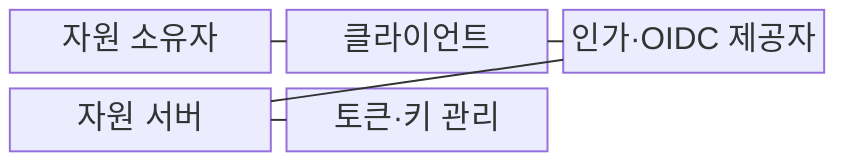
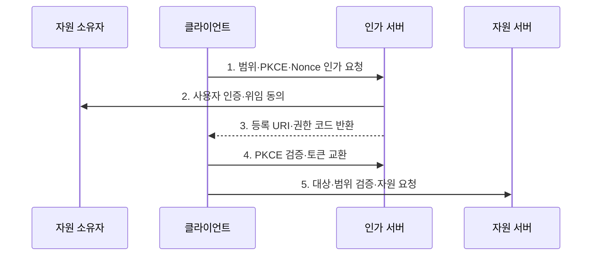

---
sidebar:
  order: 57
  label: "057. OAuth 2.0·OIDC (OAuth 2.0 OIDC)"
  badge:
    text: "기출 · 50%"
    variant: note
title: "OAuth 2.0·OIDC (OAuth 2.0 OIDC)"
date: "2026-07-30T19:00:00+09:00"
tags:
  - "notes-security"
weight: 57
extra:
  question_no: "057"
  source_status: "기출"
  source_history: "123회"
  priority: 50
  priority_note: "123회 기출이며 웹·모바일 권한위임의 기본 구조임"
---

## 미리 알고가기

- **OAuth 2.0(OAuth 2.0 Authorization Framework)**: 자원 소유자의 제한된 접근 권한을 클라이언트에 위임하는 인가 프레임워크이다.
- **오픈아이디 연결(OpenID Connect, OIDC)**: OAuth 2.0 위에서 사용자 인증 결과와 신원 정보를 전달하는 인증 프로토콜이다.
- **자원 소유자(Resource Owner)**: 보호 자원에 대한 권한을 가진 사용자이다.
- **클라이언트(Client)**: 사용자의 위임을 받아 보호 자원에 접근하는 애플리케이션이다.
- **인가 서버(Authorization Server)**: 사용자를 인증하고 코드와 토큰을 발급하는 서버이다.
- **자원 서버(Resource Server)**: 접근 토큰을 검증하고 보호 API를 제공하는 서버이다.
- **응용 프로그래밍 인터페이스(Application Programming Interface, API)**: 자원 서버가 접근 권한에 따라 기능과 데이터를 제공하는 호출 접점이다.
- **권한 코드(Authorization Code)**: 인가 결과를 토큰으로 교환하기 위한 짧은 수명의 일회용 값이다.
- **접근 토큰(Access Token)**: 보호 자원에 대한 제한 권한을 나타내는 증표이다.
- **갱신 토큰(Refresh Token)**: 새 접근 토큰을 받는 데 사용하는 장기 자격 증명이다.
- **신원 토큰(Identity Token, ID Token)**: 인증된 사용자와 인증 시점에 관한 주장을 클라이언트에 전달하는 서명 토큰이다.
- **코드 교환 증명 키(Proof Key for Code Exchange, PKCE)**: 권한 코드와 일회성 검증값을 결합하여 탈취된 코드의 재사용을 막는 보안 확장이다.
- **일회 값(Number Used Once, Nonce)**: 인증 요청과 신원 토큰을 같은 거래에 결속하여 재전송을 막는 일회성 값이다.
- **리다이렉트 통합 자원 식별자(Redirect Uniform Resource Identifier, Redirect URI)**: 인가 결과가 전달될 클라이언트의 반환 주소이다.
- **범위(Scope)**: 접근 토큰이 허용하는 자원과 행위의 범위이다.
- **단일 페이지 애플리케이션(Single-Page Application, SPA)**: 하나의 웹 문서에서 화면을 동적으로 갱신하는 클라이언트 애플리케이션이다.
- **IETF RFC 9700**: OAuth 2.0의 최신 공격 모델과 안전한 구현 관행을 정의한 보안 모범 사례이다.
- **OpenID Connect Core 1.0**: OAuth 2.0 위에서 ID Token과 사용자 인증 흐름을 정의한 공식 규격이다.

## Ⅰ. 개요

- 정의/개념: OAuth의 **권한 위임**과 OIDC의 **신원 인증**
- 배경/필요성: 비밀번호 공유의 **과잉 권한·자격 유출**

### 쉽게 이해하기 (학습용)

- OAuth는 필요한 일만 맡기는 위임장이고 OIDC는 그 위임 과정에서 확인한 사용자의 신원 확인서를 함께 전달한다.

## Ⅱ. 특징

- **권한 코드·PKCE·정확한 Redirect URI**로 코드 탈취를 막는다.
- **접근 토큰**은 API 권한, **ID 토큰**은 클라이언트 인증에 사용한다.
- **발급자·대상·범위·만료·Nonce**를 검증하고 갱신 토큰을 회전한다.

### 쉽게 이해하기 (학습용)

- 임시 교환권은 요청한 앱만 바꾸게 하고 API 출입증과 로그인 확인서를 목적에 맞게 구분해야 한다.

## Ⅲ. 구조 및 구성요소

| 구성요소 | 책임 |
|:---|:---|
| 자원 소유자 | **인증·제한 권한 동의** |
| 클라이언트 | **인가 요청·토큰 사용** |
| 인가·OIDC 제공자 | **코드·토큰·신원 주장 발급** |
| 자원 서버 | **대상·범위·객체 권한 집행** |
| 토큰·키 관리 | **서명 키·토큰 수명 관리** |

### 쉽게 이해하기 (학습용)

- 제공자는 토큰을 발급하고 클라이언트는 목적에 맞게 사용하며 자원 서버는 실제 API 권한을 다시 확인한다.

## Ⅳ. 흐름도

1. **범위·PKCE·Nonce 인가 요청**: 위임 범위·거래 결속값 포함
2. **사용자 인증·위임 동의**: 주체와 권한 범위를 확인
3. **등록 URI·권한 코드 반환**: 정확한 주소로 일회 코드 전달
4. **PKCE 검증·토큰 교환**: 접근·ID 토큰 목적별 발급
5. **대상·범위 검증·자원 요청**: 허용된 API·객체만 제공

### 쉽게 이해하기 (학습용)

- 앱은 사용자의 동의를 받은 일회 코드를 자기만 아는 검증값과 함께 토큰으로 바꾼 뒤 허용된 API만 호출한다.

## Ⅴ. 종류 및 비교

| 권한 위임·인증 표준 | OAuth 2.0 | OIDC |
|:---|:---|:---|
| 적용 기준 | 타 앱에 제한 권한 부여 | 통합 로그인과 신원 확인 |
| 핵심 특징 | **보호 API 권한 위임** | **사용자 인증 결과 전달** |
| 한계 | 범위·대상 과다 부여 | 발급자·Nonce 오검증 |

### 쉽게 이해하기 (학습용)

- API 사용 권한을 맡기려면 OAuth를 쓰고 사용자가 누구인지 앱에 알려주려면 OIDC를 추가한다.

## Ⅵ. 실무 고려사항 및 대책

| 고려사항 | 대책 | 효과 |
|:---|:---|:---|
| 코드·토큰 탈취 | **IETF RFC 9700 적용** | PKCE·정확한 URI·회전 정렬 |
| ID Token 오검증 | **OIDC Core 1.0 준수** | 발급자·대상·Nonce 검증 |
| 토큰 목적·범위 혼동 | **API·로그인 토큰 분리** | 권한 상승·오용 방지 |

### 쉽게 이해하기 (학습용)

- 모바일 앱은 권한 요청 때 만든 PKCE 검증값으로 토큰 교환을 묶어, 공격자가 권한 코드를 가로채도 접근 토큰을 받지 못하게 한다.

## Ⅶ. 결론

- **클라이언트유형·토큰목적·위임범위**로 OAuth·OIDC를 결정한다.

### 쉽게 이해하기 (학습용)

- 위임장과 신원 확인서를 구분하고 각 토큰의 발급자·대상·범위·수명을 검증해야 안전한 연동이 완성된다.
