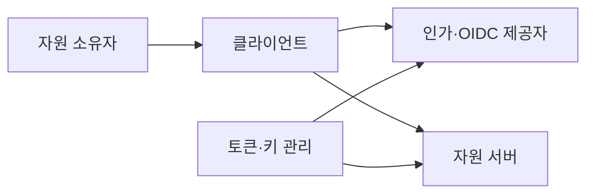
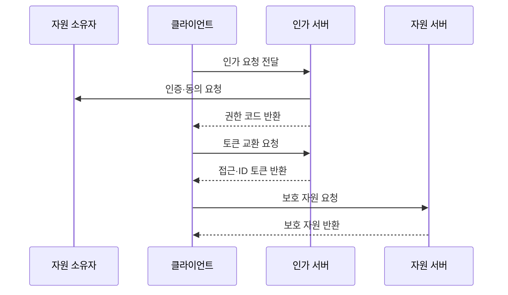

---
sidebar:
  order: 57
  label: "057. OAuth 2.0·OIDC (OAuth 2.0 OIDC)"
  badge:
    text: "기출 · 50%"
    variant: note
title: "OAuth 2.0·OIDC (OAuth 2.0 OIDC)"
date: "2026-07-27T23:59:59+09:00"
tags:
  - "notes-security"
weight: 57
extra:
  question_no: "057"
  source_status: "기출"
  source_history: "123회"
  priority: 50
  priority_note: "123회 기출이며 웹·모바일 권한위임의 기본 구조임"
---

## 미리 알고가기

- **OAuth 2.0(OAuth 2.0 Authorization Framework, OAuth 2.0)**: 약어 확장형이 아닌 공식 프로토콜명이라 “오어스 이점영”으로 읽으며, 자원 소유자의 제한된 권한을 클라이언트에 위임한다
- **오픈아이디 연결(OpenID Connect, OIDC)**: 영문명 머리글자를 딴 공식 표기라 “오아이디시”로 읽으며, OAuth 2.0 위에서 사용자 인증 결과를 전달한다
- **자원 소유자(Resource Owner)**: 보호 자원에 대한 권한을 가진 사용자
- **클라이언트(Client)**: 사용자의 위임을 받아 보호 자원에 접근하는 애플리케이션
- **인가 서버(Authorization Server)**: 사용자를 인증하고 코드와 토큰을 발급하는 서버
- **자원 서버(Resource Server)**: 접근 토큰을 검증하고 보호 API를 제공하는 서버
- **응용 프로그래밍 인터페이스(Application Programming Interface, API)**: 영문 머리글자를 딴 공식 표기라 “에이피아이”로 읽으며, 자원 서버가 권한에 따라 제공하는 기능 접점
- **권한 코드(Authorization Code)**: 인가 결과를 토큰으로 교환하기 위한 짧은 수명의 일회용 값
- **접근 토큰(Access Token)**: 보호 자원에 대한 제한 권한을 나타내는 증표
- **갱신 토큰(Refresh Token)**: 새 접근 토큰을 받는 데 사용하는 장기 자격 증명
- **신원 토큰(Identity Token, ID Token)**: `Identity`를 `ID`로 줄인 공식 표기라 “아이디 토큰”으로 읽으며, 인증된 사용자에 관한 주장을 클라이언트에 전달한다
- **코드 교환 증명 키(Proof Key for Code Exchange, PKCE)**: 영문 머리글자를 딴 공식 표기라 “픽시”로 읽으며, 권한 코드와 일회성 검증값을 묶어 탈취 코드의 재사용을 방지한다
- **일회 값(Number Used Once, Nonce)**: 한 번만 쓰는 수를 뜻하는 관례적 합성어라 “논스”로 읽으며, 인증 요청과 ID 토큰을 한 거래로 결속한다
- **리다이렉트 통합 자원 식별자(Redirect Uniform Resource Identifier, Redirect URI)**: `Uniform Resource Identifier`를 줄인 공식 표기라 “리다이렉트 유알아이”로 읽으며, 인가 결과가 돌아갈 클라이언트 주소를 지정한다
- **범위(Scope)**: 접근 토큰이 허용하는 자원과 행위의 범위
- **단일 페이지 애플리케이션(Single-Page Application, SPA)**: 영문 머리글자를 딴 공식 표기라 “에스피에이”로 읽으며, 한 웹 문서에서 화면을 동적으로 갱신하는 클라이언트 유형

## Ⅰ. 개요

- 정의/개념: OAuth는 **API 권한 위임**, OIDC는 **사용자 인증 결과 전달**
- **배경/필요성**: 앱 간 비밀번호 공유는 **과도한 권한·자격 유출 위험**

### 쉽게 이해하기 (학습용)

- OAuth는 필요한 일만 맡기는 위임장이고 OIDC는 그 위임 과정에서 확인한 사용자의 신원 확인서를 함께 전달한다.

## Ⅱ. 특징

- **권한 코드·PKCE·정확한 Redirect URI**로 코드 탈취를 막는다.
- **접근 토큰**은 API 권한, **ID 토큰**은 클라이언트 인증에 사용한다.
- **발급자·대상·범위·만료·Nonce**를 검증하고 갱신 토큰을 회전한다.

### 쉽게 이해하기 (학습용)

- 임시 교환권은 요청한 앱만 바꾸게 하고 API 출입증과 로그인 확인서를 목적에 맞게 구분해야 한다.

## Ⅲ. 아키텍처 및 구성요소

| 설계 요소 | 설명 |
|:---|:---|
| 자원 소유자 | **인증·제한 권한 동의** |
| 클라이언트 | **인가 요청·토큰 사용** |
| 인가·OIDC 제공자 | **코드·토큰·신원 주장 발급** |
| 자원 서버 | **대상·범위·객체 권한 집행** |
| 토큰·키 관리 | **서명 키·토큰 수명 관리** |

### 쉽게 이해하기 (학습용)

- 제공자는 토큰을 발급하고 클라이언트는 목적에 맞게 사용하며 자원 서버는 실제 API 권한을 다시 확인한다.

## Ⅳ. 원리 및 절차 흐름도

| 절차 | 설명 |
|:---|:---|
| 인가 요청 전달 | 범위·PKCE·Nonce 포함 |
| 인증·동의 요청 | 사용자와 위임 범위 확인 |
| 권한 코드 반환 | 등록 URI로 일회 코드 전달 |
| 토큰 교환 요청 | PKCE 검증 후 토큰 발급 |
| 접근·ID 토큰 반환 | API 권한·사용자 인증 결과 제공 |
| 보호 자원 요청 | 대상·범위 검증 후 API 제공 |
| 보호 자원 반환 | 허용된 자원만 클라이언트 전달 |

> 요약: 일회 코드를 제한 토큰으로 교환한다.

### 쉽게 이해하기 (학습용)

- 앱은 사용자의 동의를 받은 일회 코드를 자기만 아는 검증값과 함께 토큰으로 바꾼 뒤 허용된 API만 호출한다.

## Ⅴ. 종류 및 비교

| 권한 위임·인증 표준 | OAuth 2.0 | OIDC |
|:---|:---|:---|
| 적용 기준 | 타 앱에 제한 권한 부여 | 통합 로그인과 신원 확인 |
| 핵심 특징 | 보호 API 권한 위임 | 사용자 인증 결과 전달 |
| 한계 | 범위·대상 과다 부여 | 발급자·Nonce 오검증 |

### 쉽게 이해하기 (학습용)

- API 사용 권한을 맡기려면 OAuth를 쓰고 사용자가 누구인지 앱에 알려주려면 OIDC를 추가한다.

## Ⅵ. 실무 사례

1. 모바일 앱은 **권한 코드·PKCE 적용**
2. API는 **접근 토큰 대상·범위**, 앱은 **ID 토큰 검증**

### 쉽게 이해하기 (학습용)

- 권한 코드를 가로채도 PKCE 검증값 없이는 토큰으로 교환하지 못하게 한다.
- 자원 서버는 접근 토큰, 클라이언트는 ID 토큰을 각 목적에 맞게 검증한다.

## Ⅶ. 결론

- API 권한은 **OAuth 2.0**, 로그인 신원은 **OIDC**

### 쉽게 이해하기 (학습용)

- 위임장과 신원 확인서를 구분하고 각 토큰의 발급자·대상·범위·수명을 검증해야 안전한 연동이 완성된다.
