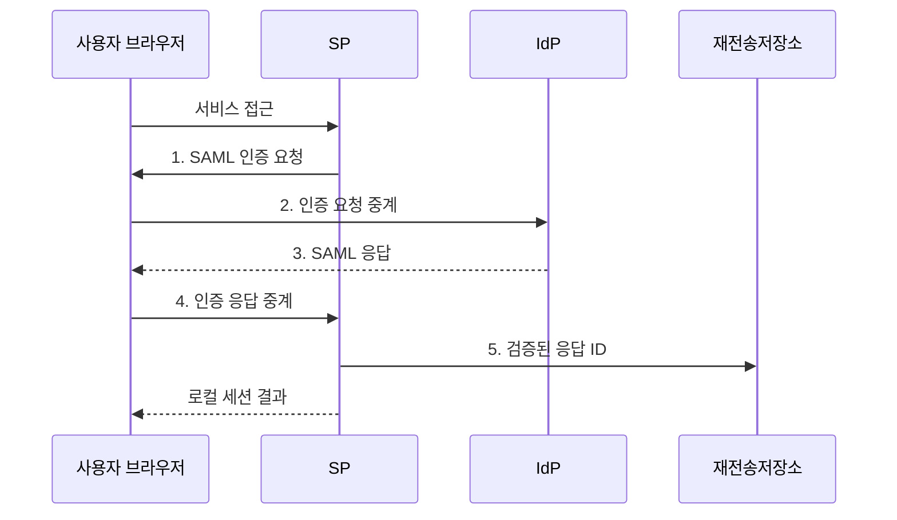

---
sidebar:
  order: 58
  label: "058. SAML 2.0 (SAML 2.0)"
  badge:
    text: "기출 · 30%"
    variant: note
title: "SAML 2.0 (SAML 2.0)"
date: "2026-07-31T02:04:51+09:00"
tags:
  - "notes-security"
weight: 58
extra:
  question_no: "058"
  source_status: "기출"
  source_history: "123회"
  priority: 30
  priority_note: "123회 기출이나 신규 시스템보다 연합 비교에 유용함"
---

## 미리 알고가기

- **보안 주장 마크업 언어 2.0(Security Assertion Markup Language 2.0, SAML 2.0)**: 인증 결과와 사용자 속성을 XML 주장으로 전달하는 연합 인증 표준이다.
- **확장 가능 마크업 언어(Extensible Markup Language, XML)**: SAML의 주장과 요청을 계층형 태그로 표현하는 마크업 언어이다.
- **신원 제공자(Identity Provider, IdP)**: 사용자를 인증하고 그 결과를 담은 SAML 주장을 발급하는 주체이다.
- **서비스 제공자(Service Provider, SP)**: SAML 주장을 검증하고 인증된 사용자에게 서비스를 제공하는 주체이다.
- **통합 인증(Single Sign-On, SSO)**: 한 번의 인증으로 여러 연계 서비스에 접속하게 하는 인증 방식이다.
- **주장(Assertion)**: 사용자·인증·속성·대상·시간 조건을 담아 SP의 로그인 판단 근거가 되는 SAML 문서 요소이다.
- **인증 요청(Authentication Request, AuthnRequest)**: 서비스 제공자가 신원 제공자에게 사용자 인증을 요구하는 SAML 메시지이다.
- **메타데이터(Metadata)**: 기관 식별자·수신 주소·인증서 등 신뢰 설정을 담은 문서이다.
- **수신자(Recipient)**: SAML 응답을 받도록 지정된 서비스 주소이다.
- **재전송 공격(Replay Attack)**: 이미 사용한 정상 응답을 다시 제출해 인증을 우회하는 공격이다.
- **XML 서명 래핑 공격(XML Signature Wrapping Attack)**: 서명된 요소와 실제 처리 요소의 차이를 악용하는 공격이다.
- **식별자(Identifier, ID)**: SAML 요청과 응답을 상호 결합하고 중복 사용 여부를 판별하는 고유값이다.
- **로컬 세션(Local Session)**: SP가 SAML 검증 후 자체적으로 발급하는 로그인 상태이다.
- **OASIS SAML 2.0 Core**: SAML 주장·프로토콜·조건·서명 처리의 핵심 구문과 의미를 정의한 공식 표준이다.
- **W3C XML Signature 1.1**: XML 요소의 서명 생성·검증·참조 처리를 정의한 W3C 권고 표준이다.

## Ⅰ. 개요

- 정의/개념: 서명된 XML 주장으로 인증 결과·속성을 전달하는 **연합 인증 표준**
- 배경/필요성: 서비스별 인증의 **중복 계정·자격 관리**

### 쉽게 이해하기 (학습용)

- 중앙 신원 기관이 서명한 소개장을 보내면 서비스는 발급자뿐 아니라 자기에게 보낸 현재 요청의 문서인지 확인한다.

## Ⅱ. 특징

- **IdP·SP 메타데이터**를 통한 식별자·주소·인증서 사전 교환
- **Assertion**을 통한 사용자·속성·대상·시간·요청 결속 전달
- **서명 요소·대상·시간·요청·응답 ID** 검증을 통한 래핑·재전송 차단

### 쉽게 이해하기 (학습용)

- 서명만 진짜여도 다른 서비스용이거나 이미 사용한 소개장이면 로그인을 허용해서는 안 된다.

## Ⅲ. 구조 및 구성요소

| 구성요소 | 책임 |
|:---|:---|
| 사용자 브라우저 | **요청·응답 중계** |
| SP | **주장 검증·로컬 세션 생성** |
| IdP | **사용자 인증·응답 서명** |
| SAML Assertion | **신원·속성·조건 전달** |
| 메타데이터·검증 체계 | **신뢰 정보·재전송 관리** |

### 쉽게 이해하기 (학습용)

- 브라우저가 문서를 운반하고 IdP가 서명하며 SP가 등록된 신뢰 정보와 조건을 기준으로 최종 로그인 여부를 정한다.

## Ⅳ. 흐름도

**동작 원리**

1. **SAML 인증 요청**: SP의 요청 ID·IdP 목적지·반환 주소 제공
2. **인증 요청 중계**: 브라우저가 인증 요청을 지정 IdP에 전달
3. **SAML 응답**: 사용자 인증 후 서명된 주장·대상·시간 조건 제공
4. **인증 응답 중계**: 브라우저가 SAML 응답을 지정 SP에 전달
5. **검증된 응답 ID**: 서명 요소·대상·요청 결속을 확인한 ID 저장

### 쉽게 이해하기 (학습용)

- SP가 만든 요청표를 IdP가 확인해 서명 응답을 만들고 SP는 처음 요청과 정확히 이어지는지 검사한다.

## Ⅴ. 종류 및 비교

| SAML 인증 시작 방식 | 공통 | SP 시작 | IdP 시작 |
|:---|:---|:---|:---|
| 적용 기준 | 기업 **웹 SSO 연계** | **요청·응답 결합** 필요 | **중앙 포털 중심** 접근 |
| 핵심 특징 | **XML 주장 연합 인증** | **SP 요청 기반 인증** | IdP 포털 기반 인증 |
| 한계 | **서명·대상 오검증** | **요청 상태 변조** | 무요청 응답의 **재전송** |

### 쉽게 이해하기 (학습용)

- SP 시작은 질문과 답을 묶기 쉽고 IdP 시작은 별도 질문이 없어 응답의 목적지와 재사용을 더 엄격히 통제해야 한다.

## Ⅵ. 실무 고려사항 및 대책

| 고려사항 | 대책 | 효과 |
|:---|:---|:---|
| 주장 대상·시간·요청을 잘못 검증하면 오수신 허용 | **OASIS SAML 2.0 Core** 준수 | 대상·시간·**요청 결속** 확보 |
| 서명 요소와 처리 요소가 다르면 XML 래핑 성공 | **W3C XML Signature 1.1** 검증 | **서명·처리 요소** 일치 |
| 무요청·중복 응답을 허용하면 재전송 로그인 | **응답 ID 저장·짧은 유효시간** 적용 | 재전송과 **세션 탈취** 방지 |

### 쉽게 이해하기 (학습용)

- 서비스 제공자는 IdP가 서명한 정확한 Assertion의 대상·수신자·유효시간을 검증한 뒤에만 기업 사용자의 세션을 생성한다.

## Ⅶ. 결론

- 요청 결속이 필요하면 **SP 시작**, 중앙 포털은 IdP 시작과 응답 ID 재사용 차단 적용

### 쉽게 이해하기 (학습용)

- SAML SSO는 문서의 서명뿐 아니라 누가 누구에게 언제 어떤 요청의 답으로 보냈는지를 모두 확인해야 안전하다.
