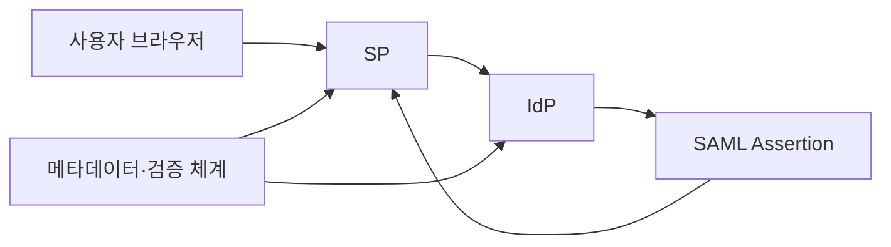
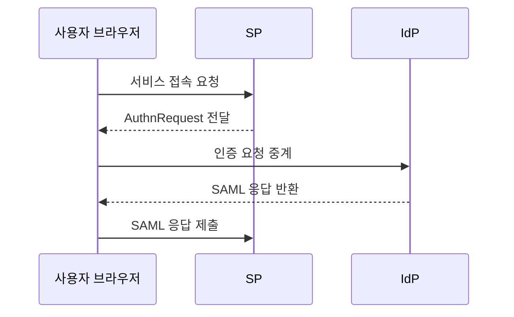

---
sidebar:
  order: 58
  label: "058. SAML 2.0 (SAML 2.0)"
  badge:
    text: "기출 · 30%"
    variant: note
title: "SAML 2.0 (SAML 2.0)"
date: "2026-07-25T21:58:00+09:00"
tags:
  - "notes-security"
weight: 58
extra:
  question_no: "058"
  source_status: "기출"
  source_history: "123회"
  priority: 30
  priority_note: "123회 기출이나 신규 시스템보다 연합 비교에 유용함"
---

## 미리 알고가기

- **보안 주장 마크업 언어 2.0(Security Assertion Markup Language 2.0, SAML 2.0)**: 영문 머리글자를 딴 공식 표기라 “새멀 이점영”으로 읽으며, 인증 결과와 사용자 속성을 XML 주장으로 전달하는 연합 인증 표준
- **확장 가능 마크업 언어(Extensible Markup Language, XML)**: 영문 머리글자를 딴 공식 표기라 “엑스엠엘”로 읽으며, SAML 주장과 요청을 계층형 태그로 표현한다
- **신원 제공자(Identity Provider, IdP)**: 영문 각 단어를 줄인 공식 표기라 “아이디피”로 읽으며, 사용자를 인증하고 SAML 주장을 발급한다
- **서비스 제공자(Service Provider, SP)**: 영문 머리글자를 딴 공식 표기라 “에스피”로 읽으며, SAML 주장을 검증하고 서비스를 제공한다
- **통합 인증(Single Sign-On, SSO)**: 영문 머리글자를 딴 공식 표기라 “에스에스오”로 읽으며, 한 번의 인증으로 여러 연계 서비스에 접속하게 한다
- **주장(Assertion, 어서션)**: 사용자·인증·속성·대상·시간 조건을 담아 SP의 로그인 판단 근거가 되는 SAML 문서 요소
- **인증 요청(Authentication Request, AuthnRequest)**: `Authentication`을 `Authn`으로 줄인 공식 요소명이라 “오슨 리퀘스트”로 읽으며, SP가 IdP에 사용자 인증을 요구한다
- **메타데이터(Metadata)**: 기관 식별자·수신 주소·인증서 등 신뢰 설정을 담은 문서
- **수신자(Recipient)**: SAML 응답을 받도록 지정된 서비스 주소
- **재전송 공격(Replay Attack)**: 이미 사용한 정상 응답을 다시 제출해 인증을 우회하는 공격
- **XML 서명 래핑 공격**: 서명된 요소와 실제 처리 요소의 차이를 악용하는 공격
- **식별자(Identifier, ID)**: `Identifier`를 줄인 공식 표기라 “아이디”로 읽으며, 요청·응답의 중복 사용과 상호 결합을 판별한다
- **로컬 세션(Local Session, 로컬 세션)**: SP가 SAML 검증 후 자체적으로 발급하는 로그인 상태

## Ⅰ. 개요

- **정의**: IdP의 XML 주장을 SP가 검증
- **배경/필요성**: 비밀번호 공유 없는 기업 SSO 구현
- **핵심**: 서명과 대상·시간·요청을 함께 확인

### 쉽게 이해하기 (학습용)

- 중앙 신원 기관이 서명한 소개장을 보내면 서비스는 발급자뿐 아니라 자기에게 보낸 현재 요청의 문서인지 확인한다.

## Ⅱ. 특징

- 메타데이터로 식별자·주소·인증서를 교환한다.
- 주장은 사용자·속성·대상·시간을 포함한다.
- 서명된 요소와 실제 처리 요소를 일치시킨다.
- 응답 ID를 저장해 재전송을 차단한다.
- 대상·시간 검증 누락은 다른 서비스 로그인을 허용한다.

### 쉽게 이해하기 (학습용)

- 서명만 진짜여도 다른 서비스용이거나 이미 사용한 소개장이면 로그인을 허용해서는 안 된다.

## Ⅲ. 아키텍처 및 구성요소

| 설계 요소 | 설명 |
|:---|:---|
| 사용자 브라우저 | 요청과 응답을 중계 |
| SP | 주장 검증과 로컬 세션 생성 |
| IdP | 사용자 인증과 응답 서명 |
| SAML Assertion | 신원·속성·조건 전달 |
| 메타데이터·검증 체계 | 신뢰 정보와 재전송 관리 |

### 쉽게 이해하기 (학습용)

- 브라우저가 문서를 운반하고 IdP가 서명하며 SP가 등록된 신뢰 정보와 조건을 기준으로 최종 로그인 여부를 정한다.

## Ⅳ. 원리 및 절차 흐름도

| 절차 | 설명 |
|:---|:---|
| 서비스 접속 요청 | 인증되지 않은 사용자 접근 |
| AuthnRequest 전달 | 요청 ID와 목적지 생성 |
| 인증 요청 중계 | 브라우저가 IdP로 전달 |
| SAML 응답 반환 | 인증 후 주장에 서명 |
| SAML 응답 제출 | 서명·대상·시간 검증 |

> 요약: 요청과 결합된 서명 주장을 검증한다.

### 쉽게 이해하기 (학습용)

- SP가 만든 요청표를 IdP가 확인해 서명 응답을 만들고 SP는 처음 요청과 정확히 이어지는지 검사한다.

## Ⅴ. 종류 및 비교

| 비교축 | SAML 공통 | SP 시작 | IdP 시작 |
|:---|:---|:---|:---|
| 핵심 특징 | XML 주장 기반 연합 인증 | SP 요청에서 인증 시작 | IdP 포털에서 인증 시작 |
| 적용 기준 | 기업 웹 SSO 연계 | 요청·응답 결합 필요 | 중앙 포털 중심 접근 |
| 주요 위험 | 서명·대상 오검증 | 요청 상태 변조 | 무요청 응답 재전송 |

### 쉽게 이해하기 (학습용)

- SP 시작은 질문과 답을 묶기 쉽고 IdP 시작은 별도 질문이 없어 응답의 목적지와 재사용을 더 엄격히 통제해야 한다.

## Ⅵ. 실무 사례

- **사례 1**: XML 외부 참조와 확장을 차단
- **사례 2**: 서명된 Assertion만 세션에 사용
- **사례 3**: 응답 ID를 저장해 재사용 거부
- **사례 4**: 인증서 교체 기간을 양측 조율

### 쉽게 이해하기 (학습용)

- 사례 1은 XML 파서가 외부 파일을 읽거나 과도한 구조로 서버 자원을 소모하지 못하게 한다.
- 사례 2는 공격자가 서명되지 않은 사용자 요소를 끼워 넣어 다른 계정으로 로그인하지 못하게 한다.
- 사례 3은 한 번 승인된 SAML 응답을 복사해 다시 로그인하는 재전송 공격을 막는다.
- 사례 4는 새 인증서 전환 중 정상 로그인이 끊기거나 오래된 키를 계속 신뢰하는 일을 방지한다.

## Ⅶ. 결론

- SAML 응답이면 서명·대상·시간을 함께 검증한다.

### 쉽게 이해하기 (학습용)

- SAML SSO는 문서의 서명뿐 아니라 누가 누구에게 언제 어떤 요청의 답으로 보냈는지를 모두 확인해야 안전하다.
