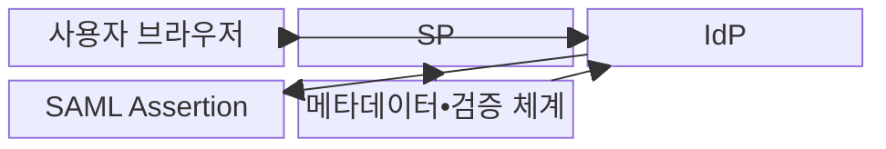
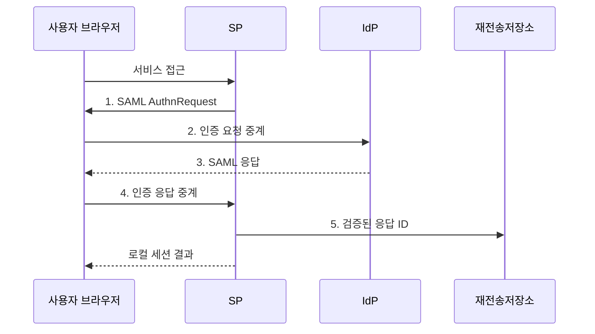

---
sidebar:
  order: 58
  label: "058. SAML 2.0 (SAML 2.0)"
  badge:
    text: "기출 • 30%"
    variant: note
title: "SAML 2.0 (SAML 2.0)"
date: "2026-08-03T08:48:47+09:00"
tags:
  - "notes-security"
weight: 58
extra:
  question_no: "058"
  source_status: "기출"
  source_history: "123회"
  priority: 30
  priority_note: "123회 기출이나 신규 시스템보다 연합 비교에 유용함"
---

## Ⅰ. 개요

핵심 용어

- **SAML 2.0**: 인증 결과와 사용자 속성을 XML 주장으로 전달하는 연합 인증 표준이다.
- **통합 인증(SSO)**: 한 번의 인증으로 여러 연계 서비스에 접속하게 하는 인증 방식이다.

- 정의/개념: 서명된 XML 주장으로 인증 결과•속성을 전달하는 **연합 인증 표준**
- 배경/필요성: 서비스별 인증의 **중복 계정•자격 관리**

#### 한줄 요약

- 중앙 신원 기관이 서명한 소개장을 보내면 서비스는 발급자뿐 아니라 자기에게 보낸 현재 요청의 문서인지 확인한다.

## Ⅱ. 특징

핵심 용어

- **Assertion•Metadata**: Assertion은 사용자•인증•조건을 담고 Metadata는 기관 식별자•수신 주소•인증서 등 신뢰 설정을 담는다.
- **IdP•SP**: IdP는 사용자를 인증해 주장을 발급하고 SP는 주장을 검증해 서비스를 제공한다.
- **Recipient•재전송 공격**: Recipient는 응답의 지정 수신 주소이며, 이미 사용한 정상 응답을 다시 제출하는 행위를 재전송 공격이라 한다.

- **IdP•SP 메타데이터** 를 통한 식별자•주소•인증서 사전 교환
- **Assertion** 을 통한 사용자•속성•대상•시간•요청 결속 전달
- **서명 요소•대상•시간•요청•응답 ID** 검증을 통한 래핑•재전송 차단

#### 한줄 요약

- 서명만 진짜여도 다른 서비스용이거나 이미 사용한 소개장이면 로그인을 허용해서는 안 된다.

## Ⅲ. 구조 및 구성요소

핵심 용어

- **IdP•SP**: IdP는 사용자를 인증해 SAML 주장을 발급하고 SP는 주장을 검증해 서비스를 제공한다.
- **로컬 세션**: SP가 SAML 검증을 완료한 뒤 자체적으로 생성하는 로그인 상태이다.

| 구성요소 | 책임 |
|:---|:---|
| 사용자 브라우저 | **요청•응답 중계** |
| SP | **주장 검증•로컬 세션 생성** |
| IdP | **사용자 인증•응답 서명** |
| SAML Assertion | **신원•속성•조건 전달** |
| 메타데이터•검증 체계 | **신뢰 정보•재전송 관리** |

#### 한줄 요약

- 브라우저가 문서를 운반하고 IdP가 서명하며 SP가 등록된 신뢰 정보와 조건을 기준으로 최종 로그인 여부를 정한다.

## Ⅳ. 흐름도

핵심 용어

- **AuthnRequest**: SP가 IdP에 사용자 인증을 요구하며 요청 ID와 반환 주소를 전달하는 SAML 메시지이다.
- **응답 ID**: 요청•응답 결속과 중복 사용 여부를 판별하는 고유 식별자이다.

**동작 원리**

1. **SAML AuthnRequest**: SP의 요청 ID•IdP 목적지•반환 주소 제공
2. **인증 요청 중계**: 브라우저가 인증 요청을 지정 IdP에 전달
3. **SAML 응답**: 사용자 인증 후 서명된 주장•대상•시간 조건 제공
4. **인증 응답 중계**: 브라우저가 SAML 응답을 지정 SP에 전달
5. **검증된 응답 ID**: 서명 요소•대상•요청 결속을 확인한 ID 저장

#### 한줄 요약

- SP가 만든 요청표를 IdP가 확인해 서명 응답을 만들고 SP는 처음 요청과 정확히 이어지는지 검사한다.

## Ⅴ. 종류 및 비교

핵심 용어

- **SP 시작•IdP 시작**: SP 시작은 서비스의 인증 요청에서 흐름이 출발하고 IdP 시작은 중앙 신원 포털의 응답에서 흐름이 출발한다.

| SAML 인증 시작 방식 | 공통 | SP 시작 | IdP 시작 |
|:---|:---|:---|:---|
| 적용 기준 | 기업 **웹 SSO 연계** | **요청•응답 결합** 필요 | **중앙 포털 중심** 접근 |
| 핵심 특징 | **XML 주장 연합 인증** | **SP 요청 기반 인증** | IdP 포털 기반 인증 |
| 한계 | **서명•대상 오검증** | **요청 상태 변조** | 무요청 응답의 **재전송** |

#### 한줄 요약

- SP 시작은 질문과 답을 묶기 쉽고 IdP 시작은 별도 질문이 없어 응답의 목적지와 재사용을 더 엄격히 통제해야 한다.

## Ⅵ. 실무 고려사항 및 대책

핵심 용어

- **OASIS SAML 2.0 Core**: SAML 주장•프로토콜•조건•서명 처리의 핵심 구문과 의미를 정의한 공식 표준이다.
- **XML 서명 래핑 공격**: 서명된 요소와 애플리케이션이 실제 처리하는 요소의 차이를 악용해 위조 내용을 수용하게 하는 공격이다.
- **W3C XML Signature 1.1**: XML 문서에서 서명 대상 요소와 검증 방법을 정의해 처리 요소와 서명 요소를 일치시키는 표준이다.

| 문제 | 대책 | 효과 |
|:---|:---|:---|
| 주장 대상•시간•요청을 잘못 검증하면 다른 서비스용 주장 수용 | **OASIS SAML 2.0 Core** 준수 | 대상•시간•**요청 결속** 확보 |
| 서명 요소와 처리 요소가 다르면 XML 래핑 성공 | **W3C XML Signature 1.1** 검증 | **서명•처리 요소** 일치 |
| 요청 없는 응답이나 중복 응답을 허용하면 재전송 로그인 | **응답 ID 저장•짧은 유효시간** 적용 | 재전송과 **세션 탈취** 방지 |

#### 한줄 요약

- 서비스 제공자는 IdP가 서명한 정확한 Assertion의 대상•수신자•유효시간을 검증한 뒤에만 기업 사용자의 세션을 생성한다.

## Ⅶ. 결론

핵심 용어

- **요청 결속**: SAML 응답을 최초 요청의 ID•대상•수신자와 연결해 다른 요청이나 서비스에서 재사용하지 못하게 하는 검증 원칙이다.
- **SP 시작•IdP 시작 선택**: 요청•응답 결속이 필요하면 SP에서 시작하고 중앙 포털 흐름에서는 응답 ID 재사용을 별도로 차단하는 판단이다.

- 요청 결속이 필요하면 **SP 시작**, 중앙 포털은 **IdP 시작** 과 응답 ID 재사용 차단 적용

#### 한줄 요약

- SAML SSO는 문서의 서명뿐 아니라 누가 누구에게 언제 어떤 요청의 답으로 보냈는지를 모두 확인해야 안전하다.
