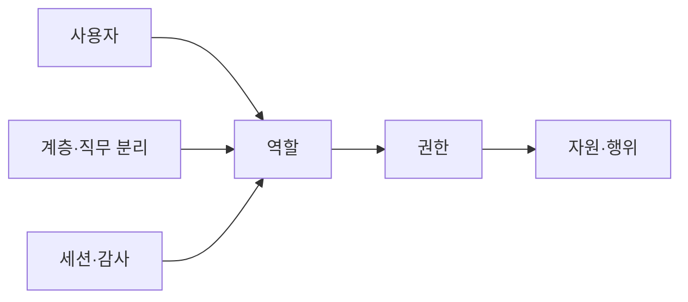
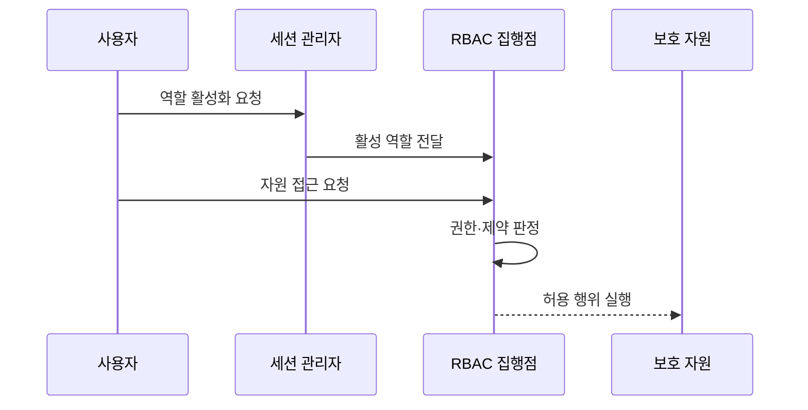

---
sidebar:
  order: 59
  label: "059. RBAC 역할 기반 접근 제어 (Role-Based Access Control)"
  badge:
    text: "기출 · 70%"
    variant: note
title: "RBAC 역할 기반 접근 제어 (Role-Based Access Control)"
date: "2026-07-25T21:59:00+09:00"
tags:
  - "notes-security"
weight: 59
extra:
  question_no: "059"
  source_status: "기출"
  source_history: "122회, 135회"
  priority: 70
  priority_note: "122·135회 반복된 역할 기반 권한 설계 핵심임"
---

## 미리 알고가기

- **역할 기반 접근 제어(Role-Based Access Control, RBAC)**: 영문 머리글자를 딴 공식 표기라 “알백”으로 읽으며, 권한을 역할에 묶고 역할을 사용자에게 배정하는 접근 제어 모델
- **사용자(User)**: 역할을 배정받는 사람이나 서비스 계정
- **역할(Role)**: 직무와 책임에 필요한 권한의 묶음
- **권한(Permission)**: 특정 자원에 특정 행위를 수행할 수 있는 허용 단위
- **자원(Resource)**: 접근 제어 대상이 되는 데이터·기능·시스템
- **역할 계층(Role Hierarchy)**: 상위 역할이 하위 역할의 권한을 상속하는 관계
- **직무 분리(Separation of Duties, SoD)**: 영문 주요 단어를 줄인 공식 표기라 “에스오디”로 읽으며, 상충하는 업무 권한을 한 주체가 함께 갖거나 쓰지 못하게 한다
- **정적 직무 분리**: 상충 역할을 한 사용자에게 동시에 배정하지 않는 제약
- **동적 직무 분리**: 상충 역할을 한 세션에서 동시에 활성화하지 않는 제약
- **세션(Session)**: 사용자가 배정된 역할 중 필요한 역할을 활성화해 사용하는 범위
- **역할 폭발(Role Explosion)**: 예외를 수용하려고 역할 수가 지나치게 늘어나는 현상
- **최소 권한(Least Privilege)**: 업무 수행에 필요한 최소한의 권한만 부여하는 원칙

## Ⅰ. 개요

- **정의**: 사용자와 권한을 역할로 연결하는 모델
- **배경/필요성**: 직무별 권한 표준화와 일괄 변경
- **적용**: 직무와 권한 관계가 안정된 조직

### 쉽게 이해하기 (학습용)

- 사람마다 열쇠를 따로 만들지 않고 회계·운영 같은 직무별 열쇠 묶음을 만들어 담당자에게 배정한다.

## Ⅱ. 특징

- 역할을 매개로 대량 권한 관리를 단순화한다.
- 역할 계층으로 공통 권한을 상속한다.
- 직무 분리로 상충 역할의 보유·사용을 제한한다.
- 세션에서 필요한 역할만 선택해 활성화한다.
- 직접 권한과 예외 누적은 역할 폭발을 유발한다.

### 쉽게 이해하기 (학습용)

- 직급에 따라 공통 열쇠를 물려주되 신청과 승인처럼 한 사람이 함께 수행하면 안 되는 권한은 분리한다.

## Ⅲ. 아키텍처 및 구성요소

| 설계 요소 | 설명 |
|:---|:---|
| 사용자 | 역할을 배정받는 주체 |
| 역할 | 직무별 권한 묶음 |
| 권한 | 자원과 허용 행위의 조합 |
| 자원·행위 | 권한이 허용하는 대상과 동작 |
| 계층·직무 분리 | 상속과 상충 관계 통제 |
| 세션·감사 | 역할 활성화와 사용 추적 |

### 쉽게 이해하기 (학습용)

- 사용자는 역할을 받고 역할은 권한을 가지며 계층과 직무 분리 제약이 과도하거나 상충하는 권한을 제한한다.

## Ⅳ. 원리 및 절차 흐름도

| 절차 | 설명 |
|:---|:---|
| 역할 활성화 요청 | 배정 역할 중 필요한 역할 선택 |
| 활성 역할 전달 | 동적 직무 분리 제약 확인 |
| 자원 접근 요청 | 대상 자원과 행위 제시 |
| 권한·제약 판정 | 역할 권한과 상충 조건 평가 |
| 허용 행위 실행 | 승인 요청만 자원에 전달 |

> 요약: 활성 역할의 권한과 제약을 함께 판정한다.

### 쉽게 이해하기 (학습용)

- 사용자가 현재 쓸 역할을 선택하면 시스템은 그 역할에 요청한 행위가 있고 상충 제약도 없는 경우에만 자원 접근을 허용한다.

## Ⅴ. 종류 및 비교

| 비교축 | RBAC 공통 | 기본 RBAC | 계층 RBAC | 제약 RBAC |
|:---|:---|:---|:---|:---|
| 핵심 특징 | 역할로 권한 간접 배정 | 사용자·역할·권한 매핑 | 역할 간 권한 상속 | 역할 조합과 사용 제한 |
| 적용 기준 | 안정된 직무 권한 | 단순 직무 표준화 | 상하위 공통 권한 | 상충 업무 분리 |
| 주요 위험 | 역할·예외 과다 | 직접 권한 우회 | 과도한 상속 | 제약 충돌과 복잡성 |

### 쉽게 이해하기 (학습용)

- 기본형은 역할 매핑, 계층형은 권한 상속, 제약형은 함께 가지거나 쓸 수 없는 역할을 통제한다.

## Ⅵ. 실무 사례

- **사례 1**: 지급 요청자와 승인자 역할 분리
- **사례 2**: 임시 관리자 역할을 자동 회수
- **사례 3**: 직접 사용자 권한을 예외로 감사
- **사례 4**: 역할 변경 전 상속 영향을 분석

### 쉽게 이해하기 (학습용)

- 사례 1은 한 사람이 지급을 만들고 스스로 승인해 부정을 완성하지 못하게 한다.
- 사례 2는 장애 대응용 높은 권한이 승인된 작업 시간이 끝난 뒤 계속 남지 않게 한다.
- 사례 3은 역할을 거치지 않은 개인 권한이 관리와 검토에서 빠지는 일을 방지한다.
- 사례 4는 상위 역할의 작은 변경이 모든 하위 역할과 서비스 계정에 과도한 권한을 주지 않게 한다.

## Ⅶ. 결론

- 직무가 안정적이면 역할로 최소 권한을 배정한다.

### 쉽게 이해하기 (학습용)

- RBAC는 직무별 권한 관리를 단순화하지만 상속·예외·상충 역할을 계속 정리해야 최소 권한을 유지할 수 있다.
