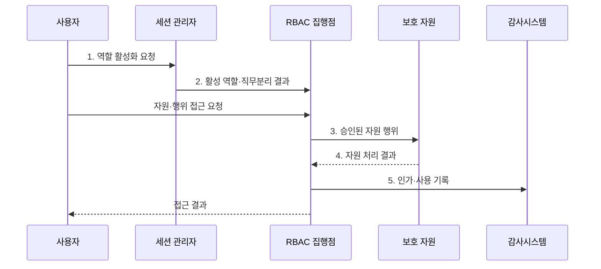

---
sidebar:
  order: 59
  label: "059. RBAC 역할 기반 접근 제어 (Role-Based Access Control)"
  badge:
    text: "기출 · 70%"
    variant: note
title: "RBAC 역할 기반 접근 제어 (Role-Based Access Control)"
date: "2026-07-31T02:05:47+09:00"
tags:
  - "notes-security"
weight: 59
extra:
  question_no: "059"
  source_status: "기출"
  source_history: "122회, 135회"
  priority: 70
  priority_note: "122·135회 반복된 역할 기반 권한 설계 핵심임"
---

## 미리 알고가기

- **역할 기반 접근 제어(Role-Based Access Control, RBAC)**: 권한을 역할에 묶고 역할을 사용자에게 배정하는 접근 제어 모델이다.
- **사용자(User)**: 역할을 배정받는 사람이나 서비스 계정이다.
- **역할(Role)**: 직무와 책임에 필요한 권한의 묶음이다.
- **권한(Permission)**: 특정 자원에 특정 행위를 수행할 수 있는 허용 단위이다.
- **자원(Resource)**: 접근 제어 대상이 되는 데이터·기능·시스템이다.
- **역할 계층(Role Hierarchy)**: 상위 역할이 하위 역할의 권한을 상속하는 관계이다.
- **직무 분리(Separation of Duties, SoD)**: 상충하는 업무 권한을 한 주체가 함께 보유하거나 행사하지 못하게 하는 통제 원칙이다.
- **정적 직무 분리(Static SoD)**: 상충 역할을 한 사용자에게 동시에 배정하지 않는 제약이다.
- **동적 직무 분리(Dynamic SoD)**: 상충 역할을 한 세션에서 동시에 활성화하지 않는 제약이다.
- **세션(Session)**: 사용자가 배정된 역할 중 필요한 역할을 활성화해 사용하는 범위이다.
- **역할 폭발(Role Explosion)**: 예외를 수용하려고 역할 수가 지나치게 늘어나는 현상이다.
- **최소 권한(Least Privilege)**: 업무 수행에 필요한 최소한의 권한만 부여하는 원칙이다.
- **ANSI INCITS 359-2012**: 핵심·계층·정적·동적 직무분리 RBAC 모델을 정의한 공식 표준이다.
- **NIST SP 800-53 Rev. 5**: 계정 관리·최소 권한·직무분리 등 접근통제 요구를 제시한 공식 지침이다.

## Ⅰ. 개요

- 정의/개념: 권한을 역할로 묶는 **간접 접근 제어**
- 배경/필요성: 직접 권한의 **일관성·변경·회수 곤란**

### 쉽게 이해하기 (학습용)

- 사람마다 열쇠를 따로 만들지 않고 회계·운영 같은 직무별 열쇠 묶음을 만들어 담당자에게 배정한다.

## Ⅱ. 특징

- **사용자-역할-권한 간접 배정**을 통한 직무별 권한 표준화
- **역할 계층·세션 활성화**를 통한 공통 권한 상속·사용 범위 관리
- **정적·동적 직무 분리**를 통한 상충 역할의 보유·동시 사용 제한

### 쉽게 이해하기 (학습용)

- 직급에 따라 공통 열쇠를 물려주되 신청과 승인처럼 한 사람이 함께 수행하면 안 되는 권한은 분리한다.

## Ⅲ. 구조 및 구성요소

| 구성요소 | 책임 |
|:---|:---|
| 사용자·역할 | **주체와 직무별 권한 묶음** |
| 권한 | **자원·허용 행위 조합** |
| 자원·행위 | **권한의 대상·동작** |
| 계층·직무 분리 | **상속·상충 관계 통제** |
| 세션·감사 | **역할 활성화·사용 추적** |

### 쉽게 이해하기 (학습용)

- 사용자는 역할을 받고 역할은 권한을 가지며 계층과 직무 분리 제약이 과도하거나 상충하는 권한을 제한한다.

## Ⅳ. 흐름도

**동작 원리**

1. **역할 활성화 요청**: 사용자가 배정 역할 중 현재 세션에 필요한 역할 제시
2. **활성 역할·직무분리 결과**: 동적 직무분리 제약을 통과한 역할 제공
3. **승인된 자원 행위**: 역할 권한·정적 제약을 확인한 대상·동작 전달
4. **자원 처리 결과**: 승인된 행위의 성공·실패 상태 제공
5. **인가·사용 기록**: 사용자·역할·권한·자원·결정 결과 저장

### 쉽게 이해하기 (학습용)

- 사용자가 현재 쓸 역할을 선택하면 시스템은 그 역할에 요청한 행위가 있고 상충 제약도 없는 경우에만 자원 접근을 허용한다.

## Ⅴ. 종류 및 비교

| RBAC 모델 | 공통 | 기본 RBAC | 계층 RBAC | 제약 RBAC |
|:---|:---|:---|:---|:---|
| 적용 기준 | **안정된 직무 권한** | 단순 **직무 표준화** | 상하위 **공통 권한** | **상충 업무 분리** |
| 핵심 특징 | **역할로 권한 간접 배정** | **사용자·역할·권한 매핑** | 역할 간 권한 상속 | 역할 조합·사용 제한 |
| 한계 | **역할·예외 과다** | **직접 권한 우회** | **과도한 상속** | 제약 **충돌·복잡성** |

### 쉽게 이해하기 (학습용)

- 기본형은 역할 매핑, 계층형은 권한 상속, 제약형은 함께 가지거나 쓸 수 없는 역할을 통제한다.

## Ⅵ. 실무 고려사항 및 대책

| 고려사항 | 대책 | 효과 |
|:---|:---|:---|
| 역할·계층·제약 정의가 다르면 인가 결과 불일치 | **ANSI INCITS 359-2012** 적용 | 계층·직무분리의 **구조 정렬** |
| 직무 이동 후 권한을 회수하지 않으면 과잉 권한 | **NIST SP 800-53 Rev. 5** 연계 | 과잉 권한과 **휴면 계정** 축소 |
| 예외마다 역할을 만들면 역할 폭발·검토 실패 | **역할 공학·정기 재인증** 수행 | 권한 모델의 **복잡성** 억제 |

### 쉽게 이해하기 (학습용)

- 자금 지급 시스템은 지급 요청 역할과 승인 역할을 분리해 한 사용자가 자신이 만든 지급을 직접 승인하지 못하게 한다.

## Ⅶ. 결론

- 단순 직무는 **기본 RBAC**, 공통 권한 상속은 계층형, 상충 업무는 제약 RBAC 선택

### 쉽게 이해하기 (학습용)

- RBAC는 직무별 권한 관리를 단순화하지만 상속·예외·상충 역할을 계속 정리해야 최소 권한을 유지할 수 있다.
