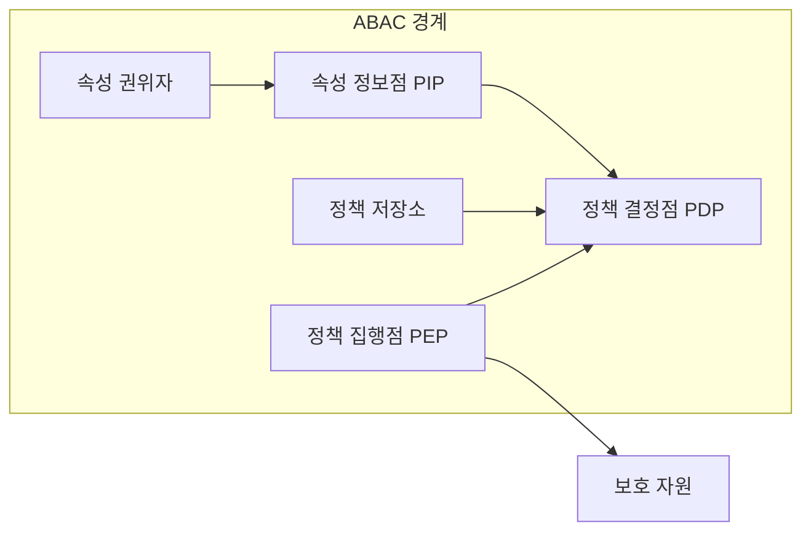
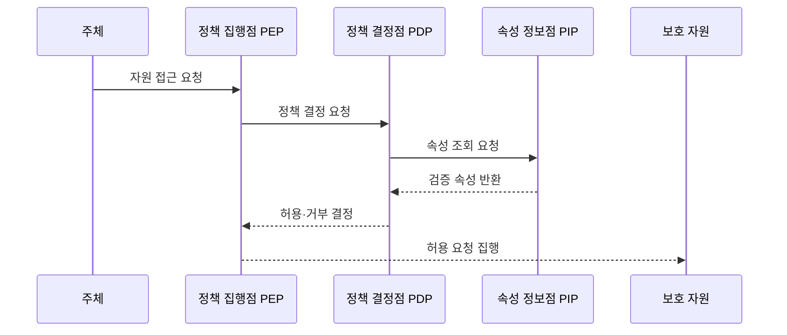

---
sidebar:
  order: 60
  label: "060. ABAC 속성 기반 접근 제어 (Attribute-Based Access Control)"
  badge:
    text: "기출 · 70%"
    variant: note
title: "ABAC 속성 기반 접근 제어 (Attribute-Based Access Control)"
date: "2026-07-27T23:59:59+09:00"
tags:
  - "notes-security"
weight: 60
extra:
  question_no: "060"
  source_status: "기출"
  source_history: "122회, 135회"
  priority: 70
  priority_note: "122·135회 반복된 속성 기반 동적 권한 핵심임"
---

## 미리 알고가기

- **속성 기반 접근 제어(Attribute-Based Access Control, ABAC)**: 주체·객체·행위·환경 속성을 정책으로 평가하여 접근을 결정하는 제어 모델이다.
- **역할 기반 접근 제어(Role-Based Access Control, RBAC)**: 권한을 역할에 묶어 사용자에게 배정하는 접근 제어 모델이다.
- **속성(Attribute)**: 접근 조건을 판단하는 데 쓰는 주체·객체·환경의 특성값
- **주체(Subject)**: 자원 접근을 요청하는 사용자·서비스·장치
- **객체(Object)**: 접근 제어 대상이 되는 데이터나 시스템 자원
- **환경(Environment)**: 시간·위치·기기 위험처럼 요청 당시의 외부 조건
- **속성 권위자(Attribute Authority)**: 신뢰할 수 있는 속성값을 생성·관리하는 주체
- **정책 정보점(Policy Information Point, PIP)**: 정책 결정에 필요한 주체·객체·환경 속성값을 제공하는 구성요소이다.
- **정책 결정점(Policy Decision Point, PDP)**: 속성과 정책을 평가하여 접근의 허용·거부를 결정하는 구성요소이다.
- **정책 집행점(Policy Enforcement Point, PEP)**: 정책 결정점의 결과를 실제 자원 접근에 적용하는 구성요소이다.
- **정책 저장소(Policy Repository)**: 접근 규칙과 조합 방식을 보관하는 장소
- **기본 거부(Default Deny)**: 명시적으로 허용되지 않은 요청을 거부하는 원칙
- **속성 신선도(Attribute Freshness)**: 속성값이 현재 상태를 반영하는 정도

## Ⅰ. 개요

- 정의: 요청 속성을 평가하는 **동적 접근 제어**
- 기존 한계: 역할 중심 권한의 **맥락 반영 부족**

### 쉽게 이해하기 (학습용)

- 직무 하나만 보지 않고 누가 어떤 문서를 어떤 기기와 시간에 무슨 행위로 여는지를 함께 따진다.

## Ⅱ. 특징

- **주체·객체·행위·환경 속성**의 조합
- PIP·PDP·PEP 기반 **정책 결정·집행**
- 속성 신선도·신뢰성 기반 **동적 판정**

### 쉽게 이해하기 (학습용)

- 조건을 세밀하게 만들 수 있지만 값이 오래되거나 틀리면 정당한 사용자를 막거나 공격자를 허용할 수 있다.

## Ⅲ. 아키텍처 및 구성요소

| 설계 요소 | 설명 |
|:---|:---|
| 정책 집행점 PEP | 요청 전달과 결정 집행 |
| 정책 결정점 PDP | 속성과 정책 평가 |
| 정책 저장소 | 규칙과 충돌 기준 관리 |
| 속성 정보점 PIP | 결정용 속성 조회 |
| 속성 권위자 | 신뢰 속성 생성·갱신 |

### 쉽게 이해하기 (학습용)

- 집행점이 질문하면 결정점이 정책과 신뢰 속성을 조회해 답하고 집행점이 그 답대로 자원 접근을 허용하거나 거부한다.

## Ⅳ. 원리 및 절차 흐름도

| 절차 | 설명 |
|:---|:---|
| 자원 접근 요청 | 주체·객체·행위 제시 |
| 정책 결정 요청 | 환경과 요청 맥락 전달 |
| 속성 조회 요청 | 필요한 최신 속성 식별 |
| 검증 속성 반환 | 신뢰 출처의 값 제공 |
| 허용·거부 결정 | 정책 조합과 기본 거부 적용 |
| 허용 요청 집행 | 승인된 행위만 자원에 전달 |

> 요약: 신뢰 속성을 정책으로 평가해 집행한다.

### 쉽게 이해하기 (학습용)

- 실제 요청마다 필요한 속성을 신뢰 출처에서 가져와 정책과 비교하고 허용된 행위만 보호 자원에 전달한다.

## Ⅴ. 종류 및 비교

| 접근 제어 모델 | ABAC | RBAC | 혼합 모델 |
|:---|:---|:---|:---|
| 적용 기준 | 맥락·데이터별 세밀 통제 | 안정된 직무 권한 | 기본 역할의 조건 강화 |
| 핵심 특징 | 속성 조합의 동적 판정 | 역할 기반 권한 배정 | 역할에 속성 조건 추가 |
| 한계 | 속성·정책 복잡성 | 역할·예외 과다 | 규칙 충돌·책임 중복 |

### 쉽게 이해하기 (학습용)

- RBAC는 직무 중심, ABAC는 요청 맥락 중심이며 혼합형은 직무 권한에 필요한 동적 조건만 덧붙인다.

## Ⅵ. 실무 사례

1. 비관리 기기의 **기밀 문서 다운로드 거부**

### 쉽게 이해하기 (학습용)

- 사용자의 직무 권한이 있어도 기기 관리 상태와 문서 등급 속성을 함께 평가해 비관리 기기에는 기밀 문서 다운로드를 허용하지 않는다.

## Ⅶ. 결론

- 역할만으로 표현하기 어려운 동적 접근을 통제하기 위해 속성 출처·최신성·정책 충돌·판단 실패 방식을 검토하여, 신뢰할 수 있는 맥락 기반 접근에는 ABAC를 선택해야 한다.

### 쉽게 이해하기 (학습용)

- ABAC의 핵심은 조건의 개수가 아니라 최신의 믿을 수 있는 속성으로 일관되게 결정하고 그 이유를 설명하는 것이다.
