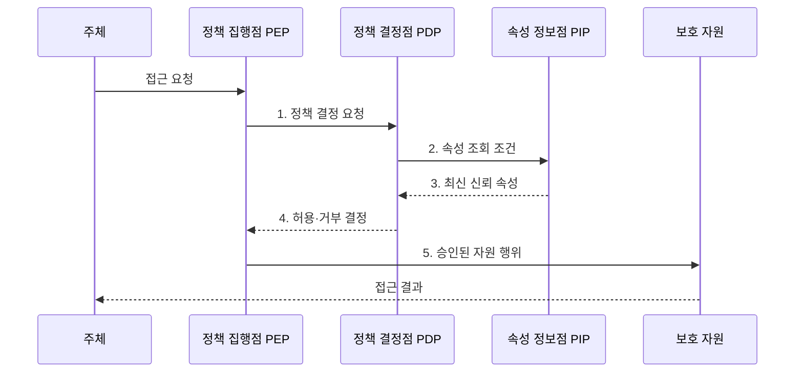

---
sidebar:
  order: 60
  label: "060. ABAC 속성 기반 접근 제어 (Attribute-Based Access Control)"
  badge:
    text: "기출 · 70%"
    variant: note
title: "ABAC 속성 기반 접근 제어 (Attribute-Based Access Control)"
date: "2026-08-02T11:58:00+09:00"
tags:
  - "notes-security"
weight: 60
extra:
  question_no: "060"
  source_status: "기출"
  source_history: "122회, 135회"
  priority: 70
  priority_note: "122·135회 반복된 속성 기반 동적 권한 핵심임"
---

## Ⅰ. 개요

핵심 용어

- **ABAC**: 주체·객체·행위·환경 속성을 정책으로 평가하여 접근을 결정하는 제어 모델이다.
- **RBAC**: 권한을 역할에 묶어 사용자에게 배정하는 접근 제어 모델이다.

- 정의/개념: 요청 속성을 평가하는 **동적 접근 제어**
- 배경/필요성: 역할 중심 권한의 **맥락 반영 부족**

#### 한줄 요약

- 직무 하나만 보지 않고 누가 어떤 문서를 어떤 기기와 시간에 무슨 행위로 여는지를 함께 따진다.

## Ⅱ. 특징

핵심 용어

- **주체·객체·행위·환경 속성**: 요청자와 대상 자원, 수행 동작, 시간·위치·기기 같은 현재 맥락을 나타내는 정책 판단값이다.
- **속성 신선도**: 속성값이 요청 시점의 실제 상태를 정확히 반영하는 정도이다.

- **주체·객체·행위·환경 속성**의 조합
- PIP·PDP·PEP 기반 **정책 결정·집행**
- 속성 신선도·신뢰성 기반 **동적 판정**

#### 한줄 요약

- 조건을 세밀하게 만들 수 있지만 값이 오래되거나 틀리면 정당한 사용자를 막거나 공격자를 허용할 수 있다.

## Ⅲ. 구조 및 구성요소

핵심 용어

- **PEP·PDP·PIP**: PEP는 결정을 집행하고 PDP는 정책을 평가하며 PIP는 평가에 필요한 신뢰 속성을 제공한다.
- **속성 권위자·정책 저장소**: 속성 권위자는 신뢰 값을 생성·관리하고 정책 저장소는 접근 규칙과 조합 방식을 보관한다.

| 구성요소 | 책임 |
|:---|:---|
| 정책 집행점 PEP | 요청 전달과 **정책 결정 집행** |
| 정책 결정점 PDP | **속성·정책 평가** |
| 정책 저장소 | **규칙·충돌 기준** 관리 |
| 속성 정보점 PIP | 결정용 **신뢰 속성 조회** |
| 속성 권위자 | **신뢰 속성 생성·갱신** |

#### 한줄 요약

- 집행점이 질문하면 결정점이 정책과 신뢰 속성을 조회해 답하고 집행점이 그 답대로 자원 접근을 허용하거나 거부한다.

## Ⅳ. 흐름도

핵심 용어

- **TTL**: 조회한 속성값을 다시 확인하기 전까지 유효하다고 보는 생존 시간이다.
- **기본 거부**: 평가 오류를 포함해 정책이 명시적으로 허용하지 않은 요청을 거부하는 원칙이다.

**동작 원리**

1. **정책 결정 요청**: 주체·객체·행위와 시간·위치·기기 맥락 전달
2. **속성 조회 조건**: 정책 평가에 필요한 속성명·권위자·신선도 요구
3. **최신 신뢰 속성**: 권위자·TTL·무결성을 확인한 속성값 제공
4. **허용·거부 결정**: 정책 조합·충돌 규칙·실패 방식을 적용한 결과 제공
5. **승인된 자원 행위**: 기본 거부 후 명시적으로 허용된 동작만 전달

#### 한줄 요약

- 실제 요청마다 필요한 속성을 신뢰 출처에서 가져와 정책과 비교하고 허용된 행위만 보호 자원에 전달한다.

## Ⅴ. 종류 및 비교

핵심 용어

- **ABAC·RBAC·혼합 모델**: ABAC는 동적 속성, RBAC는 안정된 직무 역할로 판단하며 혼합형은 역할 권한에 속성 조건을 추가한다.

| 접근 제어 모델 | ABAC | RBAC | 혼합 모델 |
|:---|:---|:---|:---|
| 적용 기준 | 맥락·데이터별 **세밀 통제** | **안정된 직무 권한** | 기본 역할의 **조건 강화** |
| 핵심 특징 | **속성 조합 동적 판정** | **역할 기반 권한 배정** | 역할에 속성 조건 추가 |
| 한계 | **속성·정책 복잡성** | **역할·예외 과다** | 규칙 **충돌·책임 중복** |

#### 한줄 요약

- RBAC는 직무 중심, ABAC는 요청 맥락 중심이며 혼합형은 직무 권한에 필요한 동적 조건만 덧붙인다.

## Ⅵ. 실무 고려사항 및 대책

핵심 용어

- **NIST SP 800-162**: 주체·객체·환경 속성 기반 접근 제어의 정의와 설계 고려사항을 제시한 공식 지침이다.
- **OASIS XACML 3.0**: 속성 기반 정책 언어와 PEP·PDP·PIP 처리 모델을 정의한 공식 표준이다.

| 문제 | 대책 | 효과 |
|:---|:---|:---|
| 속성 정의·관리 책임이 다르면 같은 요청의 판정 불일치 | **NIST SP 800-162** 적용 | 주체·객체·환경의 **정의 정렬** |
| 제품별 정책 처리 방식이 달라 집행 결과 불일치 | **OASIS XACML 3.0 Errata 01** 적용 | PEP·PDP·PIP의 **인터페이스 통일** |
| 오래된 속성·정책 충돌로 비인가 요청 허용 | **속성 권위자·TTL**과 기본 거부 적용 | 비인가 허용과 **판정 불일치** 방지 |

#### 한줄 요약

- 사용자의 직무 권한이 있어도 기기 관리 상태와 문서 등급 속성을 함께 평가해 비관리 기기에는 기밀 문서 다운로드를 허용하지 않는다.

## Ⅶ. 결론

핵심 용어

- **신뢰 속성과 설명 가능성**: 최신의 검증된 속성으로 접근을 결정하고 어떤 속성과 정책이 결과를 만들었는지 추적할 수 있어야 한다는 운영 원칙이다.

- 안정된 직무는 **RBAC**, 동적 맥락은 **ABAC**, 역할에 일부 조건만 필요하면 혼합형 선택

#### 한줄 요약

- ABAC의 핵심은 조건의 개수가 아니라 최신의 믿을 수 있는 속성으로 일관되게 결정하고 그 이유를 설명하는 것이다.
